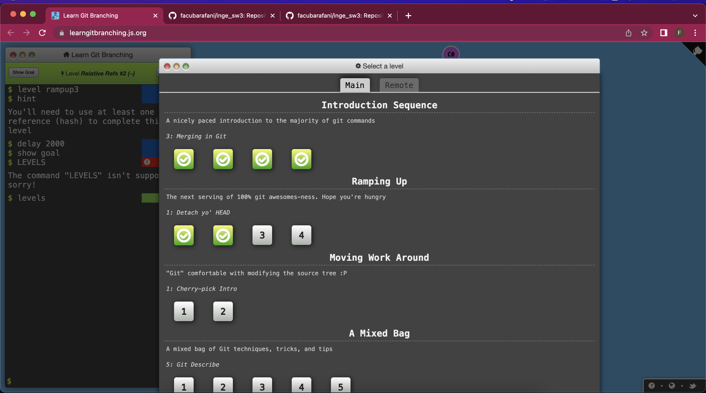

# Trabajo Práctico 1 - Ingenieria de Software III

### 1) Instalar Git

Los pasos y referencias asumen el uso del sistema operativo Windows, en caso otros SO seguir recomendaciones específicas.

- Bajar e instalar el cliente git. Por ejemplo, desde https://git-scm.com/
- Bajar e instalar un cliente visual. Por ejemplo, TortoiseGit para Windows o SourceTree para Windows/MAC:
https://tortoisegit.org/
https://www.sourcetreeapp.com/
Lista completa: https://git-scm.com/downloads/guis/

:heavy_check_mark:

### 2) Crear un repositorio local y agregar archivos
- Crear un repositorio local en un nuevo directorio.
- Agregar un archivo Readme.md, agregar algunas líneas con texto a dicho archivo.
- Crear un commit y proveer un mensaje descriptivo.

:heavy_check_mark:

### 3) Crear un repositorio remoto
- Crear una cuenta en https://github.com
- Crear un nuevo repositorio en dicha página (vacío)
- Asociar el repositorio local creado en el punto 2 al creado en github.
- Subir los cambios locales a github.

:heavy_check_mark:

### 4) Familiarizarse con el concepto de Pull Request

- Para algunos de los puntos proveer imágenes.
- Explicar que es un pull request.
- Crear un branch local y agregar cambios a dicho branch.
- Subir el cambio a dicho branch y crear un pull request.
- Completar el proceso de revisión en github y mergear el PR al branch master.

**Que es un pull request?**

Un pull request es una herramienta de colaboración que permite a los autores de un fork solicitar permiso al propietario de un repositorio para poder combinar los cambios realizados a una rama en especifico.

### 5) Mergear código con conflictos

- Clonar en un segundo directorio el repositorio creado en github.
- En el clon inicial, modificar el Readme.md agregando más texto.
- Hacer commit y subir el cambio a master a github.
- En el segundo clon también agregar texto, en las mismas líneas que se modificaron el punto anterior.
Intentar subir el cambio, haciendo un commit y push. Mostrar el error que se obtiene.
- Hacer pull y mergear el código (solo texto por ahora), mostrar la herramienta de mergeo como luce.
- Resolver los conflictos del código.
- Explicar las versiones LOCAL, BASE y REMOTE.
- Pushear el cambio mergeado.

1) Primero creamos la rama con el primer cambio en el archivo:

2) Luego creamos una segunda rama donde hagamos un cambio que vaya a generar un conflicto cuando vayamos a realizar el merge:

En este caso podemos observar que en una rama tenemos "ESTO VA A GENERAR CONFLICTO" y en la otra contiene "PROBANDO QUE ESTO VA A GENERAR CONFLICTO"

3) Ahora intentamos realizar el merge:

y esto es lo que sucede:

la terminal nos indica que hay un conflicto y que primero debemos resolverlo para poder realizar el push al remoto.

4) Ingresando al VS Code podemos hacer un analisis de el conflicto generado y que es lo que lo esta generando:

5) Finalmente corregimos el conflicto y hacemos el push con los cambios. :heavy_check_mark:

6) Algunos ejercicios online
- Entrar a la página https://learngitbranching.js.org/
- Completar los ejercicios Introduction Sequence
- Opcional - Completar el resto de los ejercicios para ser un experto en Git!!!

7) Crear Repositorio de la materia
- Crear un repositorio para la materia en github. Por ejemplo ing-software-3
- Subir archivo(s) .md con los resultados e imágenes de este trabajo práctico. Puede ser en una subcarpeta trabajo-practico-01

:heavy_check_mark: