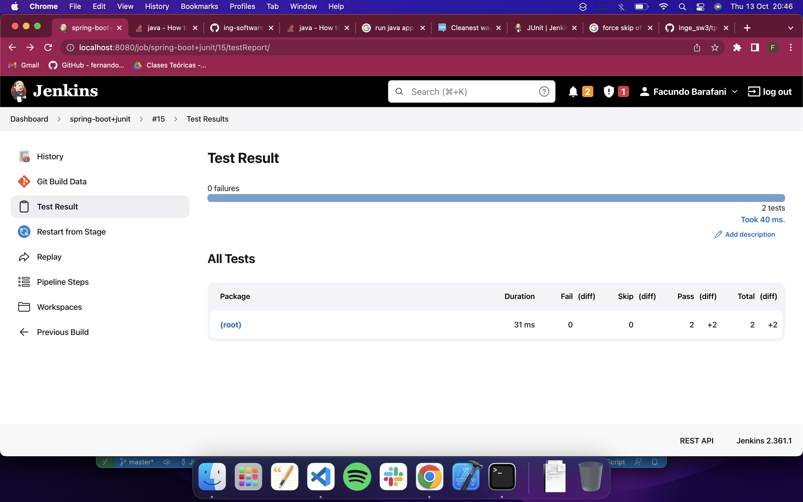
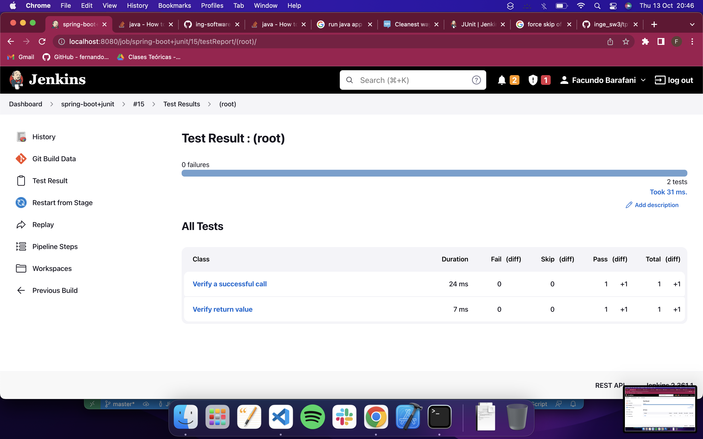

# Trabajo Práctico 10 - Pruebas de Integración

#### 1- Familiarizarse con CodeceptJs
  - El objeto **I** y sus funcionalidades básicas: https://codecept.io/basics

#### 2- Testeando la página de GitHub

- Instalar NodeJs v12 o superior: https://nodejs.org/en/download/
- En un directorio, por ejemplo **.\proyectos\ut** ejecutar:

```bash
npx create-codeceptjs .
```

- Si esta utilizando codeceptjs 3.0.0, hay que actualizar a uno superior, por ejemplo 3.0.1
- Cambiar en packages.json `"codeceptjs": "^3.0.0",` por `"codeceptjs": "^3.0.1",` y ejecutar `npm install`
- Ininicializar un nuevo proyecto CodeceptJS:
```bash
npx codeceptjs init
```
- Elegimos las opciones por defecto, ponemos **github** cuando se nos pregunte por el nombre del primer test:
```powershell
D:\repos\ucc\ing-soft-3-2020\proyectos\ut>npx codeceptjs init

  Welcome to CodeceptJS initialization tool
  It will prepare and configure a test environment for you

Installing to D:\repos\ucc\ing-soft-3-2020\proyectos\ut
? Where are your tests located? ./*_test.js
? What helpers do you want to use? (Use arrow keys)
> Playwright
  WebDriver
  Puppeteer
  TestCafe
  Protractor
  Nightmare
  Appium
? Where should logs, screenshots, and reports to be stored? ./output
? Do you want localization for tests? (See https://codecept.io/translation/) English (no localization)
Configure helpers...
? [Playwright] Base url of site to be tested http://localhost
? [Playwright] Show browser window Yes
? [Playwright] Browser in which testing will be performed. Possible options: chromium, firefox or webkit chromium

Steps file created at ./steps_file.js
Config created at D:\repos\ucc\ing-soft-3-2020\proyectos\ut\codecept.conf.js
Directory for temporary output files created at './output'
Intellisense enabled in D:\repos\ucc\ing-soft-3-2020\proyectos\ut\jsconfig.json
TypeScript Definitions provide autocompletion in Visual Studio Code and other IDEs
Definitions were generated in steps.d.ts

 Almost ready... Next step:
Creating a new test...
----------------------
? Feature which is being tested (ex: account, login, etc) github
? Filename of a test github_test.js

Test for github_test.js was created in D:\repos\ucc\ing-soft-3-2020\proyectos\ut\github_test.js

--
CodeceptJS Installed! Enjoy supercharged testing! �
Find more information at https://codecept.io
```

- Editar el archivo generado:
```
Feature('My First Test');
Scenario('test something', (I) => {

});
```

- Escribir un escenario de prueba:
```Feature('My First Test');

Scenario('test something', (I) => {
  I.amOnPage('https://github.com');
  I.see('GitHub');
});
```

- Finalmente correr el test:
```npx codeceptjs run --steps```

```bash
facundobarafani@Facundos-MBP ut % npx codeceptjs run --steps
context
CodeceptJS v3.3.6 #StandWithUkraine
Using test root "/Users/facundobarafani/Desktop/UCC/Sistemas IV/Segundo Semestre/Inge de SW 3/Practico/inge_sw3/tp10/proyecto/ut"

github --
  My First Test
    I am on page "https://github.com"
    I see "GitHub"
  ✔ OK in 2270ms


  OK  | 1 passed   // 3s
```

- Agregamos otras validaciones
```javascript
Scenario('test something', ({ I }) => {
    I.amOnPage('https://github.com');
    I.see('GitHub');
    I.see('The home for all developers')
    I.scrollPageToBottom()
    I.seeElement("//li[contains(.,'© 2022 GitHub, Inc.')]")
});
```
```bash
facundobarafani@Facundos-MBP ut % npx codeceptjs run --steps
context
CodeceptJS v3.3.6 #StandWithUkraine
Using test root "/Users/facundobarafani/Desktop/UCC/Sistemas IV/Segundo Semestre/Inge de SW 3/Practico/inge_sw3/tp10/proyecto/ut"

github --
  My First Test
    I am on page "https://github.com"
    I see "GitHub"
    I see "The home for all developers"
    I scroll page to bottom 
    I see element "//li[contains(.,'© 2022 GitHub, Inc.')]"
  ✔ OK in 1481ms


  OK  | 1 passed   // 2s
  ```

- Para generar selectores fácilmente utilizamos plugins como (Firefox o Chrome)
  - TruePath https://addons.mozilla.org/en-US/firefox/addon/truepath/
  - ChroPath https://chrome.google.com/webstore/detail/chropath/ljngjbnaijcbncmcnjfhigebomdlkcjo
  
#### 3- Testeando la aplicación spring-boot
  - En un directorio, por ejemplo **.\proyectos\spring-boot-it** ejecutar:

```bash
npx create-codeceptjs .
```

 - Instalar CodeceptJS con la librería webdriverio
```npm install codeceptjs chai --save-dev```

 - Inicializar CodeceptJS: ```npx codeceptjs init```


- Responder las preguntas. Aceptar valores por defecto. Cuando pregunte por url colocar `http://localhost:8080` y y el nombre de los tests poner `spring-boot`


- Editar el archivo generado `spring-boot_tests.js`:
```javascript
Feature('spring-boot');

const expect = require('chai').expect;
const {I} = inject();

Scenario('Verify a successful call', async () => {
	const res = await I.sendGetRequest('/');
	expect(res.status).to.eql(200);
});

Scenario('Verify return value', async () => {
	const res = await I.sendGetRequest('/');
	//console.log(res);
	expect(res.data.message).to.eql('Spring boot says hello from a Docker container');
});
```

- Reemplazar la sección helpers de codecept.conf.js por:

```javascript
	helpers: {
		REST: {
			endpoint: "http://localhost:8080",
			onRequest: () => {
			}
		}
	}
```

- Levantar la aplicación spring-boot en otra consola (usando java o Docker):
```bash
cd ./proyectos/spring-boot
java -jar target/spring-boot-sample-actuator-2.0.2.jar
```
- Ejecutar los tests desde la carpeta `.\proyectos\spring-boot-it`

```
npx codeceptjs run --steps
```

- Analizar resultados

```bash
facundobarafani@Facundos-MBP spring-boot-it % npx codeceptjs run --steps
CodeceptJS v3.3.6 #StandWithUkraine
Using test root "/Users/facundobarafani/Desktop/UCC/Sistemas IV/Segundo Semestre/Inge de SW 3/Practico/inge_sw3/tp10/proyecto/spring-boot-it"

spring-boot --
  Verify a successful call
    I send get request "/"
  ✔ OK in 33ms

  Verify return value
    I send get request "/"
  ✔ OK in 8ms


  OK  | 2 passed   // 48ms
  ```

  > En este caso podemos ver que los test pasaron, en una primear instancia verifica que haya un resultado exitoso al hacer una llamada a la ruta `/` de nuestra aplicación spring-boot, esto se hace verificando que el codigo de respuesta es `200` que significa exitoso.

  > Luego la segunda parte verifica el valor que retorna al hacer un `GET` request a la ruta `/` de nuestra aplicación. En este caso verifica que el valor de retorno sea `"Spring boot says hello from a Docker container"` que es lo que retorna la webapp al hacer un llamado al `root` del proyecto.

#### 4- Habilitar reportes para utilizarlos en CICD
- Instalar el módulo para reporting
```bash
npm i mocha-junit-reporter mocha-multi --save
```
- Reemplazar la key mocha en el archivo codecept.conf.js por:

```javascript
	mocha:  {
    "reporterOptions": {
      "codeceptjs-cli-reporter": {
        "stdout": "-",
        "options": {
          "steps": true,
        }
      },
      "mocha-junit-reporter": {
        "stdout": "./output/console.log",
        "options": {
          "mochaFile": "./output/result.xml"
        },
        "attachments": true //add screenshot for a failed test
		  }
		}
	}
```

- Ejecutar los tests nuevamente
```bash
npx codeceptjs run --steps --reporter mocha-multi
```
 ```bash
 facundobarafani@Facundos-MBP spring-boot-it % npx codeceptjs run --steps --reporter mocha-multi
CodeceptJS v3.3.6 #StandWithUkraine
Using test root "/Users/facundobarafani/Desktop/UCC/Sistemas IV/Segundo Semestre/Inge de SW 3/Practico/inge_sw3/tp10/proyecto/spring-boot-it"

spring-boot --
  Verify a successful call
    I send get request "/"
  ✔ OK in 23ms

  Verify return value
    I send get request "/"
  ✔ OK in 7ms


  OK  | 2 passed   // 37ms

```

- La salida compatible con Jenkins esta en ./output/results.xml

> Salida en el archivo `results.xml`:

```xml
<?xml version="1.0" encoding="UTF-8"?>
<testsuites name="Mocha Tests" time="0.037" tests="2" failures="0">
  <testsuite name="Root Suite" timestamp="2022-10-13T17:10:29" tests="0" time="0.000" failures="0">
  </testsuite>
  <testsuite name="spring-boot" timestamp="2022-10-13T17:10:29" tests="2" file="/Users/facundobarafani/Desktop/UCC/Sistemas IV/Segundo Semestre/Inge de SW 3/Practico/inge_sw3/tp10/proyecto/spring-boot-it/spring-boot_test.js" time="0.036" failures="0">
    <testcase name="spring-boot: Verify a successful call" time="0.023" classname="Verify a successful call">
    </testcase>
    <testcase name="spring-boot: Verify return value" time="0.007" classname="Verify return value">
    </testcase>
  </testsuite>
</testsuites>
```

#### 5- Integrar la ejecución en Jenkins
- Utilizando la funcionalidad de Junit test en Jenkins colectar estos resultados de la ejecución después del deployment.





```Jenkinsfile
pipeline {
    agent any

    tools {
        // Install the Maven version configured as "M3" and add it to the path.
        maven "M3"
    }

    stages {
        stage('Build') {
            steps {
                // Get spring-boot folder from github repo
                git 'https://github.com/facubarafani/inge_sw3'
                
                dir('tp9/spring-boot') {
                    sh("mvn package")
                }
            }
            post {
                // If Maven was able to run the tests, even if some of the test
                // failed, record the test results and archive the jar file.
                success {
                    dir('tp9/spring-boot') {
                        archiveArtifacts 'target/*.jar'
                    }
                }
            }
        }
        stage('Integration') {
            steps {
                dir('tp10/proyecto/spring-boot-it/output') {
                    junit 'result.xml'
                }
            }
        }
    }
}
```