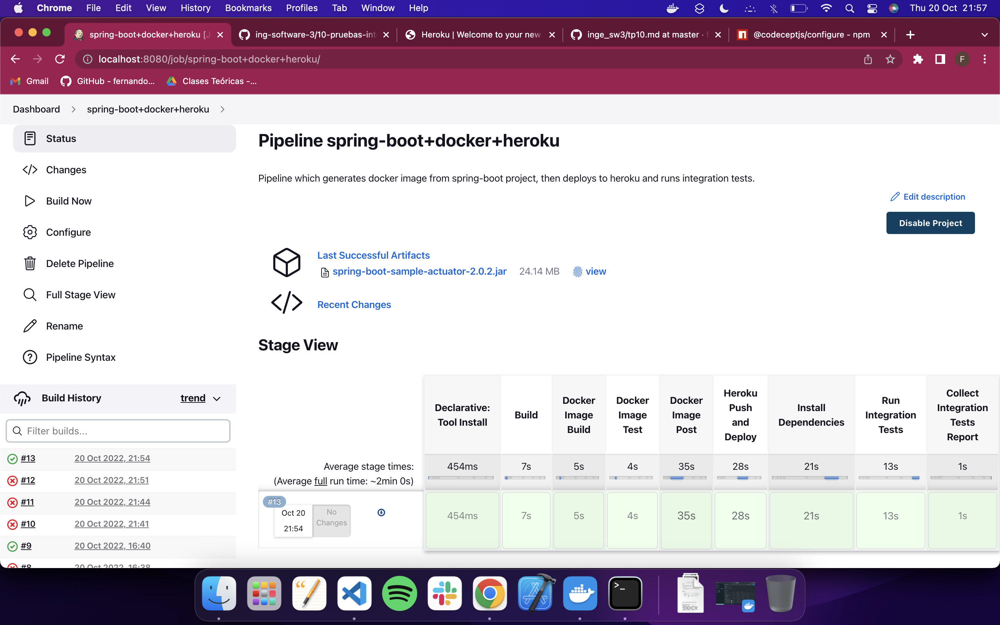
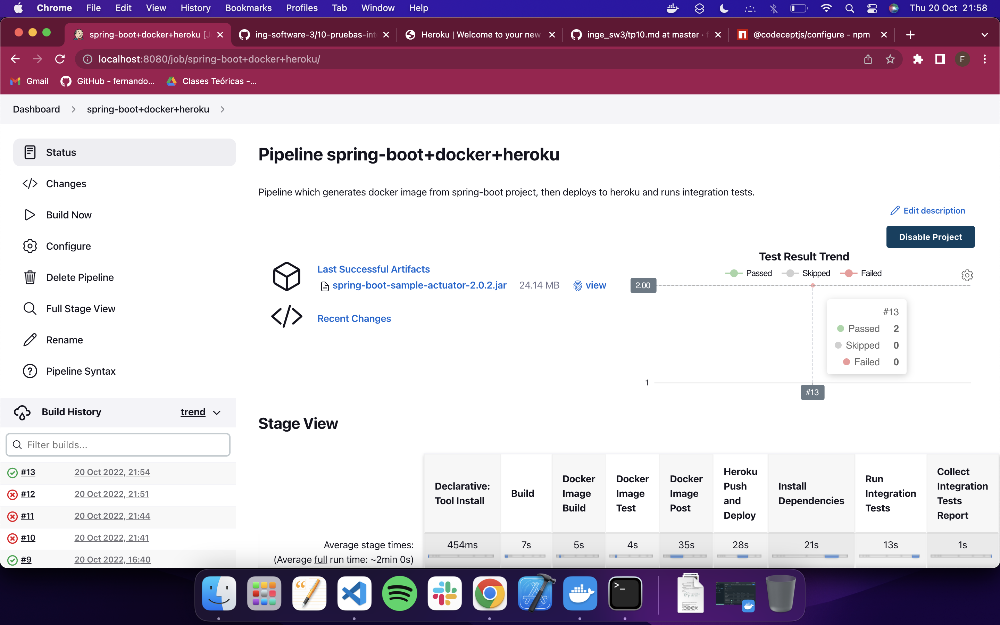
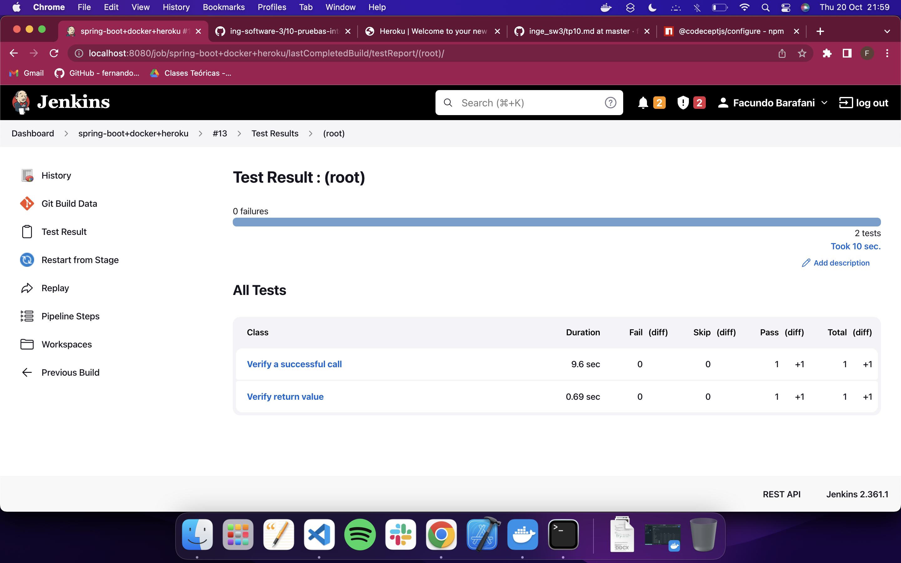
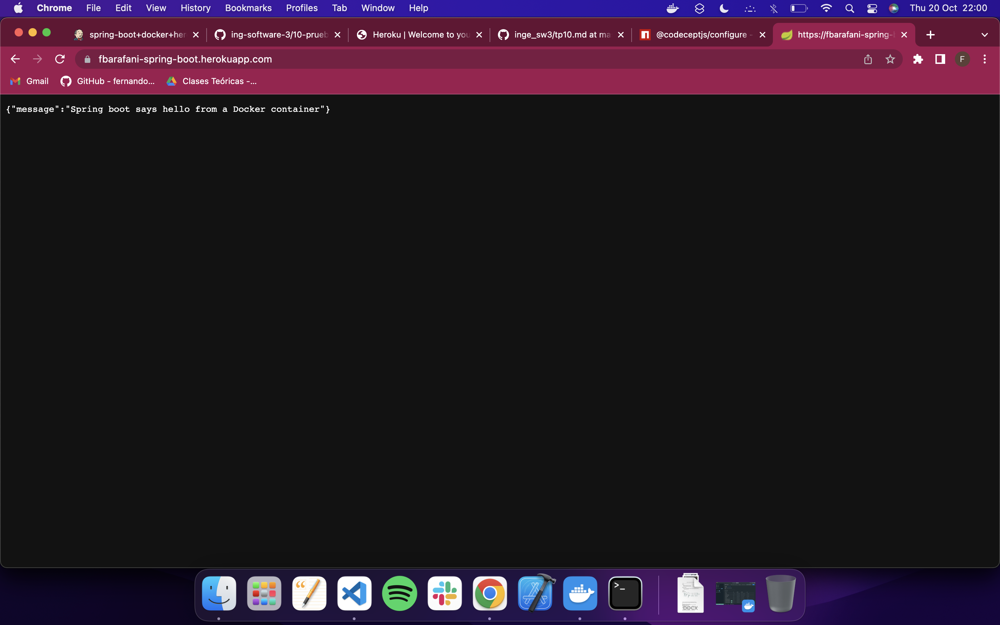

# Trabajo Práctico 12 - Despliegue de aplicaciones

#### 1- Configurando Heroku
  - Crear una cuenta en Heroku https://dashboard.heroku.com
  - Instalar la utilidad de línea de comando de Heroku: https://devcenter.heroku.com/articles/heroku-cli
  - Abrir una línea de comandos y registrase con la aplicación CLI
```
heroku login
heroku container:login
```

```bash
facundobarafani@Facundos-MBP inge_sw3 % brew tap heroku/brew && brew install heroku
Running `brew update --auto-update`...
==> Auto-updated Homebrew!
Updated 4 taps (heroku/brew, homebrew/core, homebrew/cask and homebrew/services).
==> New Formulae
autocorrect                go-camo                    pgsync
bazarr                     highway                    python-typing-extensions
cbindgen                   hpp-fcl                    rome
curlcpp                    iir1                       sambamba
dronedb                    jj                         snowball
dynein                     json2tsv                   sqlcmd
edencommon                 libretls                   tbls
fastfetch                  metview                    textract
fend                       mqttui                     tfel
ferium                     mxnet                      trezor-bridge
fortls                     mycorrhiza                 typewritten
fred                       netcdf-cxx                 verovio
gebug                      netcdf-fortran             wasm-micro-runtime
git-machete                nuraft                     xq
==> New Casks
akiflow                    onekey                     sms-plus
aptakube                   pictureview                snapmaker-luban
arc                        pieces-cli                 tempbox
battery                    planet                     topaz-denoise-ai
chipmunk                   prism                      topaz-gigapixel-ai
cisdem-duplicate-finder    random-mouse-clicker       topaz-sharpen-ai
diffusionbee               readdle-spark              topaz-video-ai
genesis-plus               readmoreading              wolfram-engine

You have 59 outdated formulae and 2 outdated casks installed.
You can upgrade them with brew upgrade
or list them with brew outdated.

==> Unshallowing heroku/brew
remote: Enumerating objects: 1480, done.
remote: Counting objects: 100% (1478/1478), done.
remote: Compressing objects: 100% (1083/1083), done.
remote: Total 1464 (delta 364), reused 1459 (delta 359), pack-reused 0
Receiving objects: 100% (1464/1464), 190.69 KiB | 364.00 KiB/s, done.
Resolving deltas: 100% (364/364), completed with 4 local objects.
heroku 7.36.3 is already installed but outdated (so it will be upgraded).
==> Downloading https://nodejs.org/download/release/v14.19.0/node-v14.19.0-darwi
######################################################################## 100.0%
==> Downloading https://cli-assets.heroku.com/heroku-v7.65.0/heroku-v7.65.0.tar.
######################################################################## 100.0%
==> Upgrading heroku/brew/heroku
  7.36.3 -> 7.65.0 

Warning: A newer Command Line Tools release is available.
Update them from Software Update in System Preferences or run:
  softwareupdate --all --install --force

If that doesn't show you any updates, run:
  sudo rm -rf /Library/Developer/CommandLineTools
  sudo xcode-select --install

Alternatively, manually download them from:
  https://developer.apple.com/download/all/.
You should download the Command Line Tools for Xcode 13.4.

==> Installing dependencies for heroku/brew/heroku: heroku/brew/heroku-node
==> Installing heroku/brew/heroku dependency: heroku/brew/heroku-node
Warning: A newer Command Line Tools release is available.
Update them from Software Update in System Preferences or run:
  softwareupdate --all --install --force

If that doesn't show you any updates, run:
  sudo rm -rf /Library/Developer/CommandLineTools
  sudo xcode-select --install

Alternatively, manually download them from:
  https://developer.apple.com/download/all/.
You should download the Command Line Tools for Xcode 13.4.

Error: The `brew link` step did not complete successfully
The formula built, but is not symlinked into /usr/local
Could not symlink bin/node
Target /usr/local/bin/node
already exists. You may want to remove it:
  rm '/usr/local/bin/node'

To force the link and overwrite all conflicting files:
  brew link --overwrite heroku-node

To list all files that would be deleted:
  brew link --overwrite --dry-run heroku-node

Possible conflicting files are:
/usr/local/bin/node
==> Summary
🍺  /usr/local/Cellar/heroku-node/14.19.0: 6 files, 73.5MB, built in 9 seconds
==> Installing heroku/brew/heroku
==> Caveats
To use the Heroku CLI's autocomplete --
  Via homebrew's shell completion:
    1) Follow homebrew's install instructions https://docs.brew.sh/Shell-Completion
        NOTE: For zsh, as the instructions mention, be sure compinit is autoloaded
              and called, either explicitly or via a framework like oh-my-zsh.
    2) Then run
      $ heroku autocomplete --refresh-cache
  OR
  Use our standalone setup:
    1) Run and follow the install steps:
      $ heroku autocomplete

zsh completions have been installed to:
  /usr/local/share/zsh/site-functions
==> Summary
🍺  /usr/local/Cellar/heroku/7.65.0: 35,065 files, 82.7MB, built in 48 seconds
==> Running `brew cleanup heroku`...
Disable this behaviour by setting HOMEBREW_NO_INSTALL_CLEANUP.
Hide these hints with HOMEBREW_NO_ENV_HINTS (see `man brew`).
Removing: /usr/local/Cellar/heroku/7.36.3... (15,061 files, 41.3MB)
==> Caveats
==> heroku
To use the Heroku CLI's autocomplete --
  Via homebrew's shell completion:
    1) Follow homebrew's install instructions https://docs.brew.sh/Shell-Completion
        NOTE: For zsh, as the instructions mention, be sure compinit is autoloaded
              and called, either explicitly or via a framework like oh-my-zsh.
    2) Then run
      $ heroku autocomplete --refresh-cache
  OR
  Use our standalone setup:
    1) Run and follow the install steps:
      $ heroku autocomplete

zsh completions have been installed to:
  /usr/local/share/zsh/site-functions
  ```
```bash
facundobarafani@Facundos-MBP inge_sw3 % heroku login
 ›   Warning: Our terms of service have changed: 
 ›   https://dashboard.heroku.com/terms-of-service
heroku: Press any key to open up the browser to login or q to exit: 
Opening browser to https://cli-auth.heroku.com/auth/cli/browser/0452f147-7638-4846-a86d-acb100cd11b3?requestor=SFMyNTY.g2gDbQAAAA0xODEuMTEwLjU1LjQxbgYAeH6X9oMBYgABUYA.NSHVraeagsYbiPZpoNk2iOHXig29M7auXSBEru2ZxSQ
Logging in... done
Logged in as 2011665@ucc.edu.ar
facundobarafani@Facundos-MBP inge_sw3 % heroku container:login
Cannot connect to the Docker daemon at unix:///var/run/docker.sock. Is the docker daemon running?
 ▸    Login failed with: 1
facundobarafani@Facundos-MBP inge_sw3 % heroku container:login
Login Succeeded

```
> En una primera instancia falló ya que no se estaba corriendo Docker en la computadora.

#### 2- Creando y Desplegando la aplicación Payroll
  - Modificar el archivo Dockerfile de nuestra aplicación para que sea compatible con Heroku (necesitamos definir una variable de entorno para el puerto donde correrá el servicio):
```
FROM java:8-jre-alpine

RUN apk add --no-cache bash

WORKDIR /app

COPY target/*.jar ./spring-boot-application.jar

ENV PORT=8080

EXPOSE 8080

CMD ["java", "-Xms32m", "-Xmx128m", "-jar", "-Dserver.port=${PORT}", "-Djava.security.egd=file:/dev/./urandom", "spring-boot-application.jar"]
```
  - Abrir una línea de comandos y cambiar el directorio a donde se encuentra nuestra aplicación
```
cd ./proyectos/spring-boot
```
  - Crear una nueva aplicación en Heroku
```
heroku create
```
  - Esto creara un aplicación con un nombre determinando, por ejemplo **ancient-reaches-06178**
  - Generar y subir la imagen de Docker al registry de Heroku, desde este registry se desplegará la aplicación en Heroku
```
heroku container:push web --app=ancient-reaches-06178
```
  - Una vez terminada la operación, procedemos a desplegar la aplicación
```
heroku container:release web --app=ancient-reaches-06178
```
  - Nuestra aplicación estará ahora disponible en https://ancient-reaches-06178.herokuapp.com/
```
$ curl https://ancient-reaches-06178.herokuapp.com/employees
{"message":"Spring boot says hello from a Docker container"}
$
```
  - Con esto vemos que está retornando el mensaje esperado.

> En mi caso al trabajar sobre el proyecto `spring-boot` lo realizo sobre el tp6, por lo tanto alguno de los pasos puede llegar a cambiar.

> Para que funcione el Dockerfile es necesario cambiar la imagen:

```Dockerfile
FROM openjdk:8-jre-alpine
```

> por la siguiente imagen:

```Dockerfile
FROM openjdk:8-jre-alpine
```
```bash
facundobarafani@Facundos-MBP inge_sw3 % cd tp12/spring-boot 
facundobarafani@Facundos-MBP spring-boot % heroku create
Creating app... done, ⬢ arcane-reaches-97944
https://arcane-reaches-97944.herokuapp.com/ | https://git.heroku.com/arcane-reaches-97944.git
```

```bash
facundobarafani@Facundos-MBP spring-boot % heroku container:push web --app=arcane-reaches-97944
=== Building web (/Users/facundobarafani/Desktop/UCC/Sistemas IV/Segundo Semestre/Inge de SW 3/Practico/inge_sw3/tp12/spring-boot/Dockerfile)
[+] Building 2.9s (10/10) FINISHED                                              
 => [internal] load build definition from Dockerfile                       0.0s
 => => transferring dockerfile: 37B                                        0.0s
 => [internal] load .dockerignore                                          0.0s
 => => transferring context: 2B                                            0.0s
 => [internal] load metadata for docker.io/library/openjdk:8-jre-alpine    2.2s
 => [auth] library/openjdk:pull token for registry-1.docker.io             0.0s
 => [1/4] FROM docker.io/library/openjdk:8-jre-alpine@sha256:f362b165b870  0.0s
 => [internal] load build context                                          0.3s
 => => transferring context: 21.72MB                                       0.3s
 => CACHED [2/4] RUN apk add --no-cache bash                               0.0s
 => CACHED [3/4] WORKDIR /app                                              0.0s
 => [4/4] COPY target/*.jar ./spring-boot-application.jar                  0.2s
 => exporting to image                                                     0.1s
 => => exporting layers                                                    0.1s
 => => writing image sha256:6598b22ad0bae4bbe10d85226f8917ae51a5a695d89a8  0.0s
 => => naming to registry.heroku.com/arcane-reaches-97944/web              0.0s
=== Pushing web (/Users/facundobarafani/Desktop/UCC/Sistemas IV/Segundo Semestre/Inge de SW 3/Practico/inge_sw3/tp12/spring-boot/Dockerfile)
Using default tag: latest
The push refers to repository [registry.heroku.com/arcane-reaches-97944/web]
8a0072e23452: Pushed 
c5d6518c4665: Pushed 
d53f588c9489: Pushed 
edd61588d126: Pushed 
9b9b7f3d56a0: Pushed 
f1b5933fe4b5: Pushed 
latest: digest: sha256:35d3468a6e7da8d8b5843e6aa2a4ea73cf7acc46607126554f73d84ca3d1d774 size: 1577
Your image has been successfully pushed. You can now release it with the 'container:release' command.
```
> Desplegamos la aplicación: 

```bash
facundobarafani@Facundos-MBP spring-boot % heroku container:push web --app=arcane-reaches-97944
=== Building web (/Users/facundobarafani/Desktop/UCC/Sistemas IV/Segundo Semestre/Inge de SW 3/Practico/inge_sw3/tp12/spring-boot/Dockerfile)
[+] Building 2.9s (10/10) FINISHED                                              
 => [internal] load build definition from Dockerfile                       0.0s
 => => transferring dockerfile: 37B                                        0.0s
 => [internal] load .dockerignore                                          0.0s
 => => transferring context: 2B                                            0.0s
 => [internal] load metadata for docker.io/library/openjdk:8-jre-alpine    2.2s
 => [auth] library/openjdk:pull token for registry-1.docker.io             0.0s
 => [1/4] FROM docker.io/library/openjdk:8-jre-alpine@sha256:f362b165b870  0.0s
 => [internal] load build context                                          0.3s
 => => transferring context: 21.72MB                                       0.3s
 => CACHED [2/4] RUN apk add --no-cache bash                               0.0s
 => CACHED [3/4] WORKDIR /app                                              0.0s
 => [4/4] COPY target/*.jar ./spring-boot-application.jar                  0.2s
 => exporting to image                                                     0.1s
 => => exporting layers                                                    0.1s
 => => writing image sha256:6598b22ad0bae4bbe10d85226f8917ae51a5a695d89a8  0.0s
 => => naming to registry.heroku.com/arcane-reaches-97944/web              0.0s
=== Pushing web (/Users/facundobarafani/Desktop/UCC/Sistemas IV/Segundo Semestre/Inge de SW 3/Practico/inge_sw3/tp12/spring-boot/Dockerfile)
Using default tag: latest
The push refers to repository [registry.heroku.com/arcane-reaches-97944/web]
8a0072e23452: Pushed 
c5d6518c4665: Pushed 
d53f588c9489: Pushed 
edd61588d126: Pushed 
9b9b7f3d56a0: Pushed 
f1b5933fe4b5: Pushed 
latest: digest: sha256:35d3468a6e7da8d8b5843e6aa2a4ea73cf7acc46607126554f73d84ca3d1d774 size: 1577
Your image has been successfully pushed. You can now release it with the 'container:release' command.
facundobarafani@Facundos-MBP spring-boot % heroku container:release web --app=arcane-reaches-97944
Releasing images web to arcane-reaches-97944... done
```

> Ahora podemos acceder a la aplicación desde:
`https://arcane-reaches-97944.herokuapp.com`

> Comprobamos que devuelve lo esperado haciendo uso de CURL:
```bash
curl https://arcane-reaches-97944.herokuapp.com/
```

```bash
facundobarafani@Facundos-MBP spring-boot % curl https://arcane-reaches-97944.herokuapp.com/
{"message":"Spring boot says hello from a Docker container"}%     
```
#### 3- Integrar el despliegue en Jenkins
  - Agregar un Job o un Stage para desplegar la aplicación en Heroku
  - Ejecutar los tests de Integración / UAT desde Jenkins y colectar los resultados utilizando esta instancia de la aplicación.

  > Primero que nada se deben adaptar los tests para que apunten a nuestra nueva aplicación de Heroku deployada.

> Se crea el directorio donde se van a alojar las pruebas de integración:

```bash
facundobarafani@Facundos-MBP tp12 % mkdir spring-boot-it
```

> Dentro del directorio inicializamos CodeceptJS:

```bash
npx create-codeceptjs .
```

```bash
facundobarafani@Facundos-MBP spring-boot-it % npx create-codeceptjs .


 ╔═╗ ╦═╗ ╔═╗ ╔═╗ ╔╦╗ ╔═╗ 
 ║   ╠╦╝ ║╣  ╠═╣  ║  ║╣  
 ╚═╝ ╩╚═ ╚═╝ ╩ ╩  ╩  ╚═╝ 

 ╔═╗ ╔═╗ ╔╦╗ ╔═╗ ╔═╗ ╔═╗ ╔═╗ ╔╦╗  ╦ ╔═╗ 
 ║   ║ ║  ║║ ║╣  ║   ║╣  ╠═╝  ║   ║ ╚═╗ 
 ╚═╝ ╚═╝ ═╩╝ ╚═╝ ╚═╝ ╚═╝ ╩    ╩  ╚╝ ╚═╝ 


 🔌 Supercharged End 2 End Testing 🌟

Creating CodeceptJS project in /Users/facundobarafani/Desktop/UCC/Sistemas IV/Segundo Semestre/Inge de SW 3/Practico/inge_sw3/tp12/spring-boot-it

Powered by Playwright engine
package.json file does not exist in current dir, creating it...
Installing packages:  codeceptjs@3, @codeceptjs/ui, @codeceptjs/examples, @codeceptjs/configure, playwright@1

added 468 packages, and audited 469 packages in 45s

79 packages are looking for funding
  run `npm fund` for details

8 vulnerabilities (3 moderate, 5 high)

To address issues that do not require attention, run:
  npm audit fix

To address all issues (including breaking changes), run:
  npm audit fix --force

Run `npm audit` for details.
Finished installing packages.

What's next?

Try CodeceptJS now with a demo project:
➕ npm run codeceptjs:demo - executes codeceptjs tests for a demo project
➕ npm run codeceptjs:demo:headless - executes codeceptjs tests headlessly (no window shown)
➕ npm run codeceptjs:demo:ui - starts codeceptjs UI application for a demo project

Initialize CodeceptJS for your project:
🔨 npx codeceptjs init - initialize codeceptjs for current project (required)
➕ npm run codeceptjs - runs codeceptjs tests for current project
➕ npm run codeceptjs:headless - executes codeceptjs tests headlessly (no window shown)
➕ npm run codeceptjs:ui - starts codeceptjs UI application for current project

npm notice 
npm notice New minor version of npm available! 8.15.0 -> 8.19.2
npm notice Changelog: https://github.com/npm/cli/releases/tag/v8.19.2
npm notice Run npm install -g npm@8.19.2 to update!
npm notice 
```

> Inicializamos CodeceptJS, ahora definiendo la URL de prueba como: https://fbarafani-spring-boot.herokuapp.com

```bash
facundobarafani@Facundos-MBP spring-boot-it % npx codeceptjs init

  Welcome to CodeceptJS initialization tool
  It will prepare and configure a test environment for you

Installing to /Users/facundobarafani/Desktop/UCC/Sistemas IV/Segundo Semestre/Inge de SW 3/Practico/inge_sw3/tp12/spring-boot-it
? Do you plan to write tests in TypeScript? No
? Where are your tests located? ./*_test.js
? What helpers do you want to use? WebDriver
? Where should logs, screenshots, and reports to be stored? ./output
? Do you want localization for tests? (See https://codecept.io/translation/) Eng
lish (no localization)
Configure helpers...
? [WebDriver] Base url of site to be tested https://fbarafani-spring-boot.heroku
app.com/
? [WebDriver] Browser in which testing will be performed chrome

Steps file created at ./steps_file.js
Config created at /Users/facundobarafani/Desktop/UCC/Sistemas IV/Segundo Semestre/Inge de SW 3/Practico/inge_sw3/tp12/spring-boot-it/codecept.conf.js
Directory for temporary output files created at './output'
Intellisense enabled in /Users/facundobarafani/Desktop/UCC/Sistemas IV/Segundo Semestre/Inge de SW 3/Practico/inge_sw3/tp12/spring-boot-it/jsconfig.json
Installing packages:  

up to date, audited 469 packages in 1s

79 packages are looking for funding
  run `npm fund` for details

8 vulnerabilities (3 moderate, 5 high)

To address all issues (including breaking changes), run:
  npm audit fix --force

Run `npm audit` for details.
Couldn't generate type definitions
Error: Could not load helper WebDriver from module './helper/WebDriver':
Required modules are not installed.

RUN: npm install --save-dev webdriverio@^6.12.1
Error: Required modules are not installed.

RUN: npm install --save-dev webdriverio@^6.12.1
    at createHelpers (/Users/facundobarafani/Desktop/UCC/Sistemas IV/Segundo Semestre/Inge de SW 3/Practico/inge_sw3/tp12/spring-boot-it/node_modules/codeceptjs/lib/container.js:179:17)
    at Function.create (/Users/facundobarafani/Desktop/UCC/Sistemas IV/Segundo Semestre/Inge de SW 3/Practico/inge_sw3/tp12/spring-boot-it/node_modules/codeceptjs/lib/container.js:44:25)
    at Codecept.init (/Users/facundobarafani/Desktop/UCC/Sistemas IV/Segundo Semestre/Inge de SW 3/Practico/inge_sw3/tp12/spring-boot-it/node_modules/codeceptjs/lib/codecept.js:56:15)
    at module.exports (/Users/facundobarafani/Desktop/UCC/Sistemas IV/Segundo Semestre/Inge de SW 3/Practico/inge_sw3/tp12/spring-boot-it/node_modules/codeceptjs/lib/command/definitions.js:131:12)
    at finish (/Users/facundobarafani/Desktop/UCC/Sistemas IV/Segundo Semestre/Inge de SW 3/Practico/inge_sw3/tp12/spring-boot-it/node_modules/codeceptjs/lib/command/init.js:268:9)
    at /Users/facundobarafani/Desktop/UCC/Sistemas IV/Segundo Semestre/Inge de SW 3/Practico/inge_sw3/tp12/spring-boot-it/node_modules/codeceptjs/lib/command/init.js:300:7
    at processTicksAndRejections (node:internal/process/task_queues:96:5)
Skipping type definitions...
To get auto-completion support, please generate type definitions: npx codeceptjs def

 Almost ready... Next step:
Creating a new test...
----------------------
? Feature which is being tested (ex: account, login, etc) spring-boot
? Filename of a test spring-boot_test.js

Test for spring-boot_test.js was created in /Users/facundobarafani/Desktop/UCC/Sistemas IV/Segundo Semestre/Inge de SW 3/Practico/inge_sw3/tp12/spring-boot-it/spring-boot_test.js

--
CodeceptJS Installed! Enjoy supercharged testing! 🤩
Find more information at https://codecept.io
```

> Definimos en el archivo `spring-boot_test.js` lo siguiente:

```js
Feature('spring-boot');

const expect = require('chai').expect;
const {I} = inject();

Scenario('Verify a successful call', async () => {
	const res = await I.sendGetRequest('/');
	expect(res.status).to.eql(200);
});

Scenario('Verify return value', async () => {
	const res = await I.sendGetRequest('/');
	//console.log(res);
	expect(res.data.message).to.eql('Spring boot says hello from a Docker container');
});
```

> Reemplazamos la sección `helpers` en el archivo `codecept.conf.js` por:

```js
  helpers: {
		REST: {
			endpoint: "https://fbarafani-spring-boot.herokuapp.com/",
			onRequest: () => {
			}
		}
	},
  ```

  > Añadimos la key `mocha` para el reporting (archivo XML) con lo siguiente:

  ```js
  	mocha:  {
    "reporterOptions": {
      "codeceptjs-cli-reporter": {
        "stdout": "-",
        "options": {
          "steps": true,
        }
      },
      "mocha-junit-reporter": {
        "stdout": "./output/console.log",
        "options": {
          "mochaFile": "./output/result.xml"
        },
        "attachments": true //add screenshot for a failed test
		  }
		}
	}
  ```

  > El comando para ejecutar los tests es el siguiente (el cual vamos a añadir a un step del pipeline de jenkins):

  ```bash
  npx codeceptjs run --steps --reporter mocha-multi
  ```

  > A continuación se deja el resultado final del `Jenkinsfile` que otorga el pipeline en cuestión:

  ```Jenkinsfile
  // Sets global variable for using docker image
// in multiple stages (build & prod)
def newImage
def herokuApp = "fbarafani-spring-boot"

pipeline {
    agent any

    tools {
        // Install the Maven version configured as "M3" and add it to the path.
         maven "M3"
    }
    stages {

        stage('Build') {
             steps {
                // Get spring-boot folder from github repo
                git 'https://github.com/facubarafani/inge_sw3'
                    
                 dir('tp12/spring-boot') {
                     sh("mvn package")
                }
            }
            post {
                 // If Maven was able to run the tests, even if some of the test
                 // failed, record the test results and archive the jar file.
                success {
                    dir('tp12/spring-boot') {
                         archiveArtifacts 'target/*.jar'
                    }
                }
            }
        }
        stage("Docker Image Build") {
            steps {
                dir('tp12/spring-boot') {
                    script {
                        // Builds new docker image named 'facubarafani/spring-boot-jenkins'
                        newImage = docker.build("facubarafani/spring-boot-jenkins:${env.BUILD_ID}")
                    }
                }
            }
         }
        stage("Docker Image Test") {
             steps {
                 script {
                     newImage.inside {
                         sh('echo "Test passed"')
                     }
                 }
             }
         }
         stage("Docker Image Post") {
            steps {
                script {
                    withCredentials([usernamePassword( credentialsId: 'dockerhub', usernameVariable: 'USERNAME', passwordVariable: 'PASSWORD')]) {
                        docker.withRegistry('', 'dockerhub') {
                        // logins into docker using credentials stored inside Jenkins credentials manager
                        sh "docker login -u ${USERNAME} -p ${PASSWORD}"

                        // push image built into docker-hub with two tags:
                        // one with the actual build number (Jenkins job build #)
                        newImage.push("${env.BUILD_NUMBER}")
                        // the other one as latest
                        newImage.push("latest")
                        }
                    }
                }
            }
        }
        stage('Heroku Push and Deploy') {
            steps {
                dir('tp12/spring-boot') {
                // sh "heroku create $herokuApp"
                sh "heroku container:push web --app=$herokuApp"
                sh "heroku container:release web --app=$herokuApp"
                }
            }
        }
        stage('Install Dependencies') {
            steps {
                dir('tp12/spring-boot-it') {
                    sh "npm install"
                    sh "npm i mocha-junit-reporter mocha-multi --save"
                }
            }
        }
        stage('Run Integration Tests') {
            steps {
                dir('tp12/spring-boot-it') {
                    sh "npx codeceptjs run --steps --reporter mocha-multi"
                }
            }
        }
        stage('Collect Integration Tests Report') {
            steps {
                dir('tp12/spring-boot-it/output') {
                    junit 'result.xml'
                }
            }
        }
    }
  ```

> Capturas de los resultdos obtenidos al correr el pipeline exitosamente:







