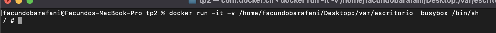

# Trabajo Práctico 2 - Ingenieria de Software III

**1) Instalar Docker Community Edition**

Diferentes opciones para cada sistema operativo
https://docs.docker.com/

Ejecutar el siguiente comando para comprobar versiones de cliente y demonio.

**2- Explorar DockerHub**
Registrase en docker hub: https://hub.docker.com/

Familiarizarse con el portal

**3) Obtener la imagen BusyBox**

Ejecutar el siguiente comando, para bajar una imagen de DockerHub

>`docker pull busybox`

Verificar qué versión y tamaño tiene la imagen bajada, obtener una lista de imágenes locales:

>`docker images`

**4) Ejecutando contenedores**

Ejecutar un contenedor utilizando el comando run de docker:

>`docker run busybox`

Explicar porque no se obtuvo ningún resultado

> Porque el comando `docker run` lo que hace es crear un contenedor a partir de la imagen, y en este caso al no estar pasandole ningun comando no realiza ninguna acción a no ser que la imagen tenga uno por defecto.

Especificamos algún comando a correr dentro del contendor, ejecutar por ejemplo:

>`docker run busybox echo "Hola Mundo"`

Ver los contendores ejecutados utilizando el comando ps:

>`docker ps`

Vemos que no existe nada en ejecución, correr entonces:

>`docker ps -a`

Mostrar el resultado y explicar que se obtuvo como salida del comando anterior.

> Nos ayudamos con el comando `docker ps --help` y nos da lo siguiente:

Es decir que agragando el parametro `-a` muestra todo los contenedores y no solo los que estan corriendo actualmente como hace el comando `docker ps` por defecto.

**5) Ejecutando en modo interactivo**

Ejecutar el siguiente comando

>`docker run -it busybox sh`

Para cada uno de los siguientes comandos dentro de contenedor, mostrar los resultados:

>`ps`

>`uptime`

>`free`

>`ls -l /`

Salimos del contendor con:

>`exit`

**6) Borrando contendores terminados**

Obtener la lista de contendores

>`docker ps -a`

Para borrar podemos utilizar el id o el nombre (autogenerado si no se especifica) de contendor que se desee, por ejemplo:

>`docker rm elated_lalande`

Para borrar todos los contendores que no estén corriendo, ejecutar cualquiera de los siguientes comandos:

>`docker rm $(docker ps -a -q -f status=exited)`

>`docker container prune`

**7) Montando volúmenes**

Hasta este punto los contenedores ejecutados no tenían contacto con el exterior, ellos corrían en su propio entorno hasta que terminaran su ejecución. 

Ahora veremos cómo montar un volumen dentro del contenedor para visualizar por ejemplo archivos del sistema huésped:

Ejecutar el siguiente comando, cambiar myusuario por el usuario que corresponda.

 En linux/Mac puede utilizarse /home/miusuario):

>`docker run -it -v C:\Users\misuario\Desktop:/var/escritorio busybox /bin/sh`

Dentro del contenedor correr

>`ls -l /var/escritorio`

>`touch /var/escritorio/hola.txt`

Verificar que el Archivo se ha creado en el escritorio o en el directorio home según corresponda.

**8) Publicando puertos**

En el caso de aplicaciones web o base de datos donde se interactúa con estas aplicaciones a través de un puerto al cual hay que acceder, estos puertos están visibles solo dentro del contenedor. Si queremos acceder desde el exterior deberemos exponerlos.

Ejecutar la siguiente imagen, en este caso utilizamos la bandera -d (detach) para que nos devuelva el control de la consola:

>`docker run -d daviey/nyan-cat-web`

Si ejecutamos un comando ps:

PS D:\> docker ps

CONTAINER ID        IMAGE                 COMMAND                  CREATED             STATUS              PORTS               NAMES
87d1c5f44809        daviey/nyan-cat-web   "nginx -g 'daemon of…"   2 minutes ago       Up 2 minutes        80/tcp, 443/tcp     compassionate_raman

Vemos que el contendor expone 2 puertos el 80 y el 443, pero si intentamos en un navegador acceder a http://localhost no sucede nada.

Procedemos entonces a parar y remover este contenedor:

>`docker kill compassionate_raman`

>`docker rm compassionate_raman`

Vamos a volver a correrlo otra vez, pero publicando uno de los puertos solamente, el este caso el 80

>`docker run -d -p 80:80 daviey/nyan-cat-web`

Accedamos nuevamente a http://localhost y expliquemos que sucede.

**9) Utilizando una base de datos**

Levantar una base de datos PostgreSQL

>`mkdir $HOME/.postgres`

>`docker run --name my-postgres -e POSTGRES_PASSWORD=mysecretpassword -v $HOME/.postgres:/var/lib/postgresql/data -p 5432:5432 -d postgres:9.4`

Ejecutar sentencias utilizando esta instancia

>`docker exec -it my-postgres /bin/bash`

>`psql -h localhost -U postgres`

#Estos comandos se corren una vez conectados a la base

>`\l
>create database test;
>\connect test
>create table tabla_a (mensaje varchar(50));
>insert into tabla_a (mensaje) values('Hola mundo!');
>select * from tabla_a;
>\q`

exit

Conectarse a la base utilizando alguna IDE (Dbeaver - https://dbeaver.io/, eclipse, IntelliJ, etc...). Interactuar con los objectos objectos creados.

Explicar que se logro con el comando docker run y docker exec ejecutados en este ejercicio.

> Con el comando docker run se pudo generar, y en este caso al no tener la imagen descargarla del motor de base de datos PostgreSQL version 9.4 llamando al contenedor `my_postgres` y asignando como contraseña del motor `mysecretpassword` en el puerto 5432.

> Y luego con el comando `docker exec` ejecutamos dentro del contenedor `/bin/bash` es decir para acceder a la consola de nuestro contenedor para desde ahi ejecutar sentencias de PostgreSQL.