# Trabajo Práctico 3 - Arquitectura de Sistemas Distribuidos - Ingenieria de Software III

**1) Sistema distribuido simple**

Ejecutar el siguiente comando para crear una red en docker

>`docker network create -d bridge mybridge`

Instanciar una base de datos Redis conectada a esa Red.

>`docker run -d --net mybridge --name db redis:alpine`


Levantar una aplicacion web, que utilice esta base de datos

>`docker run -d --net mybridge -e REDIS_HOST=db -e REDIS_PORT=6379 -p 5000:5000 --name web alexisfr/flask-app:latest`

Abrir un navegador y acceder a la URL: http://localhost:5000/

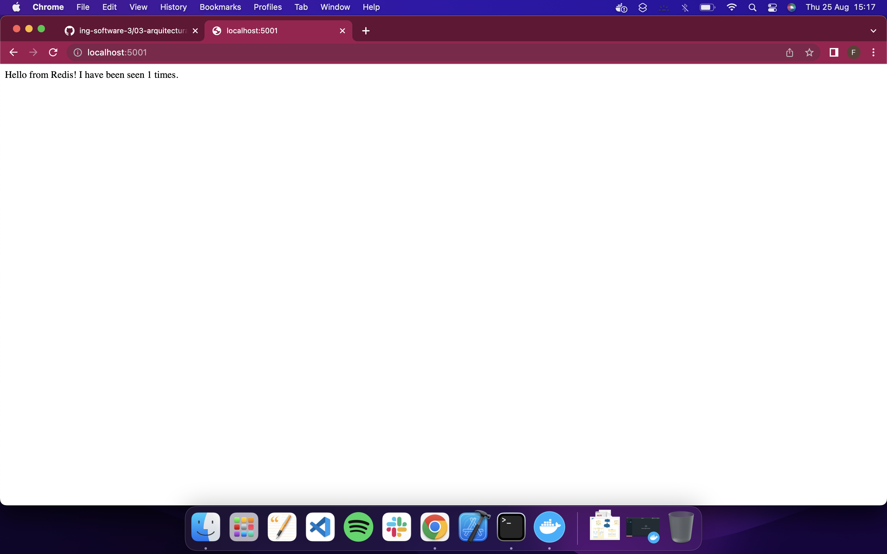

Verificar el estado de los contenedores y redes en Docker, describir:

* ¿Cuáles puertos están abiertos?
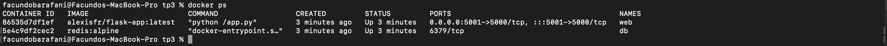
* Mostrar detalles de la red mybridge con Docker.
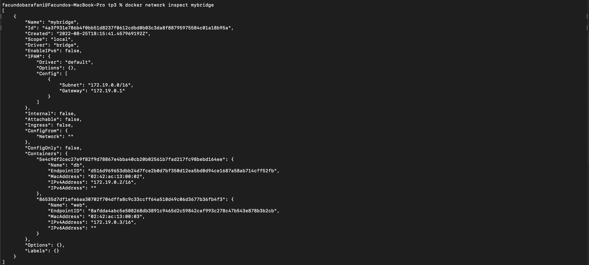
* ¿Qué comandos utilizó?

> `docker ps`

>`docker network inspect mybridge`

> **ACLARACIÓN:** Se cambio el puerto a 5001 ya que macOS por defecto utiliza el puerto 5000 para AirPlay Receiver.

**2) Análisis del sistema**

Siendo el código de la aplicación web el siguiente:

```python
import os
from flask import Flask
from redis import Redis


app = Flask(__name__)
redis = Redis(host=os.environ['REDIS_HOST'], port=os.environ['REDIS_PORT'])
bind_port = int(os.environ['BIND_PORT'])


@app.route('/')
def hello():
    redis.incr('hits')
    total_hits = redis.get('hits').decode()
    return f'Hello from Redis! I have been seen {total_hits} times.'


if __name__ == "__main__":
    app.run(host="0.0.0.0", debug=True, port=bind_port)
```

* Explicar cómo funciona el sistema

> El sistema incrementa en uno el contador de "hits" por cada vez que se ingresa al sitio. Es decir cada vez que hay un hit al endpoint se aumenta el contador. Este valor se toma de la BD en el documento "hits".

* ¿Para qué se sirven y porque están los parámetros -e en el segundo Docker run del ejercicio 1?

> Los parametros `-e` sirven para pasar parametros al entorno que se va a ejecutar.

* ¿Qué pasa si ejecuta docker rm -f web y vuelve a correr docker run -d --net mybridge -e REDIS_HOST=db -e REDIS_PORT=6379 -p 5000:5000 --name web alexisfr/flask-app:latest ?

> El contador de "hits" se resetea


* ¿Qué occure en la página web cuando borro el contenedor de Redis con docker rm -f db?

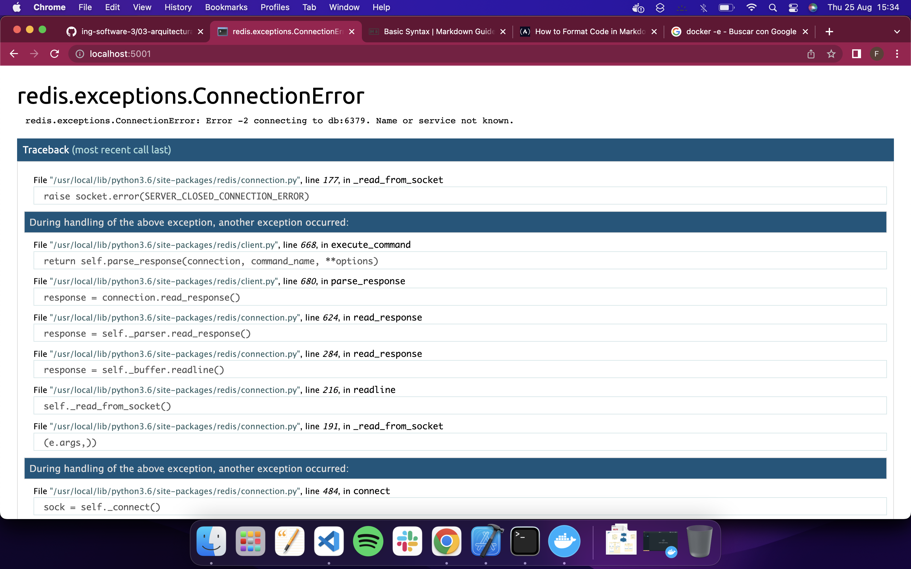

> Ocurre un error ya que al intentar instanciar redis no lo encuentra en el entorno.

* Y si lo levanto nuevamente con docker run -d --net mybridge --name db redis:alpine ?

> Vuelve a andar nuevamente pero con la perdida del contador.

*¿Qué considera usted que haría falta para no perder la cuenta de las visitas?

> Que al incializar levante un backup con el contador de la ultima vez que se inicializo

* Para eliminar los elementos creados corremos:

```bash
docker rm -f db
docker rm -f web
docker network rm mybridge
```

**3) Utilizando docker compose**

Normalmente viene como parte de la solucion cuando se instaló Docker

De ser necesario instalarlo hay que ejecutar:
```
sudo pip install docker-compose
```

Crear el siguente archivo docker-compose.yaml en un directorio de trabajo:

```yaml
version: '3.6'
services:
  app:
    image: alexisfr/flask-app:latest
    depends_on:
      - db
    environment:
      - REDIS_HOST=db
      - REDIS_PORT=6379
    ports:
      - "5001:5000"
  db:
    image: redis:alpine
    volumes:
      - redis_data:/data
volumes:
  redis_data:
```

Ejecutar `docker-compose up -d`

Acceder a la url http://localhost:5000/

Ejecutar `docker ps`, `docker network ls` y `docker volume ls`

¿Qué hizo Docker Compose por nosotros? Explicar con detalle.

> El archivo `.yaml` realizo todos los pasos previos pero unificandolos. Es decir, que levanto la imagen de flask en el el container app, en una segunda instacia definio la variables de entorno de redis en el puerto correspondiente e incluso genero un volumen donde se respalda la información almacenada por redis.

Desde el directorio donde se encuentra el archivo docker-compose.yaml ejecutar:

`docker-compose down`

**4) Aumentando la complejidad, análisis de otro sistema distribuido.**

Este es un sistema compuesto por:

* Una aplicación web de Python que te permite votar entre dos opciones

    * Una cola de Redis que recolecta nuevos votos
    * Un trabajador .NET o Java que consume votos y los almacena en...
        * Una base de datos de Postgres respaldada por un volumen de Docker

        * Una aplicación web Node.js que muestra los resultados de la votación en tiempo real.

Pasos:

1) Clonar el repositorio https://github.com/dockersamples/example-voting-app

2) Abrir una línea de comandos y ejecutar
```bash
cd example-voting-app`

docker-compose -f docker-compose-javaworker.yml up -d
Una vez terminado acceder a http://localhost:5001/ y http://localhost:5002
```

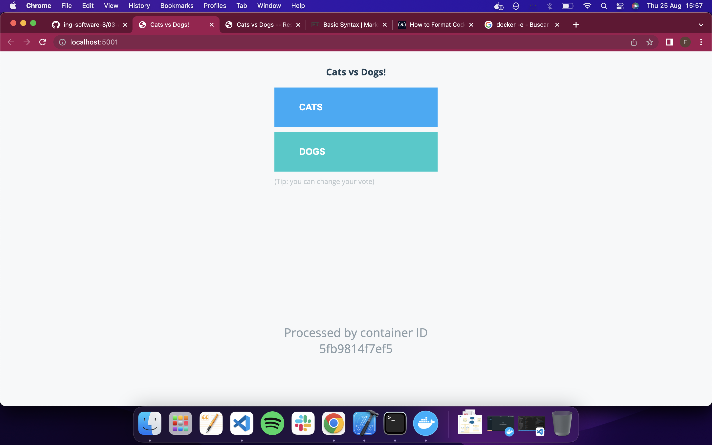

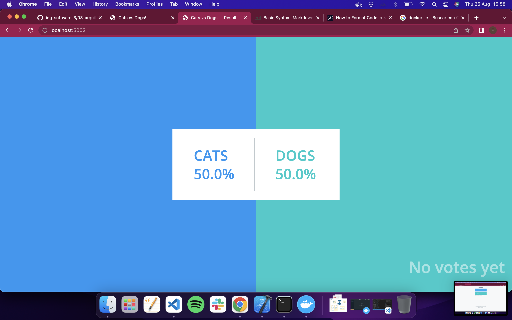

3) Emitir un voto y ver el resultado en tiempo real.

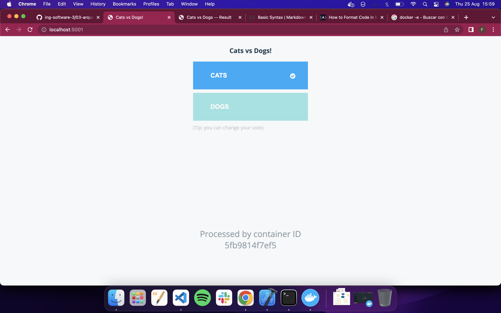

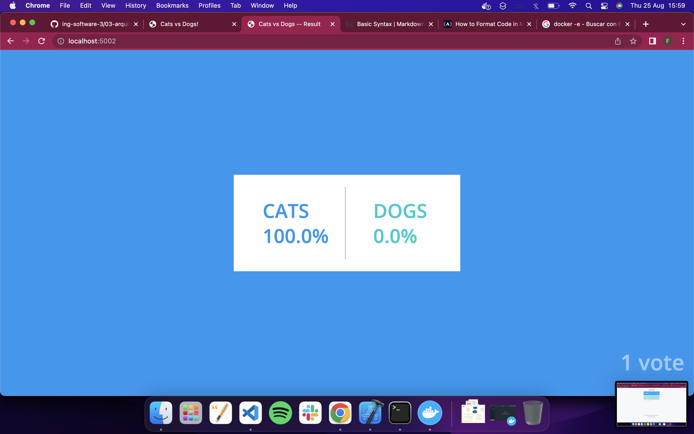

4) Para emitir más votos, abrir varios navegadores diferentes para poder hacerlo

5) Explicar como está configurado el sistema, puertos, volumenes componenetes involucrados, utilizar el Docker compose como guía.

> El docker-compose esta compuesto de 5 contenedores:
* **vote:** Es el encargado de generar la webapp con Python en el puerto 5001, es el webapp que permite al usuario emitir un voto. Que tambien hace uso del volumen en el directorio `/vote/app`

* **result:** Es el encargado de generar la webapp con Python en el puerto 5002, es el webapp que permite al usuario ver los distintos votos emitidos. Que tambien hace uso del volumen en el directorio `/result/app`

Tanto `vote`  como `result`  se encuentran en las networks `front-tier` y `back-tier`.

* **worker:** Es el encargado de correr el Dockerfile ubicado en el directorio `/worker`.

* **redis:** Contenedor a cargo de ejecutar la imagen de redis en el puerto 6379. En la red `back-tier`.

* **db:** Este contenedor levanta la imagen de Postgres 9.4 con el usuario `postgres` y contraseña `postgres`. Este levanta el volumen en el directorio `db-data:/var/lib/postgresql/data`

**5) Análisis detallado**

* Exponer más puertos para ver la configuración de Redis, y las tablas de PostgreSQL con alguna IDE como dbeaver.

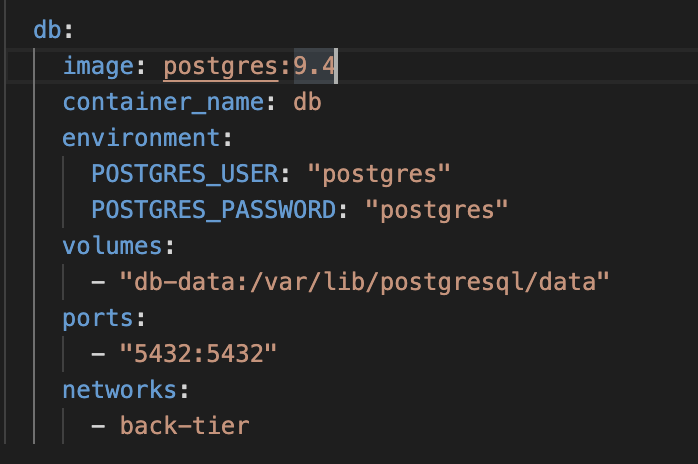

* Revisar el código de la aplicación Python `example-voting-app\vote\app.py` para ver como envía votos a Redis.

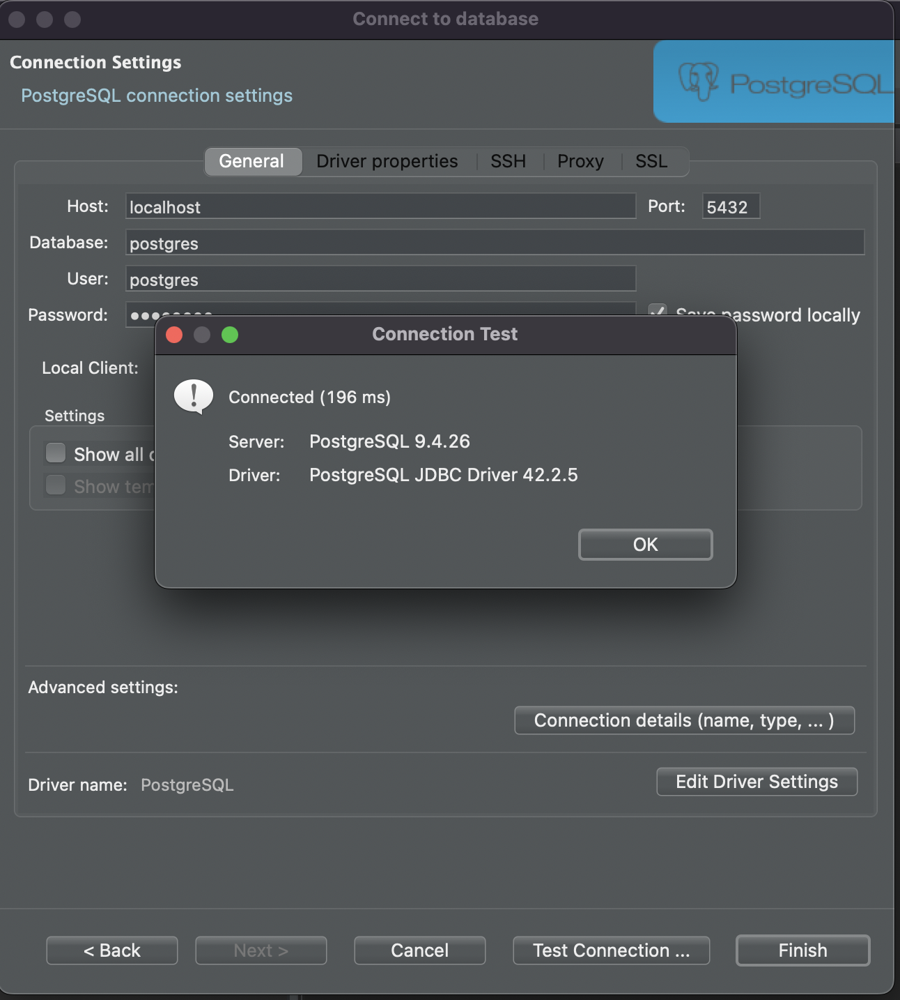

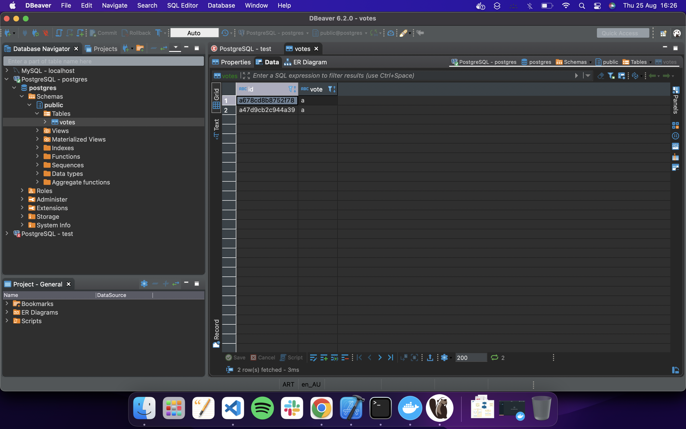

* Revisar el código del worker `example-voting-app\worker\src\main\java\worker\Worker.java` para entender como procesa los datos.

```java
package worker;

import redis.clients.jedis.Jedis;
import redis.clients.jedis.exceptions.JedisConnectionException;
import java.sql.*;
import org.json.JSONObject;

class Worker {
  public static void main(String[] args) {
    try {
      Jedis redis = connectToRedis("redis");
      Connection dbConn = connectToDB("db");

      System.err.println("Watching vote queue");

      while (true) {
        String voteJSON = redis.blpop(0, "votes").get(1);
        JSONObject voteData = new JSONObject(voteJSON);
        String voterID = voteData.getString("voter_id");
        String vote = voteData.getString("vote");

        System.err.printf("Processing vote for '%s' by '%s'\n", vote, voterID);
        updateVote(dbConn, voterID, vote);
      }
    } catch (SQLException e) {
      e.printStackTrace();
      System.exit(1);
    }
  }

  static void updateVote(Connection dbConn, String voterID, String vote) throws SQLException {
    PreparedStatement insert = dbConn.prepareStatement(
      "INSERT INTO votes (id, vote) VALUES (?, ?)");
    insert.setString(1, voterID);
    insert.setString(2, vote);

    try {
      insert.executeUpdate();
    } catch (SQLException e) {
      PreparedStatement update = dbConn.prepareStatement(
        "UPDATE votes SET vote = ? WHERE id = ?");
      update.setString(1, vote);
      update.setString(2, voterID);
      update.executeUpdate();
    }
  }

  static Jedis connectToRedis(String host) {
    Jedis conn = new Jedis(host);

    while (true) {
      try {
        conn.keys("*");
        break;
      } catch (JedisConnectionException e) {
        System.err.println("Waiting for redis");
        sleep(1000);
      }
    }

    System.err.println("Connected to redis");
    return conn;
  }

  static Connection connectToDB(String host) throws SQLException {
    Connection conn = null;

    try {

      Class.forName("org.postgresql.Driver");
      String url = "jdbc:postgresql://" + host + "/postgres";

      while (conn == null) {
        try {
          conn = DriverManager.getConnection(url, "postgres", "postgres");
        } catch (SQLException e) {
          System.err.println("Waiting for db");
          sleep(1000);
        }
      }

      PreparedStatement st = conn.prepareStatement(
        "CREATE TABLE IF NOT EXISTS votes (id VARCHAR(255) NOT NULL UNIQUE, vote VARCHAR(255) NOT NULL)");
      st.executeUpdate();

    } catch (ClassNotFoundException e) {
      e.printStackTrace();
      System.exit(1);
    }

    System.err.println("Connected to db");
    return conn;
  }

  static void sleep(long duration) {
    try {
      Thread.sleep(duration);
    } catch (InterruptedException e) {
      System.exit(1);
    }
  }
}

```

> Realiza la conexión con la base de datos redis haciendo uso del framework `Jedis`. Al tener 
```Java
while (true)
```
> entra en un bucle constante donde se ejecuta lo siguiente: 1. trae los `votes` de la tabla y genera un archivo `.json` con todos los votes y obtiene el `voteID` y el `vote` y los almacena para poder hacer uso en Java e implementar logica.
> 2. Luego llama a `updateVote` el cual basicamente corre la siguiente consulta:
```sql
INSERT INTO votes (id, vote) VALUES (?, ?)
```
> la cual inserta el nuevo voto en la base de datos.

* Revisar el código de la aplicacion que muestra los resultados `example-voting-app\result\server.js` para entender como muestra los valores.

```js
var express = require('express'),
    async = require('async'),
    pg = require('pg'),
    { Pool } = require('pg'),
    path = require('path'),
    cookieParser = require('cookie-parser'),
    bodyParser = require('body-parser'),
    methodOverride = require('method-override'),
    app = express(),
    server = require('http').Server(app),
    io = require('socket.io')(server);

io.set('transports', ['polling']);

var port = process.env.PORT || 4000;

io.sockets.on('connection', function (socket) {

  socket.emit('message', { text : 'Welcome!' });

  socket.on('subscribe', function (data) {
    socket.join(data.channel);
  });
});

var pool = new pg.Pool({
  connectionString: 'postgres://postgres:postgres@db/postgres'
});

async.retry(
  {times: 1000, interval: 1000},
  function(callback) {
    pool.connect(function(err, client, done) {
      if (err) {
        console.error("Waiting for db");
      }
      callback(err, client);
    });
  },
  function(err, client) {
    if (err) {
      return console.error("Giving up");
    }
    console.log("Connected to db");
    getVotes(client);
  }
);

function getVotes(client) {
  client.query('SELECT vote, COUNT(id) AS count FROM votes GROUP BY vote', [], function(err, result) {
    if (err) {
      console.error("Error performing query: " + err);
    } else {
      var votes = collectVotesFromResult(result);
      io.sockets.emit("scores", JSON.stringify(votes));
    }

    setTimeout(function() {getVotes(client) }, 1000);
  });
}

function collectVotesFromResult(result) {
  var votes = {a: 0, b: 0};

  result.rows.forEach(function (row) {
    votes[row.vote] = parseInt(row.count);
  });

  return votes;
}

app.use(cookieParser());
app.use(bodyParser());
app.use(methodOverride('X-HTTP-Method-Override'));
app.use(function(req, res, next) {
  res.header("Access-Control-Allow-Origin", "*");
  res.header("Access-Control-Allow-Headers", "Origin, X-Requested-With, Content-Type, Accept");
  res.header("Access-Control-Allow-Methods", "PUT, GET, POST, DELETE, OPTIONS");
  next();
});

app.use(express.static(__dirname + '/views'));

app.get('/', function (req, res) {
  res.sendFile(path.resolve(__dirname + '/views/index.html'));
});

server.listen(port, function () {
  var port = server.address().port;
  console.log('App running on port ' + port);
});
```
> El codigo levanta la base de datos de Postgres y corre la siguiente sentencia: 

```SQL
SELECT vote, COUNT(id) AS count FROM votes GROUP BY vote
```

donde lo que sucede es que trae el conteo de la cantidad de ids de la tabla votes, basicamente la cantidad de votos que hay y los agrupa por votos y luego son almacenados en la variable `votes` y ahi es `collectVotesFromResult()` el encargado de mostrarlos.

* Escribir un documento de arquitectura sencillo, pero con un nivel de detalle moderado, que incluya algunos diagramas de bloques, de sequencia, etc y descripciones de los distintos componentes involucrados es este sistema y como interactuan entre sí.

> Comenzamos con un diagrama para poder comprender la estructura general del proyecto:

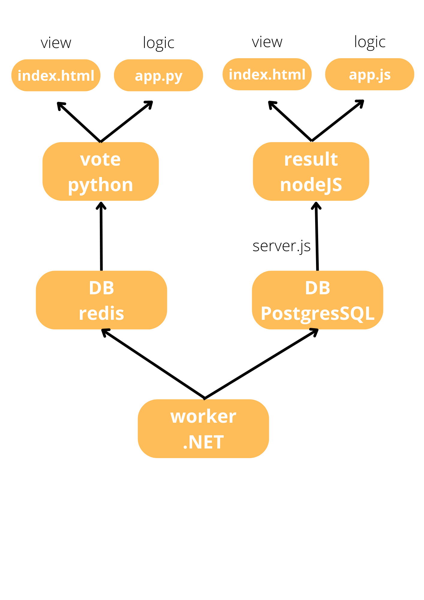

> Consta de un worker desarrollado en .NET el cual es el encargado de "orquestar" a los distintos componentes que componen a la webapp.

> Todo esto es posible gracias al archivo `docker-compose-javaworker.yml` el cual realiza la definición de los distintos puertos, redes gracias a el uso de docker network y tambien hace la definición de los "volumenes" y conexiones a la base de datos tanto para redis y PostgresSQL a partir de contenedores que contienen las imagenes de esos motores de BD.

> A el proyecto lo podemos dividir en dos partes:

> 1) Una sección de votaciones la cual utiliza como base de datos redis y para la lógica de la integración de la misma python, esto se encuentra definido en el archivo `app.py`, y luego en el archivo `index.html` dentro del directorio `/vote` es el encargado de la sección visual de la misma. Esta webapp va a ser la encargada de gestionar la realización de votos dentro de la webapp.

> 2) Finalmente, tenemos una sección de resultados la cual se sostiene en un motor de DB PostgresSQL y nodeJS para la interconexión entre la DB y la webapp. En el caso de la webapp para la vista de resultados la lógica esta integrada en el archivo `app.js` dentro del directorio `/result` y la vista `index.html`.

## Diagrama de secuencia

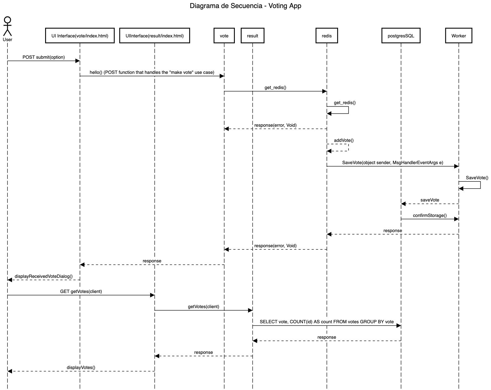

> En resumen el funcionamiento es de la siguiente forma, el usuario al ingresar al `vote` app, lo que se nos muestra en pantalla es el archivo `index.html` que se encuentra en el directorio `/vote`, en caso de realizar un voto se hace una petición la cual es receptada por el archivo `app.py` la cual almacena el registro en la DB redis, la cual es integrada tambien por el `Worker` para ser almacenada en la DB `PostgresSQL` la cual se va a encargar de mostrar los resultados cuando ingresemos a la `result` app.

> Es decir que al ingresar a la `result` app lo que se nos muestra en pantalla graficamente es el archivo `index.html` que se encuentra en el directorio `/result` la cual al ingresar realiza una petición `GET` la cual es manejada por `server.js` la cual va a realizar la consulta a la base de datos `PostgresSQL` la cual va a encargarse de retornar y luego mostrar los resultados en pantalla.