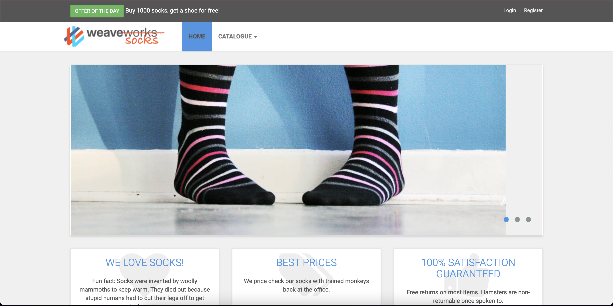
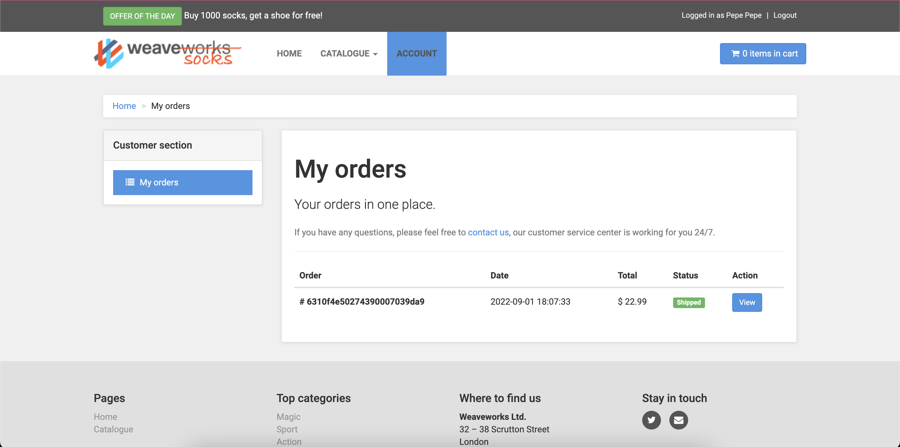

# Trabajo Práctico N4 - Arquitecture de Microservicios
*1) Instanciación del sistema*

* Clonar el repositorio https://github.com/microservices-demo/microservices-demo

```bash
mkdir -p socks-demo
```

```bash
cd socks-demo
```

```bash
git clone https://github.com/microservices-demo/microservices-demo.git
```

* Ejecutar lo siguiente
```bash
cd microservices-demo
```

```bash
docker-compose -f deploy/docker-compose/docker-compose.yml up -d
```

* Una vez terminado el comando docker-compose acceder a http://localhost



* Generar un usuario

* Realizar búsquedas por tipo de media, color, etc.

* Hacer una compra - poner datos falsos de tarjeta de crédito ;)




*2) Investigación de los componentes*

1) Describa los contenedores creados, indicando cuales son los puntos de ingreso del sistema

> Analizando el docker-compose:

```yml
version: '2'

services:
  front-end:
    image: weaveworksdemos/front-end:0.3.12
    hostname: front-end
    restart: always
    cap_drop:
      - all
    read_only: true
  edge-router:
    image: weaveworksdemos/edge-router:0.1.1
    ports:
      - '80:80'
      - '8080:8080'
    cap_drop:
      - all
    cap_add:
      - NET_BIND_SERVICE
      - CHOWN
      - SETGID
      - SETUID
      - DAC_OVERRIDE
    read_only: true
    tmpfs:
      - /var/run:rw,noexec,nosuid
    hostname: edge-router
    restart: always
  catalogue:
    image: weaveworksdemos/catalogue:0.3.5
    hostname: catalogue
    restart: always
    cap_drop:
      - all
    cap_add:
      - NET_BIND_SERVICE
    read_only: true
  catalogue-db:
    image: weaveworksdemos/catalogue-db:0.3.0
    hostname: catalogue-db
    restart: always
    environment:
      - MYSQL_ROOT_PASSWORD=${MYSQL_ROOT_PASSWORD}
      - MYSQL_ALLOW_EMPTY_PASSWORD=true
      - MYSQL_DATABASE=socksdb
  carts:
    image: weaveworksdemos/carts:0.4.8
    hostname: carts
    restart: always
    cap_drop:
      - all
    cap_add:
      - NET_BIND_SERVICE
    read_only: true
    tmpfs:
      - /tmp:rw,noexec,nosuid
    environment:
      - JAVA_OPTS=-Xms64m -Xmx128m -XX:+UseG1GC -Djava.security.egd=file:/dev/urandom -Dspring.zipkin.enabled=false
  carts-db:
    image: mongo:3.4
    hostname: carts-db
    restart: always
    cap_drop:
      - all
    cap_add:
      - CHOWN
      - SETGID
      - SETUID
    read_only: true
    tmpfs:
      - /tmp:rw,noexec,nosuid
  orders:
    image: weaveworksdemos/orders:0.4.7
    hostname: orders
    restart: always
    cap_drop:
      - all
    cap_add:
      - NET_BIND_SERVICE
    read_only: true
    tmpfs:
      - /tmp:rw,noexec,nosuid
    environment:
      - JAVA_OPTS=-Xms64m -Xmx128m -XX:+UseG1GC -Djava.security.egd=file:/dev/urandom -Dspring.zipkin.enabled=false
  orders-db:
    image: mongo:3.4
    hostname: orders-db
    restart: always
    cap_drop:
      - all
    cap_add:
      - CHOWN
      - SETGID
      - SETUID
    read_only: true
    tmpfs:
      - /tmp:rw,noexec,nosuid
  shipping:
    image: weaveworksdemos/shipping:0.4.8
    hostname: shipping
    restart: always
    cap_drop:
      - all
    cap_add:
      - NET_BIND_SERVICE
    read_only: true
    tmpfs:
      - /tmp:rw,noexec,nosuid
    environment:
      - JAVA_OPTS=-Xms64m -Xmx128m -XX:+UseG1GC -Djava.security.egd=file:/dev/urandom -Dspring.zipkin.enabled=false
  queue-master:
    image: weaveworksdemos/queue-master:0.3.1
    hostname: queue-master
    volumes:
      - /var/run/docker.sock:/var/run/docker.sock
    restart: always
    cap_drop:
      - all
    cap_add:
      - NET_BIND_SERVICE
    read_only: true
    tmpfs:
      - /tmp:rw,noexec,nosuid
  rabbitmq:
    image: rabbitmq:3.6.8
    hostname: rabbitmq
    restart: always
    cap_drop:
      - all
    cap_add:
      - CHOWN
      - SETGID
      - SETUID
      - DAC_OVERRIDE
    read_only: true
  payment:
    image: weaveworksdemos/payment:0.4.3
    hostname: payment
    restart: always
    cap_drop:
      - all
    cap_add:
      - NET_BIND_SERVICE
    read_only: true
  user:
    image: weaveworksdemos/user:0.4.4
    hostname: user
    restart: always
    cap_drop:
      - all
    cap_add:
      - NET_BIND_SERVICE
    read_only: true
    environment:
      - MONGO_HOST=user-db:27017
  user-db:
    image: weaveworksdemos/user-db:0.4.0
    hostname: user-db
    restart: always
    cap_drop:
      - all
    cap_add:
      - CHOWN
      - SETGID
      - SETUID
    read_only: true
    tmpfs:
      - /tmp:rw,noexec,nosuid
  user-sim:
    image: weaveworksdemos/load-test:0.1.1
    cap_drop:
      - all
    read_only: true
    hostname: user-simulator
    command: "-d 60 -r 200 -c 2 -h edge-router"
```

> 1) **front-end**: Como lo dice el nombre del contenedor, este es el encargado de levantar el front-end, es decir la interfaz al usuario.
> 2) **edge-router**: Este es el punto de ingreso a la web-app, ya que esta es la que esta vinculada a el puerto `:8080` y `:80`. Es el encargado de manejar las disintas rutas a ser mostradas por el front-end.
> 3) **catalogue**: Servicio de catalogo de la webapp.
> 4) **catalogue-db**: Base de datos a en la cual se sustenta el servicio `catalogue`, el motor utilizado es MySQL.
> 5) **carts**: Servicio de `carro de compras` de la webapp.
> 6) **carts-db**: Base de datos la cual soporta al servicio de carro de compras. La misma utiliza un motor de base de datos MongoDB.
> 7) **orders**: Servicio de ordenes de la webapp.
> 8) **orders-db**: Base de datos que alimenta al servicio de ordenes de la webapp. El motor de DB utilizado en este caso es MongoDB.
> 9) **queue-master**: Encargado de procesar los mensajes de rabbitmq.
> 10) **rabbitmq**: Es un broker de mensajeria multi-protocolo open-source.
> 11) **payment**: Servicio de pagos de la webapp.
> 12) **user**: Servicio encargado de la gestión de los usuarios y sus distintas funcionalidades.
> 13) **user-db**: Base de datos que sustenta a el servicio `user`. La misma utiliza MongoDB.
> 14) **user-sim**: Realizar simulaciones de usuarios.

2) Clonar algunos de los repositorios con el código de las aplicaciones

```bash
cd socks-demo
git clone https://github.com/microservices-demo/front-end.git
git clone https://github.com/microservices-demo/user.git
git clone https://github.com/microservices-demo/edge-router.git
```
3) ¿Por qué cree usted que se está utilizando repositorios separados para el código y/o la configuración del sistema? Explique puntos a favor y en contra.

> A simple vista, al analizar los distintos codigos de las aplicaciones clonadas en el paso anterior se puede observar como utilizan distintas tecnologias, por ejemplo `front-end` utliza Java a la hora de la creacion de las distintas APIs que provee el servicio. En cuanto a `user` este hace uso de Go para este mismo proposito. 

> En mi opinión esto tiene como buen aspecto que al ser atomico esto favorece su mantenimiento, ya que es mas facil de mantener y tambien permite la reutilización de los distintos microservicios para armar diferentes sistemas con la reutilización de estos. Un aspecto negativo es que al utilizar distintas tecnologias puede ser que a la hora de necesitar de capital humano para mantener este código en especificio no requerimos de el conocimiento de una tecnología sino de varias.

> Otro aspecto a favor es que al estar separado en modulos, la manera de encontrar fallas es mas ágil ya que si hay algo que esta fallando podemos saber de manera repentina de que servicio estamos dependiendo. A su vez esto también puede ser desfavorable ya que dependemos de el funcionamiento de multiples contenedores y no de uno solo, es decir, que si alguno de estos falla no estaríamos pudiendo hacer uso del sistema en su totalidad.

4) ¿Cuál contenedor hace las veces de API Gateway?

El contenedor `edge-router`.

5) Cuando ejecuto este comando:
```bash
curl http://localhost/customers
```
```json
{"_embedded":{"customer":[{"firstName":"Eve","lastName":"Berger","username":"Eve_Berger","id":"57a98d98e4b00679b4a830af","_links":{"addresses":{"href":"http://user/customers/57a98d98e4b00679b4a830af/addresses"},"cards":{"href":"http://user/customers/57a98d98e4b00679b4a830af/cards"},"customer":{"href":"http://user/customers/57a98d98e4b00679b4a830af"},"self":{"href":"http://user/customers/57a98d98e4b00679b4a830af"}}},{"firstName":"User","lastName":"Name","username":"user","id":"57a98d98e4b00679b4a830b2","_links":{"addresses":{"href":"http://user/customers/57a98d98e4b00679b4a830b2/addresses"},"cards":{"href":"http://user/customers/57a98d98e4b00679b4a830b2/cards"},"customer":{"href":"http://user/customers/57a98d98e4b00679b4a830b2"},"self":{"href":"http://user/customers/57a98d98e4b00679b4a830b2"}}},{"firstName":"User1","lastName":"Name1","username":"user1","id":"57a98d98e4b00679b4a830b5","_links":{"addresses":{"href":"http://user/customers/57a98d98e4b00679b4a830b5/addresses"},"cards":{"href":"http://user/customers/57a98d98e4b00679b4a830b5/cards"},"customer":{"href":"http://user/customers/57a98d98e4b00679b4a830b5"},"self":{"href":"http://user/customers/57a98d98e4b00679b4a830b5"}}},{"firstName":"Pepe","lastName":"Pepe","username":"pepe","id":"6310f490ee11cb0001e048c8","_links":{"addresses":{"href":"http://user/customers/6310f490ee11cb0001e048c8/addresses"},"cards":{"href":"http://user/customers/6310f490ee11cb0001e048c8/cards"},"customer":{"href":"http://user/customers/6310f490ee11cb0001e048c8"},"self":{"href":"http://user/customers/6310f490ee11cb0001e048c8"}}}]}}
```


6) ¿Cuál de todos los servicios está procesando la operación?

> El servicio **user**, lo mismo se puede observar en `/user/api/endpoints.go`:

```go
 // MakeUserGetEndpoint returns an endpoint via the given service.
func MakeUserGetEndpoint(s Service) endpoint.Endpoint {
	return func(ctx context.Context, request interface{}) (response interface{}, err error) {
		var span stdopentracing.Span
		span, ctx = stdopentracing.StartSpanFromContext(ctx, "get users")
		span.SetTag("service", "user")
		defer span.Finish()

		req := request.(GetRequest)

		userspan := stdopentracing.StartSpan("users from db", stdopentracing.ChildOf(span.Context()))
		usrs, err := s.GetUsers(req.ID)
		userspan.Finish()
		if req.ID == "" {
			return EmbedStruct{usersResponse{Users: usrs}}, err
		}
		if len(usrs) == 0 {
			if req.Attr == "addresses" {
				return EmbedStruct{addressesResponse{Addresses: make([]users.Address, 0)}}, err
			}
			if req.Attr == "cards" {
				return EmbedStruct{cardsResponse{Cards: make([]users.Card, 0)}}, err
			}
			return users.User{}, err
		}
		user := usrs[0]
		attrspan := stdopentracing.StartSpan("attributes from db", stdopentracing.ChildOf(span.Context()))
		db.GetUserAttributes(&user)
		attrspan.Finish()
		if req.Attr == "addresses" {
			return EmbedStruct{addressesResponse{Addresses: user.Addresses}}, err
		}
		if req.Attr == "cards" {
			return EmbedStruct{cardsResponse{Cards: user.Cards}}, err
		}
		return user, err
	}
}
```

7) ¿Y para los siguientes casos?
```bash
curl http://localhost/catalogue
curl http://localhost/tags
```

> En el caso de `curl http://localhost/catalogue`:

```json
[{"id":"03fef6ac-1896-4ce8-bd69-b798f85c6e0b","name":"Holy","description":"Socks fit for a Messiah. You too can experience walking in water with these special edition beauties. Each hole is lovingly proggled to leave smooth edges. The only sock approved by a higher power.","imageUrl":["/catalogue/images/holy_1.jpeg","/catalogue/images/holy_2.jpeg"],"price":99.99,"count":1,"tag":["action","magic"]},{"id":"3395a43e-2d88-40de-b95f-e00e1502085b","name":"Colourful","description":"proident occaecat irure et excepteur labore minim nisi amet irure","imageUrl":["/catalogue/images/colourful_socks.jpg","/catalogue/images/colourful_socks.jpg"],"price":18,"count":438,"tag":["brown","blue"]},{"id":"510a0d7e-8e83-4193-b483-e27e09ddc34d","name":"SuperSport XL","description":"Ready for action. Engineers: be ready to smash that next bug! Be ready, with these super-action-sport-masterpieces. This particular engineer was chased away from the office with a stick.","imageUrl":["/catalogue/images/puma_1.jpeg","/catalogue/images/puma_2.jpeg"],"price":15,"count":820,"tag":["sport","formal","black"]},{"id":"808a2de1-1aaa-4c25-a9b9-6612e8f29a38","name":"Crossed","description":"A mature sock, crossed, with an air of nonchalance.","imageUrl":["/catalogue/images/cross_1.jpeg","/catalogue/images/cross_2.jpeg"],"price":17.32,"count":738,"tag":["blue","action","red","formal"]},{"id":"819e1fbf-8b7e-4f6d-811f-693534916a8b","name":"Figueroa","description":"enim officia aliqua excepteur esse deserunt quis aliquip nostrud anim","imageUrl":["/catalogue/images/WAT.jpg","/catalogue/images/WAT2.jpg"],"price":14,"count":808,"tag":["green","formal","blue"]},{"id":"837ab141-399e-4c1f-9abc-bace40296bac","name":"Cat socks","description":"consequat amet cupidatat minim laborum tempor elit ex consequat in","imageUrl":["/catalogue/images/catsocks.jpg","/catalogue/images/catsocks2.jpg"],"price":15,"count":175,"tag":["brown","formal","green"]},{"id":"a0a4f044-b040-410d-8ead-4de0446aec7e","name":"Nerd leg","description":"For all those leg lovers out there. A perfect example of a swivel chair trained calf. Meticulously trained on a diet of sitting and Pina Coladas. Phwarr...","imageUrl":["/catalogue/images/bit_of_leg_1.jpeg","/catalogue/images/bit_of_leg_2.jpeg"],"price":7.99,"count":115,"tag":["blue","skin"]},{"id":"d3588630-ad8e-49df-bbd7-3167f7efb246","name":"YouTube.sock","description":"We were not paid to sell this sock. It's just a bit geeky.","imageUrl":["/catalogue/images/youtube_1.jpeg","/catalogue/images/youtube_2.jpeg"],"price":10.99,"count":801,"tag":["formal","geek"]},{"id":"zzz4f044-b040-410d-8ead-4de0446aec7e","name":"Classic","description":"Keep it simple.","imageUrl":["/catalogue/images/classic.jpg","/catalogue/images/classic2.jpg"],"price":12,"count":127,"tag":["brown","green"]}]
```

> De este se encarga el servicio `catalogue`.

> Se puede observar aca que al hacer un `GET` a `/catalogue` estamos llamando a `MakeListEndPoint`.

```go
// MakeEndpoints returns an Endpoints structure, where each endpoint is
// backed by the given service.
func MakeEndpoints(s Service, tracer stdopentracing.Tracer) Endpoints {
	return Endpoints{
		ListEndpoint:   opentracing.TraceServer(tracer, "GET /catalogue")(MakeListEndpoint(s)),
		CountEndpoint:  opentracing.TraceServer(tracer, "GET /catalogue/size")(MakeCountEndpoint(s)),
		GetEndpoint:    opentracing.TraceServer(tracer, "GET /catalogue/{id}")(MakeGetEndpoint(s)),
		TagsEndpoint:   opentracing.TraceServer(tracer, "GET /tags")(MakeTagsEndpoint(s)),
		HealthEndpoint: opentracing.TraceServer(tracer, "GET /health")(MakeHealthEndpoint(s)),
	}
}
```

> En el caso de `tags`, tambien estamos haciendo uso del servicio `catalogue` como se puede observar en el código de arriba `MakeTagsEndpoint`.

8) ¿Como perisisten los datos los servicios?

> Analizando el `docker-compose` contamos con que los servicios contan con otro contenedor `-db` los cuales se encargan de la persistencia de los datos. Los mismos son:

| Servicio      | Persistencia |
| ----------- | ----------- |
| catalogue | catalogue-db: MySQL |
| carts  | carts-db: MongoDB |
| orders | orders-db: MongoDB |
| user   | user-db: MongoDB |

9) ¿Cuál es el componente encargado del procesamiento de la cola de mensajes?

> El contenedor `queue-master`.

10) ¿Qué tipo de interfaz utilizan estos microservicios para comunicarse?

> `API-REST`