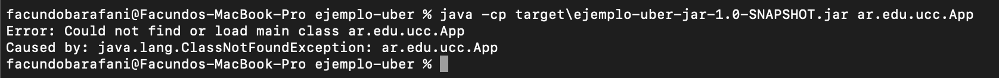

# Trabajo Práctico 5 - Herramientas de construcción de software

#### 1- Instalar Java JDK si no dispone del mismo. 
  - Java 8 es suficiente, pero puede utilizar cualquier versión.
  - Utilizar el instalador que corresponda a su sistema operativo 
  - http://www.oracle.com/technetwork/java/javase/downloads/jdk8-downloads-2133151.html
  - Agregar la variable de entorno JAVA_HOME
    - En Windows temporalmente se puede configurar
    ```bash
      SET JAVA_HOME=C:\Program Files\Java\jdk1.8.0_221
    ```
    - O permanentemente entrando a **Variables de Entorno** (Winkey + Pausa -> Opciones Avanzadas de Sistema -> Variables de Entorno)
  - Otros sistemas operativos:
    - https://www3.ntu.edu.sg/home/ehchua/programming/howto/JDK_Howto.html
    - https://www.digitalocean.com/community/tutorials/how-to-install-java-with-apt-on-ubuntu-18-04


#### 2- Instalar Maven
- Instalar maven desde https://maven.apache.org/download.cgi (última versión disponible 3.6.1)
- Descomprimir en una carpeta, por ejemplo C:\tools
- Agregar el siguiente directorio a la variable de entorno PATH, asumiendo que los binarios de ant están en C:\tools\apache-maven-3.6.1\bin

  ```bash   
    SET PATH=%PATH%;C:\tools\apache-maven-3.6.1\bin
  ```  
- Se puede modificar permanentemente la variable PATH entrando a (Winkey + Pausa -> Opciones Avanzadas de Sistema -> Variables de Entorno)
- En Linux/Mac se puede agregar la siguiente entrada al archivo ~/.bash_profile

  ```bash
  export PATH=/opt/apache-maven-3.6.1/bin:$PATH
  ```

#### 3- Introducción a Maven
- Qué es Maven?
>  Como lo dice el sitio `https://maven.apache.org/` es una herramienta de software para el manejo y comprehension de proyectos. Este esta basado en el concepto de un modelo de objeto de proyecto (Project Object Model), Maven puede manejar los "builds" del proyecto, reporte y documentacion desde una pieza central de información.
- Qué es el archivo POM?
> POM o modelo objeto de proyecto es una unidad fundamental de trabajo en Maven. Este es un archivo XML que contiene información acerca del proyecto y los detalles de configuración que utiliza Maven para "buildear" el proyecto. Contiene valores por defecto para la mayoría de proyectos.

    1. modelVersion
 > Hace referencia a la versión del "descriptor" del proyecto. Por ejemplo, versión 4.0 hace referencia a que requiere mínimo una v3 de Maven.
    
    2. groupId
> Un nombre base unico de la compañia o grupo que haya creado el proyecto.

    3. artifactId
> Nombre único del proyecto.

    4. versionId
> Indica la versión del proyecto.

- Repositorios Local, Central y Remotos http://maven.apache.org/guides/introduction/introduction-to-repositories.html
- Entender Ciclos de vida de build
  - default
  - clean
  - site
  - Referencia: http://maven.apache.org/guides/introduction/introduction-to-the-lifecycle.html#Build_Lifecycle_Basics
- Comprender las fases de un ciclo de vida, por ejemplo, default:

| Fase de build | Descripción                                                                                                                            |
|---------------|----------------------------------------------------------------------------------------------------------------------------------------|
| validate      | valida si el proyecto está correcto y toda la información está disponible                                                             |
| compile       | compila el código fuente del proyecto                                                                                 |
| test          | prueba el código fuente compilado utilizando un marco de prueba de unidad adecuado. Estas pruebas no deberían requerir que el código se empaquete o implemente |
| package       | toma el código compilado y lo empaqueta en su formato distribuible, como un JAR.                                                     |
| verify        | ejecuta cualquier verificación de los resultados de las pruebas de integración para garantizar que se cumplan los criterios de calidad                                                      |
| install       | instal1 el paquete en el repositorio local, para usarlo como dependencia en otros proyectos localmente                                       |
| deploy        | hecho en el entorno de compilación, copia el paquete final en el repositorio remoto para compartirlo con otros desarrolladores y proyectos.      |

- Copiar el siguiente contenido a un archivo, por ejemplo ./trabajo-practico-02/maven/vacio/pom.xml

```xml
<project xmlns="http://maven.apache.org/POM/4.0.0"
         xmlns:xsi="http://www.w3.org/2001/XMLSchema-instance"
         xsi:schemaLocation="http://maven.apache.org/POM/4.0.0
                      http://maven.apache.org/xsd/maven-4.0.0.xsd">
    <modelVersion>4.0.0</modelVersion>

    <groupId>ar.edu.ucc</groupId>
    <artifactId>proyecto-01</artifactId>
    <version>0.1-SNAPSHOT</version>
</project>
```

- Ejecutar el siguiente comando en el directorio donde se encuentra el archivo pom.xml
```
mvn clean install
```

- Sacar conclusiones del resultado

#### 4- Maven Continuación

- Generar un proyecto con una estructura inicial:

```bash
mvn archetype:generate -DgroupId=ar.edu.ucc -DartifactId=ejemplo -DarchetypeArtifactId=maven-archetype-quickstart -DinteractiveMode=false
```

- Analizar la estructura de directorios generada:

```
.
└── ejemplo
    ├── pom.xml
    └── src
        ├── main
        │   └── java
        │       └── ar
        │           └── edu
        │               └── ucc
        │                   └── App.java
        └── test
            └── java
                └── ar
                    └── edu
                        └── ucc
                            └── AppTest.java

12 directories, 3 files
```

- Compilar el proyecto

```bash
mvn clean package
```
> Al intentar compilar surgio el siguiente error:


> El mismo se solucionó agregando al archivo `pom.xml` lo siguiente: 

```xml
<properties> 
<maven.compiler.source>1.8</maven.compiler.source>
<maven.compiler.target>1.8</maven.compiler.target>
</properties>
```


- Analizar la salida del comando anterior y luego ejecutar el programa

> El compilar genera la clase App.js y distintos archivos dentro del directorio `target`. A su vez instala la dependencia `surefire`.

```
java -cp target/ejemplo-1.0-SNAPSHOT.jar ar.edu.ucc.App
```


#### 6- Manejo de dependencias

- Crear un nuevo proyecto con artifactId **ejemplo-uber-jar**

- Modificar el código de App.java para agregar utilizar una librería de logging:

```java
package ar.edu.ucc;

import org.slf4j.Logger;
import org.slf4j.LoggerFactory;

/**
 * Hello world!
 *
 */
public class App 
{
    public static void main( String[] args )
    {
        Logger log = LoggerFactory.getLogger(App.class);
        log.info("Hola Mundo!");
    }
}
```

- Compilar el código e identificar el problema.


> El programa no compila ya que no detecta la libreria que se esta intentando importar `org.slf4j` ya que no esta agregado como dependencia en el archivo `pom.xml`.

- Agregar la dependencia necesaria al pom.xml

```xml
    <dependency>
      <groupId>ch.qos.logback</groupId>
      <artifactId>logback-classic</artifactId>
      <version>1.2.1</version>
    </dependency>
```
```xml
<project xmlns="http://maven.apache.org/POM/4.0.0" xmlns:xsi="http://www.w3.org/2001/XMLSchema-instance"
  xsi:schemaLocation="http://maven.apache.org/POM/4.0.0 http://maven.apache.org/maven-v4_0_0.xsd">
  <modelVersion>4.0.0</modelVersion>
  <groupId>ar.edu.ucc</groupId>
  <artifactId>ejemplo</artifactId>
  <packaging>jar</packaging>
  <version>1.0-SNAPSHOT</version>
  <name>ejemplo</name>
  <url>http://maven.apache.org</url>
  <dependencies>
    <dependency>
      <groupId>junit</groupId>
      <artifactId>junit</artifactId>
      <version>3.8.1</version>
      <scope>test</scope>
    </dependency>
    <dependency>
      <groupId>ch.qos.logback</groupId>
      <artifactId>logback-classic</artifactId>
      <version>1.2.1</version>
    </dependency>
  </dependencies>
  <properties> 
   <maven.compiler.source>1.8</maven.compiler.source>
   <maven.compiler.target>1.8</maven.compiler.target>
  </properties>
</project>
```
- Verificar si se genera el archivo jar y ejecutarlo

```bash
java -cp target\ejemplo-uber-jar-1.0-SNAPSHOT.jar ar.edu.ucc.App
```



- Sacar conclusiones y analizar posibles soluciones

> Al intentar ejecutar lo que sucede es que no encuentra la clase, la solución de abajo esta ligada a la libreria Logger, la cual debe estar definiendo donde se encuentran los archivos de la libreria para que la misma funciona.

- Ahora, ejecutar la clase con el siguiente comando (en windows reemplazar `$HOME` por `%USERPROFILE%`, y separar por `;` en lugar de `:`)
```bash
 java -cp target/ejemplo-uber-jar-1.0-SNAPSHOT.jar:$HOME/.m2/repository/org/slf4j/slf4j-api/1.7.22/slf4j-api-1.7.22.jar:$HOME/.m2/repository/ch/qos/logback/logback-classic/1.2.1/logback-classic-1.2.1.jar:$HOME/.m2/repository/ch/qos/logback/logback-core/1.2.1/logback-core-1.2.1.jar ar.edu.ucc.App
```

- Verificar que ahora resueltos los classpath la aplicación muestra el mensaje correcto


- Implementar la opción de uber-jar: https://maven.apache.org/plugins/maven-shade-plugin/

```xml
  <build>
    <plugins>
      <plugin>
        <groupId>org.apache.maven.plugins</groupId>
        <artifactId>maven-shade-plugin</artifactId>
        <version>2.0</version>
        <executions>
          <execution>
            <phase>package</phase>
            <goals>
              <goal>shade</goal>
            </goals>
            <configuration>
              <finalName>${project.artifactId}</finalName>
              <transformers>
                <transformer implementation="org.apache.maven.plugins.shade.resource.ManifestResourceTransformer">
                  <mainClass>ar.edu.ucc.App</mainClass>
                </transformer>
              </transformers>
              <minimizeJar>false</minimizeJar>
            </configuration>
          </execution>
        </executions>
      </plugin>
    </plugins>
  </build>
```
- Volver a generar la salida y probar ejecutando

```bash
java -jar target\ejemplo-uber-jar.jar
```
> Primero añadimos el uber-jar como lo indica la documentación:


> Al ejecutar el comando en un principio no dejaba acceder al archivo `.jar`, pero accediendo al directorio donde se encontraba el archivo `.jar` funciono:


#### 7- Utilizar una IDE
  - Importar el proyecto anterior en Eclipse o Intellij como maven project:
    - Si no dispone de Eclipse puede obtenerlo desde este link http://www.eclipse.org/downloads/packages/release/2018-09/r/eclipse-ide-java-ee-developers
    - Para importar, ir al menú Archivo -> Importar -> Maven -> Proyecto Maven Existente:

    - Seleccionar el directorio donde se encuentra el pom.xml que se generó en el punto anterior. Luego continuar:


  - Familiarizarse con la interfaz grafica
    - Ejecutar la aplicación
    - Depurar la aplicación
    - Correr unit tests y coverage
    - Ejecutar los goals de maven
    - Encontrar donde se puede cambiar la configuración de Maven.
    - etc.


#### 8- Ejemplo con nodejs

- Instalar Nodejs: https://nodejs.org/en/


- Crear una nueva aplicación
```bash
npx create-react-app my-app
```

```bash
facundobarafani@Facundos-MacBook-Pro node % npx create-react-app my-app
npx: installed 67 in 12.922s

Creating a new React app in /Users/facundobarafani/Desktop/UCC/Sistemas IV/Segundo Semestre/Inge de SW 3/Practico/inge_sw3/tp5/node/my-app.

Installing packages. This might take a couple of minutes.
Installing react, react-dom, and react-scripts with cra-template...


> core-js@3.25.1 postinstall /Users/facundobarafani/Desktop/UCC/Sistemas IV/Segundo Semestre/Inge de SW 3/Practico/inge_sw3/tp5/node/my-app/node_modules/core-js
> node -e "try{require('./postinstall')}catch(e){}"


> core-js-pure@3.25.1 postinstall /Users/facundobarafani/Desktop/UCC/Sistemas IV/Segundo Semestre/Inge de SW 3/Practico/inge_sw3/tp5/node/my-app/node_modules/core-js-pure
> node -e "try{require('./postinstall')}catch(e){}"

+ cra-template@1.2.0
+ react@18.2.0
+ react-scripts@5.0.1
+ react-dom@18.2.0
added 1404 packages from 628 contributors in 222.86s

209 packages are looking for funding
  run `npm fund` for details


Installing template dependencies using npm...
npm WARN @apideck/better-ajv-errors@0.3.6 requires a peer of ajv@>=8 but none is installed. You must install peer dependencies yourself.
npm WARN fork-ts-checker-webpack-plugin@6.5.2 requires a peer of typescript@>= 2.7 but none is installed. You must install peer dependencies yourself.
npm WARN tsutils@3.21.0 requires a peer of typescript@>=2.8.0 || >= 3.2.0-dev || >= 3.3.0-dev || >= 3.4.0-dev || >= 3.5.0-dev || >= 3.6.0-dev || >= 3.6.0-beta || >= 3.7.0-dev || >= 3.7.0-beta but none is installed. You must install peer dependencies yourself.

+ @testing-library/user-event@13.5.0
+ web-vitals@2.1.4
+ @testing-library/jest-dom@5.16.5
+ @testing-library/react@13.4.0
added 56 packages from 80 contributors in 15.638s

209 packages are looking for funding
  run `npm fund` for details

Removing template package using npm...

npm WARN @apideck/better-ajv-errors@0.3.6 requires a peer of ajv@>=8 but none is installed. You must install peer dependencies yourself.
npm WARN fork-ts-checker-webpack-plugin@6.5.2 requires a peer of typescript@>= 2.7 but none is installed. You must install peer dependencies yourself.
npm WARN tsutils@3.21.0 requires a peer of typescript@>=2.8.0 || >= 3.2.0-dev || >= 3.3.0-dev || >= 3.4.0-dev || >= 3.5.0-dev || >= 3.6.0-dev || >= 3.6.0-beta || >= 3.7.0-dev || >= 3.7.0-beta but none is installed. You must install peer dependencies yourself.

removed 1 package and audited 1459 packages in 5.761s

209 packages are looking for funding
  run `npm fund` for details

found 1 high severity vulnerability
  run `npm audit fix` to fix them, or `npm audit` for details

Success! Created my-app at /Users/facundobarafani/Desktop/UCC/Sistemas IV/Segundo Semestre/Inge de SW 3/Practico/inge_sw3/tp5/node/my-app
Inside that directory, you can run several commands:

  npm start
    Starts the development server.

  npm run build
    Bundles the app into static files for production.

  npm test
    Starts the test runner.

  npm run eject
    Removes this tool and copies build dependencies, configuration files
    and scripts into the app directory. If you do this, you can’t go back!

We suggest that you begin by typing:

  cd my-app
  npm start

Happy hacking!
facundobarafani@
```

- Ejecutar la aplicación
```bash
cd my-app
npm start
```

- La aplicación web estará disponible en http://localhost:3000


- Analizar el manejo de paquetes y dependencias realizado por npm.

> El manejo de paquetes lo podemos encontrar en el directorio `package.json` donde en la sección `dependencies` podemos ver las dependencia que tiene este proyecto:

```json
"dependencies": {
    "@testing-library/jest-dom": "^5.16.5",
    "@testing-library/react": "^13.4.0",
    "@testing-library/user-event": "^13.5.0",
    "react": "^18.2.0",
    "react-dom": "^18.2.0",
    "react-scripts": "5.0.1",
    "web-vitals": "^2.1.4"
  }
```

> - `jest-dom`: Libreria que provee de componentes DOM (Data Object Modelling) para realizar pruebas.
> - `react`: Framework para la facilitación de la creación de aplicaciones reactivas de una sola pagina.
> - `react-dom`: proporciona métodos específicos del DOM que pueden ser utilizados en el nivel más alto de tu aplicación como una alternativa a React.
> - `react-scripts`: incluye configuraciones y scripts para la realización de la app por default de React "Create App React".
> - `web-vitals`: iniciativa de Google para proporcionar una guía unificada de indicadores de calidad.


#### 9- Ejemplo con python
- Instalar dependencias (Ejemplo Ubuntu) varía según el OS:
```
sudo apt install build-essential python3-dev
pip3 install cookiecutter
```

```bash
facundobarafani@Facundos-MacBook-Pro python % pip3 install cookiecutter
DEPRECATION: Configuring installation scheme with distutils config files is deprecated and will no longer work in the near future. If you are using a Homebrew or Linuxbrew Python, please see discussion at https://github.com/Homebrew/homebrew-core/issues/76621
Collecting cookiecutter
  Downloading cookiecutter-2.1.1-py2.py3-none-any.whl (36 kB)
Requirement already satisfied: requests>=2.23.0 in /usr/local/lib/python3.9/site-packages (from cookiecutter) (2.27.1)
Collecting jinja2-time>=0.2.0
  Downloading jinja2_time-0.2.0-py2.py3-none-any.whl (6.4 kB)
Collecting python-slugify>=4.0.0
  Downloading python_slugify-6.1.2-py2.py3-none-any.whl (9.4 kB)
Collecting binaryornot>=0.4.4
  Downloading binaryornot-0.4.4-py2.py3-none-any.whl (9.0 kB)
Collecting pyyaml>=5.3.1
  Downloading PyYAML-6.0-cp39-cp39-macosx_10_9_x86_64.whl (197 kB)
     ━━━━━━━━━━━━━━━━━━━━━━━━━━━━━━━━━━━━━━━ 197.6/197.6 kB 1.1 MB/s eta 0:00:00
Collecting Jinja2<4.0.0,>=2.7
  Downloading Jinja2-3.1.2-py3-none-any.whl (133 kB)
     ━━━━━━━━━━━━━━━━━━━━━━━━━━━━━━━━━━━━━━━ 133.1/133.1 kB 1.0 MB/s eta 0:00:00
Collecting click<9.0.0,>=7.0
  Downloading click-8.1.3-py3-none-any.whl (96 kB)
     ━━━━━━━━━━━━━━━━━━━━━━━━━━━━━━━━━━━━━━━ 96.6/96.6 kB 792.1 kB/s eta 0:00:00
Collecting chardet>=3.0.2
  Downloading chardet-5.0.0-py3-none-any.whl (193 kB)
     ━━━━━━━━━━━━━━━━━━━━━━━━━━━━━━━━━━━━━ 193.6/193.6 kB 916.0 kB/s eta 0:00:00
Collecting MarkupSafe>=2.0
  Downloading MarkupSafe-2.1.1-cp39-cp39-macosx_10_9_x86_64.whl (13 kB)
Collecting arrow
  Downloading arrow-1.2.3-py3-none-any.whl (66 kB)
     ━━━━━━━━━━━━━━━━━━━━━━━━━━━━━━━━━━━━━━━ 66.4/66.4 kB 947.3 kB/s eta 0:00:00
Collecting text-unidecode>=1.3
  Downloading text_unidecode-1.3-py2.py3-none-any.whl (78 kB)
     ━━━━━━━━━━━━━━━━━━━━━━━━━━━━━━━━━━━━━━━ 78.2/78.2 kB 836.9 kB/s eta 0:00:00
Requirement already satisfied: certifi>=2017.4.17 in /usr/local/lib/python3.9/site-packages (from requests>=2.23.0->cookiecutter) (2022.5.18.1)
Requirement already satisfied: charset-normalizer~=2.0.0 in /usr/local/lib/python3.9/site-packages (from requests>=2.23.0->cookiecutter) (2.0.12)
Requirement already satisfied: idna<4,>=2.5 in /usr/local/lib/python3.9/site-packages (from requests>=2.23.0->cookiecutter) (3.3)
Requirement already satisfied: urllib3<1.27,>=1.21.1 in /usr/local/lib/python3.9/site-packages (from requests>=2.23.0->cookiecutter) (1.26.9)
Collecting python-dateutil>=2.7.0
  Downloading python_dateutil-2.8.2-py2.py3-none-any.whl (247 kB)
     ━━━━━━━━━━━━━━━━━━━━━━━━━━━━━━━━━━━━━━━ 247.7/247.7 kB 1.0 MB/s eta 0:00:00
Collecting six>=1.5
  Downloading six-1.16.0-py2.py3-none-any.whl (11 kB)
Installing collected packages: text-unidecode, six, pyyaml, python-slugify, MarkupSafe, click, chardet, python-dateutil, Jinja2, binaryornot, arrow, jinja2-time, cookiecutter
  DEPRECATION: Configuring installation scheme with distutils config files is deprecated and will no longer work in the near future. If you are using a Homebrew or Linuxbrew Python, please see discussion at https://github.com/Homebrew/homebrew-core/issues/76621
  DEPRECATION: Configuring installation scheme with distutils config files is deprecated and will no longer work in the near future. If you are using a Homebrew or Linuxbrew Python, please see discussion at https://github.com/Homebrew/homebrew-core/issues/76621
  DEPRECATION: Configuring installation scheme with distutils config files is deprecated and will no longer work in the near future. If you are using a Homebrew or Linuxbrew Python, please see discussion at https://github.com/Homebrew/homebrew-core/issues/76621
  DEPRECATION: Configuring installation scheme with distutils config files is deprecated and will no longer work in the near future. If you are using a Homebrew or Linuxbrew Python, please see discussion at https://github.com/Homebrew/homebrew-core/issues/76621
  DEPRECATION: Configuring installation scheme with distutils config files is deprecated and will no longer work in the near future. If you are using a Homebrew or Linuxbrew Python, please see discussion at https://github.com/Homebrew/homebrew-core/issues/76621
  DEPRECATION: Configuring installation scheme with distutils config files is deprecated and will no longer work in the near future. If you are using a Homebrew or Linuxbrew Python, please see discussion at https://github.com/Homebrew/homebrew-core/issues/76621
  DEPRECATION: Configuring installation scheme with distutils config files is deprecated and will no longer work in the near future. If you are using a Homebrew or Linuxbrew Python, please see discussion at https://github.com/Homebrew/homebrew-core/issues/76621
  DEPRECATION: Configuring installation scheme with distutils config files is deprecated and will no longer work in the near future. If you are using a Homebrew or Linuxbrew Python, please see discussion at https://github.com/Homebrew/homebrew-core/issues/76621
  DEPRECATION: Configuring installation scheme with distutils config files is deprecated and will no longer work in the near future. If you are using a Homebrew or Linuxbrew Python, please see discussion at https://github.com/Homebrew/homebrew-core/issues/76621
  DEPRECATION: Configuring installation scheme with distutils config files is deprecated and will no longer work in the near future. If you are using a Homebrew or Linuxbrew Python, please see discussion at https://github.com/Homebrew/homebrew-core/issues/76621
  DEPRECATION: Configuring installation scheme with distutils config files is deprecated and will no longer work in the near future. If you are using a Homebrew or Linuxbrew Python, please see discussion at https://github.com/Homebrew/homebrew-core/issues/76621
  DEPRECATION: Configuring installation scheme with distutils config files is deprecated and will no longer work in the near future. If you are using a Homebrew or Linuxbrew Python, please see discussion at https://github.com/Homebrew/homebrew-core/issues/76621
  DEPRECATION: Configuring installation scheme with distutils config files is deprecated and will no longer work in the near future. If you are using a Homebrew or Linuxbrew Python, please see discussion at https://github.com/Homebrew/homebrew-core/issues/76621
DEPRECATION: Configuring installation scheme with distutils config files is deprecated and will no longer work in the near future. If you are using a Homebrew or Linuxbrew Python, please see discussion at https://github.com/Homebrew/homebrew-core/issues/76621
Successfully installed Jinja2-3.1.2 MarkupSafe-2.1.1 arrow-1.2.3 binaryornot-0.4.4 chardet-5.0.0 click-8.1.3 cookiecutter-2.1.1 jinja2-time-0.2.0 python-dateutil-2.8.2 python-slugify-6.1.2 pyyaml-6.0 six-1.16.0 text-unidecode-1.3
WARNING: There was an error checking the latest version of pip.
facundobarafani@Facundos-MacBook-Pro python % 

```
- Correr el scaffold
```bash
$ cookiecutter https://github.com/candidtim/cookiecutter-flask-minimal.git
application_name [Your Application]: test
package_name [yourapplication]: test
$
```

```bash
facundobarafani@Facundos-MacBook-Pro python % cookiecutter https://github.com/candidtim/cookiecutter-flask-minimal.git
/usr/local/lib/python3.9/site-packages/requests/__init__.py:102: RequestsDependencyWarning: urllib3 (1.26.9) or chardet (5.0.0)/charset_normalizer (2.0.12) doesn't match a supported version!
  warnings.warn("urllib3 ({}) or chardet ({})/charset_normalizer ({}) doesn't match a supported "
You've downloaded /Users/facundobarafani/.cookiecutters/cookiecutter-flask-minimal before. Is it okay to delete and re-download it? [yes]: 
application_name [Your Application]: test
package_name [yourapplication]: test
use_flake8 [n]: 
use_black [n]: 
use_isort [n]: 
use_mypy [n]: 
facundobarafani@Facundos-MacBook-Pro python % 
```

- Ejecutar la aplicación
```bash
cd test
make run
```

```bash
facundobarafani@Facundos-MacBook-Pro test % make run
python3 -m venv venv && \
		venv/bin/pip install --upgrade pip setuptools && \
		venv/bin/pip install --editable ".[dev]"
Requirement already satisfied: pip in ./venv/lib/python3.9/site-packages (22.1.1)
Collecting pip
  Downloading pip-22.2.2-py3-none-any.whl (2.0 MB)
     ━━━━━━━━━━━━━━━━━━━━━━━━━━━━━━━━━━━━━━━━ 2.0/2.0 MB 1.1 MB/s eta 0:00:00
Requirement already satisfied: setuptools in ./venv/lib/python3.9/site-packages (62.3.2)
Collecting setuptools
  Downloading setuptools-65.3.0-py3-none-any.whl (1.2 MB)
     ━━━━━━━━━━━━━━━━━━━━━━━━━━━━━━━━━━━━━━━━ 1.2/1.2 MB 1.2 MB/s eta 0:00:00
Installing collected packages: setuptools, pip
  Attempting uninstall: setuptools
    Found existing installation: setuptools 62.3.2
    Uninstalling setuptools-62.3.2:
      Successfully uninstalled setuptools-62.3.2
  Attempting uninstall: pip
    Found existing installation: pip 22.1.1
    Uninstalling pip-22.1.1:
      Successfully uninstalled pip-22.1.1
Successfully installed pip-22.2.2 setuptools-65.3.0
Obtaining file:///Users/facundobarafani/Desktop/UCC/Sistemas%20IV/Segundo%20Semestre/Inge%20de%20SW%203/Practico/inge_sw3/tp5/python/test
  Installing build dependencies ... done
  Checking if build backend supports build_editable ... done
  Getting requirements to build editable ... done
  Installing backend dependencies ... done
  Preparing editable metadata (pyproject.toml) ... done
Collecting Flask<3,>=2.1
  Downloading Flask-2.2.2-py3-none-any.whl (101 kB)
     ━━━━━━━━━━━━━━━━━━━━━━━━━━━━━━━━━━━━━━━━ 101.5/101.5 kB 904.4 kB/s eta 0:00:00
Collecting pytest<8,>=7
  Downloading pytest-7.1.3-py3-none-any.whl (298 kB)
     ━━━━━━━━━━━━━━━━━━━━━━━━━━━━━━━━━━━━━━━━ 298.2/298.2 kB 964.3 kB/s eta 0:00:00
Collecting Werkzeug>=2.2.2
  Downloading Werkzeug-2.2.2-py3-none-any.whl (232 kB)
     ━━━━━━━━━━━━━━━━━━━━━━━━━━━━━━━━━━━━━━━━ 232.7/232.7 kB 1.0 MB/s eta 0:00:00
Collecting Jinja2>=3.0
  Using cached Jinja2-3.1.2-py3-none-any.whl (133 kB)
Collecting importlib-metadata>=3.6.0
  Downloading importlib_metadata-4.12.0-py3-none-any.whl (21 kB)
Collecting itsdangerous>=2.0
  Downloading itsdangerous-2.1.2-py3-none-any.whl (15 kB)
Collecting click>=8.0
  Using cached click-8.1.3-py3-none-any.whl (96 kB)
Collecting tomli>=1.0.0
  Downloading tomli-2.0.1-py3-none-any.whl (12 kB)
Collecting py>=1.8.2
  Downloading py-1.11.0-py2.py3-none-any.whl (98 kB)
     ━━━━━━━━━━━━━━━━━━━━━━━━━━━━━━━━━━━━━━━━ 98.7/98.7 kB 935.7 kB/s eta 0:00:00
Collecting packaging
  Downloading packaging-21.3-py3-none-any.whl (40 kB)
     ━━━━━━━━━━━━━━━━━━━━━━━━━━━━━━━━━━━━━━━━ 40.8/40.8 kB 302.2 kB/s eta 0:00:00
Collecting iniconfig
  Downloading iniconfig-1.1.1-py2.py3-none-any.whl (5.0 kB)
Collecting pluggy<2.0,>=0.12
  Downloading pluggy-1.0.0-py2.py3-none-any.whl (13 kB)
Collecting attrs>=19.2.0
  Downloading attrs-22.1.0-py2.py3-none-any.whl (58 kB)
     ━━━━━━━━━━━━━━━━━━━━━━━━━━━━━━━━━━━━━━━━ 58.8/58.8 kB 794.9 kB/s eta 0:00:00
Collecting zipp>=0.5
  Downloading zipp-3.8.1-py3-none-any.whl (5.6 kB)
Collecting MarkupSafe>=2.0
  Using cached MarkupSafe-2.1.1-cp39-cp39-macosx_10_9_x86_64.whl (13 kB)
Collecting pyparsing!=3.0.5,>=2.0.2
  Using cached pyparsing-3.0.9-py3-none-any.whl (98 kB)
Building wheels for collected packages: test
  Building editable for test (pyproject.toml) ... done
  Created wheel for test: filename=test-1.0.0-0.editable-py3-none-any.whl size=2271 sha256=5cc516ee4cf06b870ea588006e9931bf432c422e091c30e2e3c0e386fcb5ca07
  Stored in directory: /private/var/folders/w3/6ppv18fd3sd2mfv2rj2k1m0m0000gn/T/pip-ephem-wheel-cache-8rrffg3k/wheels/65/09/9f/d572e9e1fd9f3ae64fe109986009c3aff1dce3bc3f51752268
Successfully built test
Installing collected packages: iniconfig, zipp, tomli, pyparsing, py, pluggy, MarkupSafe, itsdangerous, click, attrs, Werkzeug, packaging, Jinja2, importlib-metadata, pytest, Flask, test
Successfully installed Flask-2.2.2 Jinja2-3.1.2 MarkupSafe-2.1.1 Werkzeug-2.2.2 attrs-22.1.0 click-8.1.3 importlib-metadata-4.12.0 iniconfig-1.1.1 itsdangerous-2.1.2 packaging-21.3 pluggy-1.0.0 py-1.11.0 pyparsing-3.0.9 pytest-7.1.3 test-1.0.0 tomli-2.0.1 zipp-3.8.1
FLASK_APP=test FLASK_ENV=development venv/bin/flask run
'FLASK_ENV' is deprecated and will not be used in Flask 2.3. Use 'FLASK_DEBUG' instead.
'FLASK_ENV' is deprecated and will not be used in Flask 2.3. Use 'FLASK_DEBUG' instead.
'FLASK_ENV' is deprecated and will not be used in Flask 2.3. Use 'FLASK_DEBUG' instead.
 * Serving Flask app 'test'
 * Debug mode: on
[2022-09-14 14:47:00,223] INFO in _internal: WARNING: This is a development server. Do not use it in a production deployment. Use a production WSGI server instead.
 * Running on http://127.0.0.1:5000
[2022-09-14 14:47:00,223] INFO in _internal: Press CTRL+C to quit
[2022-09-14 14:47:00,223] INFO in _internal:  * Restarting with stat
'FLASK_ENV' is deprecated and will not be used in Flask 2.3. Use 'FLASK_DEBUG' instead.
'FLASK_ENV' is deprecated and will not be used in Flask 2.3. Use 'FLASK_DEBUG' instead.
'FLASK_ENV' is deprecated and will not be used in Flask 2.3. Use 'FLASK_DEBUG' instead.
[2022-09-14 14:47:00,424] WARNING in _internal:  * Debugger is active!
[2022-09-14 14:47:00,436] INFO in _internal:  * Debugger PIN: 586-653-643
```


- Acceder a la aplicación en: http://localhost:5000/


> En macOS a partir de la versión Monterey no se puede hacer uso de el puerto 5000 ya que en este corre un servicio interno de Apple y es por esto que devuelve un `403` ya que este esta prohibido su acceso.


- Explicar que hace una tool como cookiecutter, make y pip.

> **cookiteclutter**: Herramienta que facilita la creación de proyectos a partir de copiar `templates` de distintos lugares accesibles para todos, por ejemplo, en nuestro caso estamos haciendo uso de un template de un repositorio de Github el cual es una arquitectura minimalista de proyectos en Flask.

> **make**: Una herramienta que permite correr comandos para la lectura de archivos, el procesamiento de estos como puede ser la compilación y vinculación de los mismos.

> **pip**: Manejador de paquetes de Python.

#### 10- Build tools para otros lenguajes
- Hacer una lista de herramientas de build (una o varias) para distintos lenguajes, por ejemplo (Rust -> cargo)
- Elegir al menos 10 lenguajes de la lista de top 20 o top 50 de tiobe: https://www.tiobe.com/tiobe-index/

> 1) **Swift**: `xcode-build`
> 2) **C++**: `g++`
> 3) **Objective-C**: `gcc -framework Foundation`
> 4) **Go**: `build`
> 5) **Ruby**: `ruby-build`
> 6) **Dart**: `compile`
> 7) **Kotlin**: `kotlinc`
> 8) **Fortran**: `gfortran -c `
> 9) **PHP**: `nmake`
> 10) **Java**: `javac`