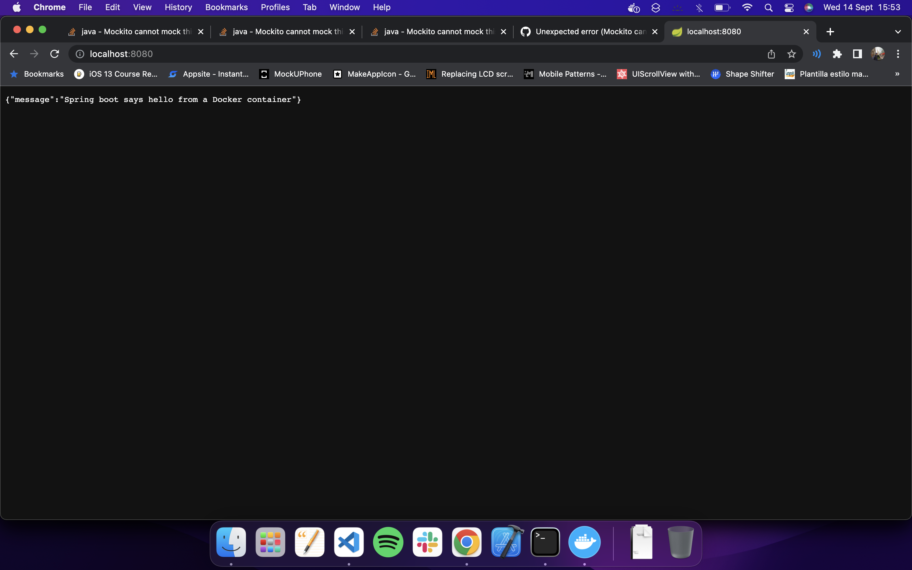

# Trabajo Práctico 6 - Construcción de Imágenes de Docker

#### 1- Conceptos de Dockerfiles
  - Leer https://docs.docker.com/engine/reference/builder/ (tiempo estimado 2 horas)
  - Describir las instrucciones
     - FROM: Un archivo Dockerfile debe comenzar con `FROM`, esta instrucción especifica la "imagen padre" de donde se va a hacer el build.
     - RUN: Permite la ejecución de comandos dentro de la imagen de Docker.
     - ADD: Copia archivos/directoria a un archivo del sistema de la imagen especificada.
     - COPY: Copia los archivos de una ubicación local a un destion en el contenedor de Docker. A difrencia del comando `ADD` que lo hace a una imagen de Docker especifica.
     - EXPOSE: Permite informar que la imagen creada por el archivo Dockerfile va a escuchar en el puerto especificado cuando se corra el contenedor.
     - CMD: Sirve para especificar el programa por default que se va a ejecutar una vez que se ponga a corre rel contenedor.
     - ENTRYPOINT: Permite definir ejecutables que van a correr siempre que se inicialize el contenedor.

#### 2- Generar imagen de docker
   - Clonar/Actualizar el repositorio de https://github.com/fernandobono/ing-software-3
   - El código se encuentra en la carpeta `./proyectos/spring-boot`
   - Se puede copiar al repositorio personal en una carpeta `trabajo-practico-06/spring-boot`
   - Compilar la salida con:
```bash
cd proyectos/spring-boot
mvn clean package spring-boot:repackage  
```

> Al intentar ejecutar surgió un error con Mockito(lo utiliza la dependencia `test-spring-boot`), a la hora de solucionar se realizo lo siguiente: excluir la dependencia de Mockito de la dependencia `test-spring-boot` y añadirla nuevamente con una version mas actualizada en el archivo `pom.xml`:

```xml
<dependencies>
...
<dependency>
    <groupId>org.springframework.boot</groupId>
    <artifactId>spring-boot-starter-test</artifactId>
    <scope>test</scope>
    <exclusions>
        <exclusion>
            <groupId>org.mockito</groupId>
            <artifactId>mockito-core</artifactId>
        </exclusion>
    </exclusions>
</dependency>

<dependency>
    <groupId>org.mockito</groupId>
    <artifactId>mockito-core</artifactId>
    <version>2.23.4</version>
</dependency>
</dependencies>
```

```bash
facundobarafani@Facundos-MacBook-Pro spring-boot % mvn clean package spring-boot:repackage 
[INFO] Scanning for projects...
[INFO] 
[INFO] --------< org.springframework.boot:spring-boot-sample-actuator >--------
[INFO] Building Spring Boot Actuator Sample 2.0.2
[INFO] --------------------------------[ jar ]---------------------------------
[INFO] 
[INFO] --- maven-clean-plugin:3.0.0:clean (default-clean) @ spring-boot-sample-actuator ---
[INFO] Deleting /Users/facundobarafani/Desktop/UCC/Sistemas IV/Segundo Semestre/Inge de SW 3/Practico/inge_sw3/tp6/spring-boot/target
[INFO] 
[INFO] --- maven-resources-plugin:3.0.1:resources (default-resources) @ spring-boot-sample-actuator ---
[INFO] Using 'UTF-8' encoding to copy filtered resources.
[INFO] Copying 1 resource
[INFO] Copying 1 resource
[INFO] 
[INFO] --- maven-compiler-plugin:3.7.0:compile (default-compile) @ spring-boot-sample-actuator ---
[INFO] Changes detected - recompiling the module!
[INFO] Compiling 6 source files to /Users/facundobarafani/Desktop/UCC/Sistemas IV/Segundo Semestre/Inge de SW 3/Practico/inge_sw3/tp6/spring-boot/target/classes
[INFO] 
[INFO] --- maven-resources-plugin:3.0.1:testResources (default-testResources) @ spring-boot-sample-actuator ---
[INFO] Using 'UTF-8' encoding to copy filtered resources.
[INFO] Copying 1 resource
[INFO] 
[INFO] --- maven-compiler-plugin:3.7.0:testCompile (default-testCompile) @ spring-boot-sample-actuator ---
[INFO] Changes detected - recompiling the module!
[INFO] Compiling 3 source files to /Users/facundobarafani/Desktop/UCC/Sistemas IV/Segundo Semestre/Inge de SW 3/Practico/inge_sw3/tp6/spring-boot/target/test-classes
[INFO] 
[INFO] --- maven-surefire-plugin:2.9:test (default-test) @ spring-boot-sample-actuator ---
[INFO] Surefire report directory: /Users/facundobarafani/Desktop/UCC/Sistemas IV/Segundo Semestre/Inge de SW 3/Practico/inge_sw3/tp6/spring-boot/target/surefire-reports

-------------------------------------------------------
 T E S T S
-------------------------------------------------------
Running sample.actuator.ExampleInfoContributorTest
Tests run: 1, Failures: 0, Errors: 0, Skipped: 0, Time elapsed: 0.448 sec
Running sample.actuator.HelloWorldServiceTest
Tests run: 1, Failures: 0, Errors: 0, Skipped: 0, Time elapsed: 0 sec

Results :

Tests run: 2, Failures: 0, Errors: 0, Skipped: 0

[INFO] 
[INFO] --- maven-jar-plugin:3.0.2:jar (default-jar) @ spring-boot-sample-actuator ---
Downloading from central: https://repo.maven.apache.org/maven2/org/apache/maven/maven-archiver/3.1.1/maven-archiver-3.1.1.pom
Downloaded from central: https://repo.maven.apache.org/maven2/org/apache/maven/maven-archiver/3.1.1/maven-archiver-3.1.1.pom (4.3 kB at 3.8 kB/s)
Downloading from central: https://repo.maven.apache.org/maven2/org/apache/maven/shared/maven-shared-utils/3.0.1/maven-shared-utils-3.0.1.pom
Downloaded from central: https://repo.maven.apache.org/maven2/org/apache/maven/shared/maven-shared-utils/3.0.1/maven-shared-utils-3.0.1.pom (4.6 kB at 13 kB/s)
Downloading from central: https://repo.maven.apache.org/maven2/org/codehaus/plexus/plexus-archiver/3.3/plexus-archiver-3.3.pom
Downloaded from central: https://repo.maven.apache.org/maven2/org/codehaus/plexus/plexus-archiver/3.3/plexus-archiver-3.3.pom (5.3 kB at 16 kB/s)
Downloading from central: https://repo.maven.apache.org/maven2/org/codehaus/plexus/plexus-io/2.7.1/plexus-io-2.7.1.pom
Downloaded from central: https://repo.maven.apache.org/maven2/org/codehaus/plexus/plexus-io/2.7.1/plexus-io-2.7.1.pom (4.9 kB at 14 kB/s)
Downloading from central: https://repo.maven.apache.org/maven2/org/apache/commons/commons-compress/1.11/commons-compress-1.11.pom
Downloaded from central: https://repo.maven.apache.org/maven2/org/apache/commons/commons-compress/1.11/commons-compress-1.11.pom (13 kB at 36 kB/s)
Downloading from central: https://repo.maven.apache.org/maven2/org/tukaani/xz/1.5/xz-1.5.pom
Downloaded from central: https://repo.maven.apache.org/maven2/org/tukaani/xz/1.5/xz-1.5.pom (1.9 kB at 5.7 kB/s)
Downloading from central: https://repo.maven.apache.org/maven2/org/codehaus/plexus/plexus-archiver/3.4/plexus-archiver-3.4.pom
Downloaded from central: https://repo.maven.apache.org/maven2/org/codehaus/plexus/plexus-archiver/3.4/plexus-archiver-3.4.pom (5.3 kB at 16 kB/s)
Downloading from central: https://repo.maven.apache.org/maven2/org/apache/maven/maven-archiver/3.1.1/maven-archiver-3.1.1.jar
Downloading from central: https://repo.maven.apache.org/maven2/org/apache/maven/shared/maven-shared-utils/3.0.1/maven-shared-utils-3.0.1.jar
Downloading from central: https://repo.maven.apache.org/maven2/org/codehaus/plexus/plexus-archiver/3.4/plexus-archiver-3.4.jar
Downloading from central: https://repo.maven.apache.org/maven2/org/codehaus/plexus/plexus-io/2.7.1/plexus-io-2.7.1.jar
Downloading from central: https://repo.maven.apache.org/maven2/org/apache/commons/commons-compress/1.11/commons-compress-1.11.jar
Downloaded from central: https://repo.maven.apache.org/maven2/org/apache/maven/maven-archiver/3.1.1/maven-archiver-3.1.1.jar (24 kB at 62 kB/s)
Downloading from central: https://repo.maven.apache.org/maven2/org/tukaani/xz/1.5/xz-1.5.jar
Downloaded from central: https://repo.maven.apache.org/maven2/org/codehaus/plexus/plexus-io/2.7.1/plexus-io-2.7.1.jar (86 kB at 92 kB/s)
Downloaded from central: https://repo.maven.apache.org/maven2/org/tukaani/xz/1.5/xz-1.5.jar (100 kB at 83 kB/s)
Downloaded from central: https://repo.maven.apache.org/maven2/org/codehaus/plexus/plexus-archiver/3.4/plexus-archiver-3.4.jar (187 kB at 146 kB/s)
Downloaded from central: https://repo.maven.apache.org/maven2/org/apache/maven/shared/maven-shared-utils/3.0.1/maven-shared-utils-3.0.1.jar (154 kB at 109 kB/s)
Downloaded from central: https://repo.maven.apache.org/maven2/org/apache/commons/commons-compress/1.11/commons-compress-1.11.jar (426 kB at 202 kB/s)
[INFO] Building jar: /Users/facundobarafani/Desktop/UCC/Sistemas IV/Segundo Semestre/Inge de SW 3/Practico/inge_sw3/tp6/spring-boot/target/spring-boot-sample-actuator-2.0.2.jar
[INFO] 
[INFO] --- spring-boot-maven-plugin:2.0.2.RELEASE:repackage (default) @ spring-boot-sample-actuator ---
Downloading from central: https://repo.maven.apache.org/maven2/org/springframework/boot/spring-boot-loader-tools/2.0.2.RELEASE/spring-boot-loader-tools-2.0.2.RELEASE.pom
Downloaded from central: https://repo.maven.apache.org/maven2/org/springframework/boot/spring-boot-loader-tools/2.0.2.RELEASE/spring-boot-loader-tools-2.0.2.RELEASE.pom (2.7 kB at 7.8 kB/s)
Downloading from central: https://repo.maven.apache.org/maven2/org/apache/maven/maven-archiver/2.6/maven-archiver-2.6.pom
Downloaded from central: https://repo.maven.apache.org/maven2/org/apache/maven/maven-archiver/2.6/maven-archiver-2.6.pom (4.3 kB at 13 kB/s)
Downloading from central: https://repo.maven.apache.org/maven2/org/slf4j/slf4j-jdk14/1.7.25/slf4j-jdk14-1.7.25.pom
Downloaded from central: https://repo.maven.apache.org/maven2/org/slf4j/slf4j-jdk14/1.7.25/slf4j-jdk14-1.7.25.pom (1.0 kB at 2.8 kB/s)
Downloading from central: https://repo.maven.apache.org/maven2/org/slf4j/jcl-over-slf4j/1.7.25/jcl-over-slf4j-1.7.25.pom
Downloaded from central: https://repo.maven.apache.org/maven2/org/slf4j/jcl-over-slf4j/1.7.25/jcl-over-slf4j-1.7.25.pom (959 B at 2.9 kB/s)
Downloading from central: https://repo.maven.apache.org/maven2/org/apache/maven/reporting/maven-reporting-api/2.2.1/maven-reporting-api-2.2.1.pom
Downloaded from central: https://repo.maven.apache.org/maven2/org/apache/maven/reporting/maven-reporting-api/2.2.1/maven-reporting-api-2.2.1.pom (1.9 kB at 4.9 kB/s)
Downloading from central: https://repo.maven.apache.org/maven2/org/apache/maven/reporting/maven-reporting/2.2.1/maven-reporting-2.2.1.pom
Downloaded from central: https://repo.maven.apache.org/maven2/org/apache/maven/reporting/maven-reporting/2.2.1/maven-reporting-2.2.1.pom (1.4 kB at 4.1 kB/s)
Downloading from central: https://repo.maven.apache.org/maven2/org/apache/maven/doxia/doxia-sink-api/1.1/doxia-sink-api-1.1.pom
Downloaded from central: https://repo.maven.apache.org/maven2/org/apache/maven/doxia/doxia-sink-api/1.1/doxia-sink-api-1.1.pom (2.0 kB at 6.0 kB/s)
Downloading from central: https://repo.maven.apache.org/maven2/org/apache/maven/doxia/doxia/1.1/doxia-1.1.pom
Downloaded from central: https://repo.maven.apache.org/maven2/org/apache/maven/doxia/doxia/1.1/doxia-1.1.pom (15 kB at 41 kB/s)
Downloading from central: https://repo.maven.apache.org/maven2/org/apache/maven/doxia/doxia-logging-api/1.1/doxia-logging-api-1.1.pom
Downloaded from central: https://repo.maven.apache.org/maven2/org/apache/maven/doxia/doxia-logging-api/1.1/doxia-logging-api-1.1.pom (1.6 kB at 4.7 kB/s)
Downloading from central: https://repo.maven.apache.org/maven2/commons-cli/commons-cli/1.2/commons-cli-1.2.pom
Downloaded from central: https://repo.maven.apache.org/maven2/commons-cli/commons-cli/1.2/commons-cli-1.2.pom (8.0 kB at 23 kB/s)
Downloading from central: https://repo.maven.apache.org/maven2/org/apache/maven/shared/maven-shared-utils/0.7/maven-shared-utils-0.7.pom
Downloaded from central: https://repo.maven.apache.org/maven2/org/apache/maven/shared/maven-shared-utils/0.7/maven-shared-utils-0.7.pom (5.0 kB at 14 kB/s)
Downloading from central: https://repo.maven.apache.org/maven2/org/codehaus/plexus/plexus-archiver/2.8.1/plexus-archiver-2.8.1.pom
Downloaded from central: https://repo.maven.apache.org/maven2/org/codehaus/plexus/plexus-archiver/2.8.1/plexus-archiver-2.8.1.pom (4.1 kB at 11 kB/s)
Downloading from central: https://repo.maven.apache.org/maven2/org/codehaus/plexus/plexus-components/1.3/plexus-components-1.3.pom
Downloaded from central: https://repo.maven.apache.org/maven2/org/codehaus/plexus/plexus-components/1.3/plexus-components-1.3.pom (3.1 kB at 9.0 kB/s)
Downloading from central: https://repo.maven.apache.org/maven2/org/codehaus/plexus/plexus-io/2.3.2/plexus-io-2.3.2.pom
Downloaded from central: https://repo.maven.apache.org/maven2/org/codehaus/plexus/plexus-io/2.3.2/plexus-io-2.3.2.pom (2.7 kB at 7.8 kB/s)
Downloading from central: https://repo.maven.apache.org/maven2/org/codehaus/plexus/plexus-components/1.2/plexus-components-1.2.pom
Downloaded from central: https://repo.maven.apache.org/maven2/org/codehaus/plexus/plexus-components/1.2/plexus-components-1.2.pom (3.1 kB at 9.0 kB/s)
Downloading from central: https://repo.maven.apache.org/maven2/org/apache/commons/commons-compress/1.9/commons-compress-1.9.pom
Downloaded from central: https://repo.maven.apache.org/maven2/org/apache/commons/commons-compress/1.9/commons-compress-1.9.pom (11 kB at 31 kB/s)
Downloading from central: https://repo.maven.apache.org/maven2/org/apache/maven/maven-artifact/3.1.1/maven-artifact-3.1.1.pom
Downloaded from central: https://repo.maven.apache.org/maven2/org/apache/maven/maven-artifact/3.1.1/maven-artifact-3.1.1.pom (2.0 kB at 5.8 kB/s)
Downloading from central: https://repo.maven.apache.org/maven2/org/apache/maven/maven/3.1.1/maven-3.1.1.pom
Downloaded from central: https://repo.maven.apache.org/maven2/org/apache/maven/maven/3.1.1/maven-3.1.1.pom (22 kB at 59 kB/s)
Downloading from central: https://repo.maven.apache.org/maven2/org/apache/maven/maven-core/3.1.1/maven-core-3.1.1.pom
Downloaded from central: https://repo.maven.apache.org/maven2/org/apache/maven/maven-core/3.1.1/maven-core-3.1.1.pom (7.3 kB at 21 kB/s)
Downloading from central: https://repo.maven.apache.org/maven2/org/apache/maven/maven-model/3.1.1/maven-model-3.1.1.pom
Downloaded from central: https://repo.maven.apache.org/maven2/org/apache/maven/maven-model/3.1.1/maven-model-3.1.1.pom (4.1 kB at 12 kB/s)
Downloading from central: https://repo.maven.apache.org/maven2/org/apache/maven/maven-settings/3.1.1/maven-settings-3.1.1.pom
Downloaded from central: https://repo.maven.apache.org/maven2/org/apache/maven/maven-settings/3.1.1/maven-settings-3.1.1.pom (2.2 kB at 6.3 kB/s)
Downloading from central: https://repo.maven.apache.org/maven2/org/apache/maven/maven-settings-builder/3.1.1/maven-settings-builder-3.1.1.pom
Downloaded from central: https://repo.maven.apache.org/maven2/org/apache/maven/maven-settings-builder/3.1.1/maven-settings-builder-3.1.1.pom (2.6 kB at 7.4 kB/s)
Downloading from central: https://repo.maven.apache.org/maven2/org/codehaus/plexus/plexus-interpolation/1.19/plexus-interpolation-1.19.pom
Downloaded from central: https://repo.maven.apache.org/maven2/org/codehaus/plexus/plexus-interpolation/1.19/plexus-interpolation-1.19.pom (1.0 kB at 3.1 kB/s)
Downloading from central: https://repo.maven.apache.org/maven2/org/apache/maven/maven-repository-metadata/3.1.1/maven-repository-metadata-3.1.1.pom
Downloaded from central: https://repo.maven.apache.org/maven2/org/apache/maven/maven-repository-metadata/3.1.1/maven-repository-metadata-3.1.1.pom (2.2 kB at 6.5 kB/s)
Downloading from central: https://repo.maven.apache.org/maven2/org/apache/maven/maven-plugin-api/3.1.1/maven-plugin-api-3.1.1.pom
Downloaded from central: https://repo.maven.apache.org/maven2/org/apache/maven/maven-plugin-api/3.1.1/maven-plugin-api-3.1.1.pom (3.4 kB at 10.0 kB/s)
Downloading from central: https://repo.maven.apache.org/maven2/org/eclipse/sisu/org.eclipse.sisu.plexus/0.0.0.M5/org.eclipse.sisu.plexus-0.0.0.M5.pom
Downloaded from central: https://repo.maven.apache.org/maven2/org/eclipse/sisu/org.eclipse.sisu.plexus/0.0.0.M5/org.eclipse.sisu.plexus-0.0.0.M5.pom (4.8 kB at 14 kB/s)
Downloading from central: https://repo.maven.apache.org/maven2/org/eclipse/sisu/sisu-plexus/0.0.0.M5/sisu-plexus-0.0.0.M5.pom
Downloaded from central: https://repo.maven.apache.org/maven2/org/eclipse/sisu/sisu-plexus/0.0.0.M5/sisu-plexus-0.0.0.M5.pom (13 kB at 36 kB/s)
Downloading from central: https://repo.maven.apache.org/maven2/javax/enterprise/cdi-api/1.0/cdi-api-1.0.pom
Downloaded from central: https://repo.maven.apache.org/maven2/javax/enterprise/cdi-api/1.0/cdi-api-1.0.pom (1.4 kB at 4.2 kB/s)
Downloading from central: https://repo.maven.apache.org/maven2/org/jboss/weld/weld-api-parent/1.0/weld-api-parent-1.0.pom
Downloaded from central: https://repo.maven.apache.org/maven2/org/jboss/weld/weld-api-parent/1.0/weld-api-parent-1.0.pom (2.4 kB at 6.8 kB/s)
Downloading from central: https://repo.maven.apache.org/maven2/org/jboss/weld/weld-api-bom/1.0/weld-api-bom-1.0.pom
Downloaded from central: https://repo.maven.apache.org/maven2/org/jboss/weld/weld-api-bom/1.0/weld-api-bom-1.0.pom (7.9 kB at 23 kB/s)
Downloading from central: https://repo.maven.apache.org/maven2/org/jboss/weld/weld-parent/6/weld-parent-6.pom
Downloaded from central: https://repo.maven.apache.org/maven2/org/jboss/weld/weld-parent/6/weld-parent-6.pom (21 kB at 55 kB/s)
Downloading from central: https://repo.maven.apache.org/maven2/javax/annotation/jsr250-api/1.0/jsr250-api-1.0.pom
Downloaded from central: https://repo.maven.apache.org/maven2/javax/annotation/jsr250-api/1.0/jsr250-api-1.0.pom (1.0 kB at 3.0 kB/s)
Downloading from central: https://repo.maven.apache.org/maven2/javax/inject/javax.inject/1/javax.inject-1.pom
Downloaded from central: https://repo.maven.apache.org/maven2/javax/inject/javax.inject/1/javax.inject-1.pom (612 B at 1.8 kB/s)
Downloading from central: https://repo.maven.apache.org/maven2/com/google/guava/guava/10.0.1/guava-10.0.1.pom
Downloaded from central: https://repo.maven.apache.org/maven2/com/google/guava/guava/10.0.1/guava-10.0.1.pom (5.4 kB at 15 kB/s)
Downloading from central: https://repo.maven.apache.org/maven2/com/google/guava/guava-parent/10.0.1/guava-parent-10.0.1.pom
Downloaded from central: https://repo.maven.apache.org/maven2/com/google/guava/guava-parent/10.0.1/guava-parent-10.0.1.pom (2.0 kB at 5.8 kB/s)
Downloading from central: https://repo.maven.apache.org/maven2/org/sonatype/sisu/sisu-guice/3.1.0/sisu-guice-3.1.0.pom
Downloaded from central: https://repo.maven.apache.org/maven2/org/sonatype/sisu/sisu-guice/3.1.0/sisu-guice-3.1.0.pom (10 kB at 28 kB/s)
Downloading from central: https://repo.maven.apache.org/maven2/org/sonatype/sisu/inject/guice-parent/3.1.0/guice-parent-3.1.0.pom
Downloaded from central: https://repo.maven.apache.org/maven2/org/sonatype/sisu/inject/guice-parent/3.1.0/guice-parent-3.1.0.pom (11 kB at 30 kB/s)
Downloading from central: https://repo.maven.apache.org/maven2/org/eclipse/sisu/org.eclipse.sisu.inject/0.0.0.M5/org.eclipse.sisu.inject-0.0.0.M5.pom
Downloaded from central: https://repo.maven.apache.org/maven2/org/eclipse/sisu/org.eclipse.sisu.inject/0.0.0.M5/org.eclipse.sisu.inject-0.0.0.M5.pom (2.5 kB at 7.5 kB/s)
Downloading from central: https://repo.maven.apache.org/maven2/org/eclipse/sisu/sisu-inject/0.0.0.M5/sisu-inject-0.0.0.M5.pom
Downloaded from central: https://repo.maven.apache.org/maven2/org/eclipse/sisu/sisu-inject/0.0.0.M5/sisu-inject-0.0.0.M5.pom (14 kB at 39 kB/s)
Downloading from central: https://repo.maven.apache.org/maven2/org/codehaus/plexus/plexus-classworlds/2.4/plexus-classworlds-2.4.pom
Downloaded from central: https://repo.maven.apache.org/maven2/org/codehaus/plexus/plexus-classworlds/2.4/plexus-classworlds-2.4.pom (3.9 kB at 11 kB/s)
Downloading from central: https://repo.maven.apache.org/maven2/org/apache/maven/maven-model-builder/3.1.1/maven-model-builder-3.1.1.pom
Downloaded from central: https://repo.maven.apache.org/maven2/org/apache/maven/maven-model-builder/3.1.1/maven-model-builder-3.1.1.pom (2.8 kB at 8.0 kB/s)
Downloading from central: https://repo.maven.apache.org/maven2/org/apache/maven/maven-aether-provider/3.1.1/maven-aether-provider-3.1.1.pom
Downloaded from central: https://repo.maven.apache.org/maven2/org/apache/maven/maven-aether-provider/3.1.1/maven-aether-provider-3.1.1.pom (4.1 kB at 11 kB/s)
Downloading from central: https://repo.maven.apache.org/maven2/org/eclipse/aether/aether-api/0.9.0.M2/aether-api-0.9.0.M2.pom
Downloaded from central: https://repo.maven.apache.org/maven2/org/eclipse/aether/aether-api/0.9.0.M2/aether-api-0.9.0.M2.pom (1.7 kB at 5.1 kB/s)
Downloading from central: https://repo.maven.apache.org/maven2/org/eclipse/aether/aether-spi/0.9.0.M2/aether-spi-0.9.0.M2.pom
Downloaded from central: https://repo.maven.apache.org/maven2/org/eclipse/aether/aether-spi/0.9.0.M2/aether-spi-0.9.0.M2.pom (1.8 kB at 5.2 kB/s)
Downloading from central: https://repo.maven.apache.org/maven2/org/eclipse/aether/aether-impl/0.9.0.M2/aether-impl-0.9.0.M2.pom
Downloaded from central: https://repo.maven.apache.org/maven2/org/eclipse/aether/aether-impl/0.9.0.M2/aether-impl-0.9.0.M2.pom (3.3 kB at 9.8 kB/s)
Downloading from central: https://repo.maven.apache.org/maven2/org/apache/maven/shared/maven-common-artifact-filters/1.4/maven-common-artifact-filters-1.4.pom
Downloaded from central: https://repo.maven.apache.org/maven2/org/apache/maven/shared/maven-common-artifact-filters/1.4/maven-common-artifact-filters-1.4.pom (3.8 kB at 11 kB/s)
Downloading from central: https://repo.maven.apache.org/maven2/org/apache/maven/maven-artifact/2.0.8/maven-artifact-2.0.8.pom
Downloaded from central: https://repo.maven.apache.org/maven2/org/apache/maven/maven-artifact/2.0.8/maven-artifact-2.0.8.pom (1.6 kB at 4.8 kB/s)
Downloading from central: https://repo.maven.apache.org/maven2/org/apache/maven/maven/2.0.8/maven-2.0.8.pom
Downloaded from central: https://repo.maven.apache.org/maven2/org/apache/maven/maven/2.0.8/maven-2.0.8.pom (12 kB at 34 kB/s)
Downloading from central: https://repo.maven.apache.org/maven2/org/apache/maven/maven-parent/6/maven-parent-6.pom
Downloaded from central: https://repo.maven.apache.org/maven2/org/apache/maven/maven-parent/6/maven-parent-6.pom (20 kB at 54 kB/s)
Downloading from central: https://repo.maven.apache.org/maven2/org/codehaus/plexus/plexus-utils/1.4.6/plexus-utils-1.4.6.pom
Downloaded from central: https://repo.maven.apache.org/maven2/org/codehaus/plexus/plexus-utils/1.4.6/plexus-utils-1.4.6.pom (2.3 kB at 6.7 kB/s)
Downloading from central: https://repo.maven.apache.org/maven2/org/apache/maven/maven-model/2.0.8/maven-model-2.0.8.pom
Downloaded from central: https://repo.maven.apache.org/maven2/org/apache/maven/maven-model/2.0.8/maven-model-2.0.8.pom (3.1 kB at 9.2 kB/s)
Downloading from central: https://repo.maven.apache.org/maven2/org/apache/maven/maven-project/2.0.8/maven-project-2.0.8.pom
Downloaded from central: https://repo.maven.apache.org/maven2/org/apache/maven/maven-project/2.0.8/maven-project-2.0.8.pom (2.7 kB at 7.9 kB/s)
Downloading from central: https://repo.maven.apache.org/maven2/org/apache/maven/maven-settings/2.0.8/maven-settings-2.0.8.pom
Downloaded from central: https://repo.maven.apache.org/maven2/org/apache/maven/maven-settings/2.0.8/maven-settings-2.0.8.pom (2.1 kB at 6.1 kB/s)
Downloading from central: https://repo.maven.apache.org/maven2/org/apache/maven/maven-profile/2.0.8/maven-profile-2.0.8.pom
Downloaded from central: https://repo.maven.apache.org/maven2/org/apache/maven/maven-profile/2.0.8/maven-profile-2.0.8.pom (2.0 kB at 6.0 kB/s)
Downloading from central: https://repo.maven.apache.org/maven2/org/apache/maven/maven-artifact-manager/2.0.8/maven-artifact-manager-2.0.8.pom
Downloaded from central: https://repo.maven.apache.org/maven2/org/apache/maven/maven-artifact-manager/2.0.8/maven-artifact-manager-2.0.8.pom (2.7 kB at 7.2 kB/s)
Downloading from central: https://repo.maven.apache.org/maven2/org/apache/maven/maven-repository-metadata/2.0.8/maven-repository-metadata-2.0.8.pom
Downloaded from central: https://repo.maven.apache.org/maven2/org/apache/maven/maven-repository-metadata/2.0.8/maven-repository-metadata-2.0.8.pom (1.9 kB at 5.7 kB/s)
Downloading from central: https://repo.maven.apache.org/maven2/org/apache/maven/maven-plugin-registry/2.0.8/maven-plugin-registry-2.0.8.pom
Downloaded from central: https://repo.maven.apache.org/maven2/org/apache/maven/maven-plugin-registry/2.0.8/maven-plugin-registry-2.0.8.pom (2.0 kB at 6.0 kB/s)
Downloading from central: https://repo.maven.apache.org/maven2/org/apache/maven/maven-plugin-api/2.0.8/maven-plugin-api-2.0.8.pom
Downloaded from central: https://repo.maven.apache.org/maven2/org/apache/maven/maven-plugin-api/2.0.8/maven-plugin-api-2.0.8.pom (1.5 kB at 4.4 kB/s)
Downloading from central: https://repo.maven.apache.org/maven2/org/apache/maven/plugins/maven-shade-plugin/2.2/maven-shade-plugin-2.2.pom
Downloaded from central: https://repo.maven.apache.org/maven2/org/apache/maven/plugins/maven-shade-plugin/2.2/maven-shade-plugin-2.2.pom (7.8 kB at 5.0 kB/s)
Downloading from central: https://repo.maven.apache.org/maven2/org/codehaus/plexus/plexus-component-annotations/1.5.4/plexus-component-annotations-1.5.4.pom
Downloaded from central: https://repo.maven.apache.org/maven2/org/codehaus/plexus/plexus-component-annotations/1.5.4/plexus-component-annotations-1.5.4.pom (815 B at 2.3 kB/s)
Downloading from central: https://repo.maven.apache.org/maven2/org/codehaus/plexus/plexus-containers/1.5.4/plexus-containers-1.5.4.pom
Downloaded from central: https://repo.maven.apache.org/maven2/org/codehaus/plexus/plexus-containers/1.5.4/plexus-containers-1.5.4.pom (4.2 kB at 12 kB/s)
Downloading from central: https://repo.maven.apache.org/maven2/org/apache/maven/shared/maven-dependency-tree/2.1/maven-dependency-tree-2.1.pom
Downloaded from central: https://repo.maven.apache.org/maven2/org/apache/maven/shared/maven-dependency-tree/2.1/maven-dependency-tree-2.1.pom (6.8 kB at 18 kB/s)
Downloading from central: https://repo.maven.apache.org/maven2/com/google/guava/guava/11.0.2/guava-11.0.2.pom
Downloaded from central: https://repo.maven.apache.org/maven2/com/google/guava/guava/11.0.2/guava-11.0.2.pom (5.5 kB at 15 kB/s)
Downloading from central: https://repo.maven.apache.org/maven2/com/google/guava/guava-parent/11.0.2/guava-parent-11.0.2.pom
Downloaded from central: https://repo.maven.apache.org/maven2/com/google/guava/guava-parent/11.0.2/guava-parent-11.0.2.pom (2.0 kB at 5.8 kB/s)
Downloading from central: https://repo.maven.apache.org/maven2/org/springframework/boot/spring-boot-loader-tools/2.0.2.RELEASE/spring-boot-loader-tools-2.0.2.RELEASE.jar
Downloading from central: https://repo.maven.apache.org/maven2/org/apache/commons/commons-compress/1.14/commons-compress-1.14.jar
Downloading from central: https://repo.maven.apache.org/maven2/org/apache/maven/maven-archiver/2.6/maven-archiver-2.6.jar
Downloading from central: https://repo.maven.apache.org/maven2/org/apache/maven/shared/maven-shared-utils/0.7/maven-shared-utils-0.7.jar
Downloading from central: https://repo.maven.apache.org/maven2/org/codehaus/plexus/plexus-interpolation/1.21/plexus-interpolation-1.21.jar
Downloaded from central: https://repo.maven.apache.org/maven2/org/codehaus/plexus/plexus-interpolation/1.21/plexus-interpolation-1.21.jar (62 kB at 148 kB/s)
Downloading from central: https://repo.maven.apache.org/maven2/org/apache/maven/maven-artifact/3.1.1/maven-artifact-3.1.1.jar
Downloaded from central: https://repo.maven.apache.org/maven2/org/apache/maven/maven-archiver/2.6/maven-archiver-2.6.jar (23 kB at 50 kB/s)
Downloading from central: https://repo.maven.apache.org/maven2/org/apache/maven/maven-core/3.1.1/maven-core-3.1.1.jar
Downloaded from central: https://repo.maven.apache.org/maven2/org/apache/maven/maven-artifact/3.1.1/maven-artifact-3.1.1.jar (52 kB at 63 kB/s)
Downloading from central: https://repo.maven.apache.org/maven2/org/apache/maven/maven-settings-builder/3.1.1/maven-settings-builder-3.1.1.jar
Downloaded from central: https://repo.maven.apache.org/maven2/org/apache/maven/shared/maven-shared-utils/0.7/maven-shared-utils-0.7.jar (170 kB at 178 kB/s)
Downloading from central: https://repo.maven.apache.org/maven2/org/apache/maven/maven-repository-metadata/3.1.1/maven-repository-metadata-3.1.1.jar
Downloaded from central: https://repo.maven.apache.org/maven2/org/springframework/boot/spring-boot-loader-tools/2.0.2.RELEASE/spring-boot-loader-tools-2.0.2.RELEASE.jar (148 kB at 138 kB/s)
Downloading from central: https://repo.maven.apache.org/maven2/org/apache/maven/maven-model-builder/3.1.1/maven-model-builder-3.1.1.jar
Downloaded from central: https://repo.maven.apache.org/maven2/org/apache/maven/maven-settings-builder/3.1.1/maven-settings-builder-3.1.1.jar (42 kB at 34 kB/s)
Downloading from central: https://repo.maven.apache.org/maven2/org/apache/maven/maven-aether-provider/3.1.1/maven-aether-provider-3.1.1.jar
Downloaded from central: https://repo.maven.apache.org/maven2/org/apache/maven/maven-repository-metadata/3.1.1/maven-repository-metadata-3.1.1.jar (25 kB at 18 kB/s)
Downloading from central: https://repo.maven.apache.org/maven2/org/eclipse/aether/aether-spi/0.9.0.M2/aether-spi-0.9.0.M2.jar
Downloaded from central: https://repo.maven.apache.org/maven2/org/apache/maven/maven-aether-provider/3.1.1/maven-aether-provider-3.1.1.jar (60 kB at 36 kB/s)
Downloading from central: https://repo.maven.apache.org/maven2/org/eclipse/aether/aether-impl/0.9.0.M2/aether-impl-0.9.0.M2.jar
Downloaded from central: https://repo.maven.apache.org/maven2/org/eclipse/aether/aether-spi/0.9.0.M2/aether-spi-0.9.0.M2.jar (18 kB at 10.0 kB/s)
Downloading from central: https://repo.maven.apache.org/maven2/org/eclipse/aether/aether-api/0.9.0.M2/aether-api-0.9.0.M2.jar
Downloaded from central: https://repo.maven.apache.org/maven2/org/apache/maven/maven-model-builder/3.1.1/maven-model-builder-3.1.1.jar (160 kB at 79 kB/s)
Downloading from central: https://repo.maven.apache.org/maven2/org/eclipse/sisu/org.eclipse.sisu.plexus/0.0.0.M5/org.eclipse.sisu.plexus-0.0.0.M5.jar
Downloaded from central: https://repo.maven.apache.org/maven2/org/apache/commons/commons-compress/1.14/commons-compress-1.14.jar (530 kB at 230 kB/s)
Downloading from central: https://repo.maven.apache.org/maven2/javax/enterprise/cdi-api/1.0/cdi-api-1.0.jar
Downloaded from central: https://repo.maven.apache.org/maven2/org/apache/maven/maven-core/3.1.1/maven-core-3.1.1.jar (557 kB at 234 kB/s)
Downloading from central: https://repo.maven.apache.org/maven2/javax/annotation/jsr250-api/1.0/jsr250-api-1.0.jar
Downloaded from central: https://repo.maven.apache.org/maven2/org/eclipse/aether/aether-impl/0.9.0.M2/aether-impl-0.9.0.M2.jar (145 kB at 60 kB/s)
Downloading from central: https://repo.maven.apache.org/maven2/javax/inject/javax.inject/1/javax.inject-1.jar
Downloaded from central: https://repo.maven.apache.org/maven2/org/eclipse/aether/aether-api/0.9.0.M2/aether-api-0.9.0.M2.jar (134 kB at 53 kB/s)
Downloading from central: https://repo.maven.apache.org/maven2/org/sonatype/sisu/sisu-guice/3.1.0/sisu-guice-3.1.0-no_aop.jar
Downloaded from central: https://repo.maven.apache.org/maven2/javax/annotation/jsr250-api/1.0/jsr250-api-1.0.jar (5.8 kB at 2.1 kB/s)
Downloading from central: https://repo.maven.apache.org/maven2/org/eclipse/sisu/org.eclipse.sisu.inject/0.0.0.M5/org.eclipse.sisu.inject-0.0.0.M5.jar
Downloaded from central: https://repo.maven.apache.org/maven2/javax/inject/javax.inject/1/javax.inject-1.jar (2.5 kB at 905 B/s)
Downloading from central: https://repo.maven.apache.org/maven2/org/codehaus/plexus/plexus-classworlds/2.5.1/plexus-classworlds-2.5.1.jar
Downloaded from central: https://repo.maven.apache.org/maven2/javax/enterprise/cdi-api/1.0/cdi-api-1.0.jar (45 kB at 16 kB/s)
Downloading from central: https://repo.maven.apache.org/maven2/org/apache/maven/maven-model/3.1.1/maven-model-3.1.1.jar
Downloaded from central: https://repo.maven.apache.org/maven2/org/eclipse/sisu/org.eclipse.sisu.plexus/0.0.0.M5/org.eclipse.sisu.plexus-0.0.0.M5.jar (197 kB at 68 kB/s)
Downloading from central: https://repo.maven.apache.org/maven2/org/apache/maven/maven-plugin-api/3.1.1/maven-plugin-api-3.1.1.jar
Downloaded from central: https://repo.maven.apache.org/maven2/org/codehaus/plexus/plexus-classworlds/2.5.1/plexus-classworlds-2.5.1.jar (50 kB at 16 kB/s)
Downloading from central: https://repo.maven.apache.org/maven2/org/apache/maven/maven-settings/3.1.1/maven-settings-3.1.1.jar
Downloaded from central: https://repo.maven.apache.org/maven2/org/apache/maven/maven-plugin-api/3.1.1/maven-plugin-api-3.1.1.jar (45 kB at 14 kB/s)
Downloading from central: https://repo.maven.apache.org/maven2/org/apache/maven/shared/maven-common-artifact-filters/1.4/maven-common-artifact-filters-1.4.jar
Downloaded from central: https://repo.maven.apache.org/maven2/org/apache/maven/maven-settings/3.1.1/maven-settings-3.1.1.jar (42 kB at 12 kB/s)
Downloading from central: https://repo.maven.apache.org/maven2/org/apache/maven/maven-project/2.0.8/maven-project-2.0.8.jar
Downloaded from central: https://repo.maven.apache.org/maven2/org/apache/maven/shared/maven-common-artifact-filters/1.4/maven-common-artifact-filters-1.4.jar (32 kB at 8.5 kB/s)
Downloading from central: https://repo.maven.apache.org/maven2/org/apache/maven/maven-profile/2.0.8/maven-profile-2.0.8.jar
Downloaded from central: https://repo.maven.apache.org/maven2/org/sonatype/sisu/sisu-guice/3.1.0/sisu-guice-3.1.0-no_aop.jar (357 kB at 95 kB/s)
Downloading from central: https://repo.maven.apache.org/maven2/org/apache/maven/maven-artifact-manager/2.0.8/maven-artifact-manager-2.0.8.jar
Downloaded from central: https://repo.maven.apache.org/maven2/org/apache/maven/maven-model/3.1.1/maven-model-3.1.1.jar (154 kB at 41 kB/s)
Downloading from central: https://repo.maven.apache.org/maven2/org/apache/maven/maven-plugin-registry/2.0.8/maven-plugin-registry-2.0.8.jar
Downloaded from central: https://repo.maven.apache.org/maven2/org/apache/maven/maven-project/2.0.8/maven-project-2.0.8.jar (117 kB at 29 kB/s)
Downloading from central: https://repo.maven.apache.org/maven2/org/codehaus/plexus/plexus-archiver/2.8.1/plexus-archiver-2.8.1.jar
Downloaded from central: https://repo.maven.apache.org/maven2/org/eclipse/sisu/org.eclipse.sisu.inject/0.0.0.M5/org.eclipse.sisu.inject-0.0.0.M5.jar (291 kB at 70 kB/s)
Downloading from central: https://repo.maven.apache.org/maven2/org/codehaus/plexus/plexus-io/2.3.2/plexus-io-2.3.2.jar
Downloaded from central: https://repo.maven.apache.org/maven2/org/apache/maven/maven-profile/2.0.8/maven-profile-2.0.8.jar (35 kB at 8.5 kB/s)
Downloading from central: https://repo.maven.apache.org/maven2/org/apache/maven/plugins/maven-shade-plugin/2.2/maven-shade-plugin-2.2.jar
Downloaded from central: https://repo.maven.apache.org/maven2/org/apache/maven/maven-artifact-manager/2.0.8/maven-artifact-manager-2.0.8.jar (57 kB at 14 kB/s)
Downloading from central: https://repo.maven.apache.org/maven2/org/apache/maven/shared/maven-dependency-tree/2.1/maven-dependency-tree-2.1.jar
Downloaded from central: https://repo.maven.apache.org/maven2/org/apache/maven/maven-plugin-registry/2.0.8/maven-plugin-registry-2.0.8.jar (29 kB at 6.9 kB/s)
Downloading from central: https://repo.maven.apache.org/maven2/com/google/guava/guava/11.0.2/guava-11.0.2.jar
Downloaded from central: https://repo.maven.apache.org/maven2/org/codehaus/plexus/plexus-archiver/2.8.1/plexus-archiver-2.8.1.jar (143 kB at 32 kB/s)
Downloaded from central: https://repo.maven.apache.org/maven2/org/apache/maven/shared/maven-dependency-tree/2.1/maven-dependency-tree-2.1.jar (60 kB at 13 kB/s)
Downloaded from central: https://repo.maven.apache.org/maven2/org/codehaus/plexus/plexus-io/2.3.2/plexus-io-2.3.2.jar (74 kB at 16 kB/s)
Downloaded from central: https://repo.maven.apache.org/maven2/org/apache/maven/plugins/maven-shade-plugin/2.2/maven-shade-plugin-2.2.jar (100 kB at 21 kB/s)
Downloaded from central: https://repo.maven.apache.org/maven2/com/google/guava/guava/11.0.2/guava-11.0.2.jar (1.6 MB at 178 kB/s)
[INFO] 
[INFO] --- spring-boot-maven-plugin:2.0.2.RELEASE:repackage (default-cli) @ spring-boot-sample-actuator ---
[INFO] ------------------------------------------------------------------------
[INFO] BUILD SUCCESS
[INFO] ------------------------------------------------------------------------
[INFO] Total time:  42.649 s
[INFO] Finished at: 2022-09-14T15:43:13-03:00
[INFO] ------------------------------------------------------------------------

```


   - Agregar un archivo llamado **Dockerfile** (en el directorio donde se corrió el comando mvn)

```bash
touch Dockerfile
```


```Dockerfile
FROM java:8-jre-alpine

RUN apk add --no-cache bash

WORKDIR /app

COPY target/*.jar ./spring-boot-application.jar

ENV JAVA_OPTS="-Xms32m -Xmx128m"
EXPOSE 8080

ENTRYPOINT exec java $JAVA_OPTS -Djava.security.egd=file:/dev/./urandom -jar spring-boot-application.jar
```

> Para que funcione se tuvo que hacer la siguiente modificación: en la primera linea cambiar `java:8` por `openjdk:8`.

   - Generar la imagen de docker con el comando build
```bash
docker build -t test-spring-boot .
```

```bash
facundobarafani@Facundos-MacBook-Pro spring-boot % docker build -t test-spring-boot .
[+] Building 5.1s (9/9) FINISHED                                                
 => [internal] load build definition from Dockerfile                       0.0s
 => => transferring dockerfile: 313B                                       0.0s
 => [internal] load .dockerignore                                          0.0s
 => => transferring context: 2B                                            0.0s
 => [internal] load metadata for docker.io/library/openjdk:8-jre-alpine    0.8s
 => CACHED [1/4] FROM docker.io/library/openjdk:8-jre-alpine@sha256:f362b  0.0s
 => [internal] load build context                                          0.6s
 => => transferring context: 25.31MB                                       0.6s
 => [2/4] RUN apk add --no-cache bash                                      3.7s
 => [3/4] WORKDIR /app                                                     0.0s
 => [4/4] COPY target/*.jar ./spring-boot-application.jar                  0.2s
 => exporting to image                                                     0.3s 
 => => exporting layers                                                    0.2s 
 => => writing image sha256:5841d5541b4d9724c2c5dacf3ced7febd123b618698a1  0.0s 
 => => naming to docker.io/library/test-spring-boot                        0.0s 

 ```

  - Ejecutar el contenedor
```bash
docker run -p 8080:8080 test-spring-boot
```
  - Capturar y mostrar la salida.

```bash
facundobarafani@Facundos-MacBook-Pro spring-boot % docker run -p 8080:8080 test-spring-boot

  .   ____          _            __ _ _
 /\\ / ___'_ __ _ _(_)_ __  __ _ \ \ \ \
( ( )\___ | '_ | '_| | '_ \/ _` | \ \ \ \
 \\/  ___)| |_)| | | | | || (_| |  ) ) ) )
  '  |____| .__|_| |_|_| |_\__, | / / / /
 =========|_|==============|___/=/_/_/_/
 :: Spring Boot ::        (v2.0.2.RELEASE)

2022-09-14 18:52:34.748  INFO 1 --- [           main] s.actuator.SampleActuatorApplication     : Starting SampleActuatorApplication v2.0.2 on b2137fe3fa43 with PID 1 (/app/spring-boot-application.jar started by root in /app)
2022-09-14 18:52:34.753  INFO 1 --- [           main] s.actuator.SampleActuatorApplication     : No active profile set, falling back to default profiles: default
2022-09-14 18:52:34.864  INFO 1 --- [           main] ConfigServletWebServerApplicationContext : Refreshing org.springframework.boot.web.servlet.context.AnnotationConfigServletWebServerApplicationContext@6842775d: startup date [Wed Sep 14 18:52:34 GMT 2022]; root of context hierarchy
2022-09-14 18:52:36.355  INFO 1 --- [           main] trationDelegate$BeanPostProcessorChecker : Bean 'org.springframework.transaction.annotation.ProxyTransactionManagementConfiguration' of type [org.springframework.transaction.annotation.ProxyTransactionManagementConfiguration$$EnhancerBySpringCGLIB$$c649acd6] is not eligible for getting processed by all BeanPostProcessors (for example: not eligible for auto-proxying)
2022-09-14 18:52:36.715  INFO 1 --- [           main] o.s.b.w.embedded.tomcat.TomcatWebServer  : Tomcat initialized with port(s): 8080 (http)
2022-09-14 18:52:36.746  INFO 1 --- [           main] o.apache.catalina.core.StandardService   : Starting service [Tomcat]
2022-09-14 18:52:36.747  INFO 1 --- [           main] org.apache.catalina.core.StandardEngine  : Starting Servlet Engine: Apache Tomcat/8.5.31
2022-09-14 18:52:36.762  INFO 1 --- [ost-startStop-1] o.a.catalina.core.AprLifecycleListener   : The APR based Apache Tomcat Native library which allows optimal performance in production environments was not found on the java.library.path: [/usr/lib/jvm/java-1.8-openjdk/jre/lib/amd64/server:/usr/lib/jvm/java-1.8-openjdk/jre/lib/amd64:/usr/lib/jvm/java-1.8-openjdk/jre/../lib/amd64:/usr/java/packages/lib/amd64:/usr/lib64:/lib64:/lib:/usr/lib]
2022-09-14 18:52:36.861  INFO 1 --- [ost-startStop-1] o.a.c.c.C.[Tomcat].[localhost].[/]       : Initializing Spring embedded WebApplicationContext
2022-09-14 18:52:36.862  INFO 1 --- [ost-startStop-1] o.s.web.context.ContextLoader            : Root WebApplicationContext: initialization completed in 1998 ms
2022-09-14 18:52:37.617  INFO 1 --- [ost-startStop-1] o.s.b.w.servlet.ServletRegistrationBean  : Servlet dispatcherServlet mapped to [/]
2022-09-14 18:52:37.621  INFO 1 --- [ost-startStop-1] o.s.b.w.servlet.FilterRegistrationBean   : Mapping filter: 'characterEncodingFilter' to: [/*]
2022-09-14 18:52:37.622  INFO 1 --- [ost-startStop-1] o.s.b.w.servlet.FilterRegistrationBean   : Mapping filter: 'hiddenHttpMethodFilter' to: [/*]
2022-09-14 18:52:37.622  INFO 1 --- [ost-startStop-1] o.s.b.w.servlet.FilterRegistrationBean   : Mapping filter: 'httpPutFormContentFilter' to: [/*]
2022-09-14 18:52:37.623  INFO 1 --- [ost-startStop-1] o.s.b.w.servlet.FilterRegistrationBean   : Mapping filter: 'requestContextFilter' to: [/*]
2022-09-14 18:52:37.623  INFO 1 --- [ost-startStop-1] o.s.b.w.servlet.FilterRegistrationBean   : Mapping filter: 'httpTraceFilter' to: [/*]
2022-09-14 18:52:37.623  INFO 1 --- [ost-startStop-1] o.s.b.w.servlet.FilterRegistrationBean   : Mapping filter: 'webMvcMetricsFilter' to: [/*]
2022-09-14 18:52:37.759  INFO 1 --- [           main] o.s.w.s.handler.SimpleUrlHandlerMapping  : Mapped URL path [/**/favicon.ico] onto handler of type [class org.springframework.web.servlet.resource.ResourceHttpRequestHandler]
2022-09-14 18:52:37.975  INFO 1 --- [           main] s.w.s.m.m.a.RequestMappingHandlerAdapter : Looking for @ControllerAdvice: org.springframework.boot.web.servlet.context.AnnotationConfigServletWebServerApplicationContext@6842775d: startup date [Wed Sep 14 18:52:34 GMT 2022]; root of context hierarchy
2022-09-14 18:52:38.049  INFO 1 --- [           main] s.w.s.m.m.a.RequestMappingHandlerMapping : Mapped "{[/foo]}" onto public java.lang.String sample.actuator.SampleController.foo()
2022-09-14 18:52:38.050  INFO 1 --- [           main] s.w.s.m.m.a.RequestMappingHandlerMapping : Mapped "{[/],methods=[GET],produces=[application/json]}" onto public java.util.Map<java.lang.String, java.lang.String> sample.actuator.SampleController.hello()
2022-09-14 18:52:38.051  INFO 1 --- [           main] s.w.s.m.m.a.RequestMappingHandlerMapping : Mapped "{[/],methods=[POST],produces=[application/json]}" onto public java.util.Map<java.lang.String, java.lang.Object> sample.actuator.SampleController.olleh(sample.actuator.SampleController$Message)
2022-09-14 18:52:38.054  INFO 1 --- [           main] s.w.s.m.m.a.RequestMappingHandlerMapping : Mapped "{[/error],produces=[text/html]}" onto public org.springframework.web.servlet.ModelAndView org.springframework.boot.autoconfigure.web.servlet.error.BasicErrorController.errorHtml(javax.servlet.http.HttpServletRequest,javax.servlet.http.HttpServletResponse)
2022-09-14 18:52:38.055  INFO 1 --- [           main] s.w.s.m.m.a.RequestMappingHandlerMapping : Mapped "{[/error]}" onto public org.springframework.http.ResponseEntity<java.util.Map<java.lang.String, java.lang.Object>> org.springframework.boot.autoconfigure.web.servlet.error.BasicErrorController.error(javax.servlet.http.HttpServletRequest)
2022-09-14 18:52:38.082  INFO 1 --- [           main] o.s.w.s.handler.SimpleUrlHandlerMapping  : Mapped URL path [/webjars/**] onto handler of type [class org.springframework.web.servlet.resource.ResourceHttpRequestHandler]
2022-09-14 18:52:38.083  INFO 1 --- [           main] o.s.w.s.handler.SimpleUrlHandlerMapping  : Mapped URL path [/**] onto handler of type [class org.springframework.web.servlet.resource.ResourceHttpRequestHandler]
2022-09-14 18:52:38.452  INFO 1 --- [           main] o.s.b.a.e.web.EndpointLinksResolver      : Exposing 15 endpoint(s) beneath base path '/actuator'
2022-09-14 18:52:38.463  INFO 1 --- [           main] s.b.a.e.w.s.WebMvcEndpointHandlerMapping : Mapped "{[/actuator/auditevents],methods=[GET],produces=[application/vnd.spring-boot.actuator.v2+json || application/json]}" onto public java.lang.Object org.springframework.boot.actuate.endpoint.web.servlet.AbstractWebMvcEndpointHandlerMapping$OperationHandler.handle(javax.servlet.http.HttpServletRequest,java.util.Map<java.lang.String, java.lang.String>)
2022-09-14 18:52:38.464  INFO 1 --- [           main] s.b.a.e.w.s.WebMvcEndpointHandlerMapping : Mapped "{[/actuator/beans],methods=[GET],produces=[application/vnd.spring-boot.actuator.v2+json || application/json]}" onto public java.lang.Object org.springframework.boot.actuate.endpoint.web.servlet.AbstractWebMvcEndpointHandlerMapping$OperationHandler.handle(javax.servlet.http.HttpServletRequest,java.util.Map<java.lang.String, java.lang.String>)
2022-09-14 18:52:38.465  INFO 1 --- [           main] s.b.a.e.w.s.WebMvcEndpointHandlerMapping : Mapped "{[/actuator/health],methods=[GET],produces=[application/vnd.spring-boot.actuator.v2+json || application/json]}" onto public java.lang.Object org.springframework.boot.actuate.endpoint.web.servlet.AbstractWebMvcEndpointHandlerMapping$OperationHandler.handle(javax.servlet.http.HttpServletRequest,java.util.Map<java.lang.String, java.lang.String>)
2022-09-14 18:52:38.465  INFO 1 --- [           main] s.b.a.e.w.s.WebMvcEndpointHandlerMapping : Mapped "{[/actuator/conditions],methods=[GET],produces=[application/vnd.spring-boot.actuator.v2+json || application/json]}" onto public java.lang.Object org.springframework.boot.actuate.endpoint.web.servlet.AbstractWebMvcEndpointHandlerMapping$OperationHandler.handle(javax.servlet.http.HttpServletRequest,java.util.Map<java.lang.String, java.lang.String>)
2022-09-14 18:52:38.466  INFO 1 --- [           main] s.b.a.e.w.s.WebMvcEndpointHandlerMapping : Mapped "{[/actuator/shutdown],methods=[POST],produces=[application/vnd.spring-boot.actuator.v2+json || application/json]}" onto public java.lang.Object org.springframework.boot.actuate.endpoint.web.servlet.AbstractWebMvcEndpointHandlerMapping$OperationHandler.handle(javax.servlet.http.HttpServletRequest,java.util.Map<java.lang.String, java.lang.String>)
2022-09-14 18:52:38.467  INFO 1 --- [           main] s.b.a.e.w.s.WebMvcEndpointHandlerMapping : Mapped "{[/actuator/configprops],methods=[GET],produces=[application/vnd.spring-boot.actuator.v2+json || application/json]}" onto public java.lang.Object org.springframework.boot.actuate.endpoint.web.servlet.AbstractWebMvcEndpointHandlerMapping$OperationHandler.handle(javax.servlet.http.HttpServletRequest,java.util.Map<java.lang.String, java.lang.String>)
2022-09-14 18:52:38.468  INFO 1 --- [           main] s.b.a.e.w.s.WebMvcEndpointHandlerMapping : Mapped "{[/actuator/env/{toMatch}],methods=[GET],produces=[application/vnd.spring-boot.actuator.v2+json || application/json]}" onto public java.lang.Object org.springframework.boot.actuate.endpoint.web.servlet.AbstractWebMvcEndpointHandlerMapping$OperationHandler.handle(javax.servlet.http.HttpServletRequest,java.util.Map<java.lang.String, java.lang.String>)
2022-09-14 18:52:38.469  INFO 1 --- [           main] s.b.a.e.w.s.WebMvcEndpointHandlerMapping : Mapped "{[/actuator/env],methods=[GET],produces=[application/vnd.spring-boot.actuator.v2+json || application/json]}" onto public java.lang.Object org.springframework.boot.actuate.endpoint.web.servlet.AbstractWebMvcEndpointHandlerMapping$OperationHandler.handle(javax.servlet.http.HttpServletRequest,java.util.Map<java.lang.String, java.lang.String>)
2022-09-14 18:52:38.469  INFO 1 --- [           main] s.b.a.e.w.s.WebMvcEndpointHandlerMapping : Mapped "{[/actuator/info],methods=[GET],produces=[application/vnd.spring-boot.actuator.v2+json || application/json]}" onto public java.lang.Object org.springframework.boot.actuate.endpoint.web.servlet.AbstractWebMvcEndpointHandlerMapping$OperationHandler.handle(javax.servlet.http.HttpServletRequest,java.util.Map<java.lang.String, java.lang.String>)
2022-09-14 18:52:38.470  INFO 1 --- [           main] s.b.a.e.w.s.WebMvcEndpointHandlerMapping : Mapped "{[/actuator/loggers],methods=[GET],produces=[application/vnd.spring-boot.actuator.v2+json || application/json]}" onto public java.lang.Object org.springframework.boot.actuate.endpoint.web.servlet.AbstractWebMvcEndpointHandlerMapping$OperationHandler.handle(javax.servlet.http.HttpServletRequest,java.util.Map<java.lang.String, java.lang.String>)
2022-09-14 18:52:38.470  INFO 1 --- [           main] s.b.a.e.w.s.WebMvcEndpointHandlerMapping : Mapped "{[/actuator/loggers/{name}],methods=[GET],produces=[application/vnd.spring-boot.actuator.v2+json || application/json]}" onto public java.lang.Object org.springframework.boot.actuate.endpoint.web.servlet.AbstractWebMvcEndpointHandlerMapping$OperationHandler.handle(javax.servlet.http.HttpServletRequest,java.util.Map<java.lang.String, java.lang.String>)
2022-09-14 18:52:38.472  INFO 1 --- [           main] s.b.a.e.w.s.WebMvcEndpointHandlerMapping : Mapped "{[/actuator/loggers/{name}],methods=[POST],consumes=[application/vnd.spring-boot.actuator.v2+json || application/json]}" onto public java.lang.Object org.springframework.boot.actuate.endpoint.web.servlet.AbstractWebMvcEndpointHandlerMapping$OperationHandler.handle(javax.servlet.http.HttpServletRequest,java.util.Map<java.lang.String, java.lang.String>)
2022-09-14 18:52:38.472  INFO 1 --- [           main] s.b.a.e.w.s.WebMvcEndpointHandlerMapping : Mapped "{[/actuator/heapdump],methods=[GET],produces=[application/octet-stream]}" onto public java.lang.Object org.springframework.boot.actuate.endpoint.web.servlet.AbstractWebMvcEndpointHandlerMapping$OperationHandler.handle(javax.servlet.http.HttpServletRequest,java.util.Map<java.lang.String, java.lang.String>)
2022-09-14 18:52:38.473  INFO 1 --- [           main] s.b.a.e.w.s.WebMvcEndpointHandlerMapping : Mapped "{[/actuator/threaddump],methods=[GET],produces=[application/vnd.spring-boot.actuator.v2+json || application/json]}" onto public java.lang.Object org.springframework.boot.actuate.endpoint.web.servlet.AbstractWebMvcEndpointHandlerMapping$OperationHandler.handle(javax.servlet.http.HttpServletRequest,java.util.Map<java.lang.String, java.lang.String>)
2022-09-14 18:52:38.473  INFO 1 --- [           main] s.b.a.e.w.s.WebMvcEndpointHandlerMapping : Mapped "{[/actuator/metrics],methods=[GET],produces=[application/vnd.spring-boot.actuator.v2+json || application/json]}" onto public java.lang.Object org.springframework.boot.actuate.endpoint.web.servlet.AbstractWebMvcEndpointHandlerMapping$OperationHandler.handle(javax.servlet.http.HttpServletRequest,java.util.Map<java.lang.String, java.lang.String>)
2022-09-14 18:52:38.474  INFO 1 --- [           main] s.b.a.e.w.s.WebMvcEndpointHandlerMapping : Mapped "{[/actuator/metrics/{requiredMetricName}],methods=[GET],produces=[application/vnd.spring-boot.actuator.v2+json || application/json]}" onto public java.lang.Object org.springframework.boot.actuate.endpoint.web.servlet.AbstractWebMvcEndpointHandlerMapping$OperationHandler.handle(javax.servlet.http.HttpServletRequest,java.util.Map<java.lang.String, java.lang.String>)
2022-09-14 18:52:38.475  INFO 1 --- [           main] s.b.a.e.w.s.WebMvcEndpointHandlerMapping : Mapped "{[/actuator/scheduledtasks],methods=[GET],produces=[application/vnd.spring-boot.actuator.v2+json || application/json]}" onto public java.lang.Object org.springframework.boot.actuate.endpoint.web.servlet.AbstractWebMvcEndpointHandlerMapping$OperationHandler.handle(javax.servlet.http.HttpServletRequest,java.util.Map<java.lang.String, java.lang.String>)
2022-09-14 18:52:38.475  INFO 1 --- [           main] s.b.a.e.w.s.WebMvcEndpointHandlerMapping : Mapped "{[/actuator/httptrace],methods=[GET],produces=[application/vnd.spring-boot.actuator.v2+json || application/json]}" onto public java.lang.Object org.springframework.boot.actuate.endpoint.web.servlet.AbstractWebMvcEndpointHandlerMapping$OperationHandler.handle(javax.servlet.http.HttpServletRequest,java.util.Map<java.lang.String, java.lang.String>)
2022-09-14 18:52:38.476  INFO 1 --- [           main] s.b.a.e.w.s.WebMvcEndpointHandlerMapping : Mapped "{[/actuator/mappings],methods=[GET],produces=[application/vnd.spring-boot.actuator.v2+json || application/json]}" onto public java.lang.Object org.springframework.boot.actuate.endpoint.web.servlet.AbstractWebMvcEndpointHandlerMapping$OperationHandler.handle(javax.servlet.http.HttpServletRequest,java.util.Map<java.lang.String, java.lang.String>)
2022-09-14 18:52:38.477  INFO 1 --- [           main] s.b.a.e.w.s.WebMvcEndpointHandlerMapping : Mapped "{[/actuator],methods=[GET],produces=[application/vnd.spring-boot.actuator.v2+json || application/json]}" onto protected java.util.Map<java.lang.String, java.util.Map<java.lang.String, org.springframework.boot.actuate.endpoint.web.Link>> org.springframework.boot.actuate.endpoint.web.servlet.WebMvcEndpointHandlerMapping.links(javax.servlet.http.HttpServletRequest,javax.servlet.http.HttpServletResponse)
2022-09-14 18:52:38.547  INFO 1 --- [           main] o.s.j.e.a.AnnotationMBeanExporter        : Registering beans for JMX exposure on startup
2022-09-14 18:52:38.549  INFO 1 --- [           main] o.s.j.e.a.AnnotationMBeanExporter        : Bean with name 'dataSource' has been autodetected for JMX exposure
2022-09-14 18:52:38.556  INFO 1 --- [           main] o.s.j.e.a.AnnotationMBeanExporter        : Located MBean 'dataSource': registering with JMX server as MBean [com.zaxxer.hikari:name=dataSource,type=HikariDataSource]
2022-09-14 18:52:38.632  INFO 1 --- [           main] o.s.b.w.embedded.tomcat.TomcatWebServer  : Tomcat started on port(s): 8080 (http) with context path ''
2022-09-14 18:52:38.636  INFO 1 --- [           main] s.actuator.SampleActuatorApplication     : Started SampleActuatorApplication in 4.32 seconds (JVM running for 5.242)
```
  - Verificar si retorna un mensaje (correr en otro terminal o browser)



```bash
curl -v localhost:8080
```

```bash
facundobarafani@Facundos-MacBook-Pro ~ % curl -v localhost:8080
*   Trying 127.0.0.1:8080...
* Connected to localhost (127.0.0.1) port 8080 (#0)
> GET / HTTP/1.1
> Host: localhost:8080
> User-Agent: curl/7.79.1
> Accept: */*
> 
* Mark bundle as not supporting multiuse
< HTTP/1.1 200 
< Content-Type: application/json;charset=UTF-8
< Transfer-Encoding: chunked
< Date: Wed, 14 Sep 2022 18:54:58 GMT
< 
* Connection #0 to host localhost left intact
{"message":"Spring boot says hello from a Docker container"}%                   facundobarafani@Facundos-MacBook-Pro ~ % 


```

#### 3- Dockerfiles Multi Etapas
Se recomienda crear compilaciones de varias etapas para todas las aplicaciones (incluso las heredadas). En resumen, las compilaciones de múltiples etapas:

- Son independientes y auto descriptibles
- Resultan en una imagen de Docker muy pequeña
- Puede ser construido fácilmente por todas las partes interesadas del proyecto (incluso los no desarrolladores)
- Son muy fáciles de entender y mantener.
- No requiere un entorno de desarrollo (aparte del código fuente en sí)
- Se puede empaquetar con pipelines muy simples

Las compilaciones de múltiples etapas también son esenciales en organizaciones que emplean múltiples lenguajes de programación. La facilidad de crear una imagen de Docker por cualquier persona sin la necesidad de JDK / Node / Python / etc. no puede ser sobrestimado.

- Modificar el dockerfile para el proyecto Java anterior de la siguiente forma
```dockerfile
FROM maven:3.5.2-jdk-8-alpine AS MAVEN_TOOL_CHAIN
COPY pom.xml /tmp/
RUN mvn -B dependency:go-offline -f /tmp/pom.xml -s /usr/share/maven/ref/settings-docker.xml
COPY src /tmp/src/
WORKDIR /tmp/
RUN mvn -B -s /usr/share/maven/ref/settings-docker.xml package

FROM java:8-jre-alpine

EXPOSE 8080

RUN mkdir /app
COPY --from=MAVEN_TOOL_CHAIN /tmp/target/*.jar /app/spring-boot-application.jar

ENV JAVA_OPTS="-Xms32m -Xmx128m"

ENTRYPOINT exec java $JAVA_OPTS -Djava.security.egd=file:/dev/./urandom -jar /app/spring-boot-application.jar

HEALTHCHECK --interval=1m --timeout=3s CMD wget -q -T 3 -s http://localhost:8080/actuator/health/ || exit 1
```
- Construir nuevamente la imagen
```bash
docker build -t test-spring-boot .
```
> Al intentar construir la imagen ocurrió el siguiente error:
```bash
facundobarafani@Facundos-MacBook-Pro spring-boot % docker build -t test-spring-boot .
[+] Building 2.5s (4/4) FINISHED                                                
 => [internal] load build definition from Dockerfile                       0.1s
 => => transferring dockerfile: 688B                                       0.0s
 => [internal] load .dockerignore                                          0.0s
 => => transferring context: 2B                                            0.0s
 => ERROR [internal] load metadata for docker.io/library/java:8-jre-alpin  2.3s
 => CANCELED [internal] load metadata for docker.io/library/maven:3.5.2-j  2.3s
------
 > [internal] load metadata for docker.io/library/java:8-jre-alpine:
------
failed to solve with frontend dockerfile.v0: failed to create LLB definition: docker.io/library/java:8-jre-alpine: not found

```

> Esto se solucionó modificando `java:8` por `openjdk:8` como se muestra en el siguiente archivo `Dockerfile`:
```dockerfile
FROM maven:3.5.2-jdk-8-alpine AS MAVEN_TOOL_CHAIN
COPY pom.xml /tmp/
RUN mvn -B dependency:go-offline -f /tmp/pom.xml -s /usr/share/maven/ref/settings-docker.xml
COPY src /tmp/src/
WORKDIR /tmp/
RUN mvn -B -s /usr/share/maven/ref/settings-docker.xml package

FROM openjdk:8-jre-alpine

EXPOSE 8080

RUN mkdir /app
COPY --from=MAVEN_TOOL_CHAIN /tmp/target/*.jar /app/spring-boot-application.jar

ENV JAVA_OPTS="-Xms32m -Xmx128m"

ENTRYPOINT exec java $JAVA_OPTS -Djava.security.egd=file:/dev/./urandom -jar /app/spring-boot-application.jar

HEALTHCHECK --interval=1m --timeout=3s CMD wget -q -T 3 -s http://localhost:8080/actuator/health/ || exit 1
```

- Construir nuevamente la imagen
```bash
docker build -t test-spring-boot .
```

```bash
facundobarafani@Facundos-MacBook-Pro spring-boot % docker build -t test-spring-boot .
[+] Building 454.0s (15/15) FINISHED                                            
 => [internal] load build definition from Dockerfile                       0.0s
 => => transferring dockerfile: 691B                                       0.0s
 => [internal] load .dockerignore                                          0.0s
 => => transferring context: 2B                                            0.0s
 => [internal] load metadata for docker.io/library/openjdk:8-jre-alpine    2.0s
 => [internal] load metadata for docker.io/library/maven:3.5.2-jdk-8-alpi  1.7s
 => CACHED [stage-1 1/3] FROM docker.io/library/openjdk:8-jre-alpine@sha2  0.0s
 => [maven_tool_chain 1/6] FROM docker.io/library/maven:3.5.2-jdk-8-alpi  72.9s
 => => resolve docker.io/library/maven:3.5.2-jdk-8-alpine@sha256:7cebda60  0.0s
 => => sha256:3de1f64186426fdbd3f732a327f41eb72f9b87f6942 1.78kB / 1.78kB  0.0s
 => => sha256:293423a981a7effa3bbb76dcb3c210671ec7bd560bf 6.15kB / 6.15kB  0.0s
 => => sha256:cfc728c1c5584d8e0ae69368fc9c34d54d726513555 1.97MB / 1.97MB  2.5s
 => => sha256:5b12b87f0a0e1bc0a163558cc56861b86355598153fb9e3 231B / 231B  2.5s
 => => sha256:b7d6497a92f9de7c9b828962ad09a648e1d72687 70.00MB / 70.00MB  70.1s
 => => sha256:7cebda60f8a541e1bf2330306d22f9786f989187f4e 1.42kB / 1.42kB  0.0s
 => => extracting sha256:cfc728c1c5584d8e0ae69368fc9c34d54d72651355573ba4  0.2s
 => => sha256:399bf97523476b8d4e2f8f9e3502e84e3830692fa1a 1.77MB / 1.77MB  5.7s
 => => sha256:9e41e7b89fb836d0b1ccdce50ac7e47fd16c378869 8.88MB / 8.88MB  28.0s
 => => extracting sha256:5b12b87f0a0e1bc0a163558cc56861b86355598153fb9e35  0.0s
 => => sha256:1017f315d511fe2beb8d9367f9994bb5e5d40928d990b58 733B / 733B  6.0s
 => => sha256:22bc7fb81913133d8d1b51b5c8e72f689b527acb125559b 354B / 354B  6.2s
 => => extracting sha256:b7d6497a92f9de7c9b828962ad09a648e1d72687dda6bb98  1.7s
 => => extracting sha256:399bf97523476b8d4e2f8f9e3502e84e3830692fa1a821cd  0.3s
 => => extracting sha256:9e41e7b89fb836d0b1ccdce50ac7e47fd16c3788692cf167  0.3s
 => => extracting sha256:1017f315d511fe2beb8d9367f9994bb5e5d40928d990b589  0.0s
 => => extracting sha256:22bc7fb81913133d8d1b51b5c8e72f689b527acb125559b1  0.0s
 => [internal] load build context                                          0.0s
 => => transferring context: 17.69kB                                       0.0s
 => [stage-1 2/3] RUN mkdir /app                                           0.3s
 => [maven_tool_chain 2/6] COPY pom.xml /tmp/                              0.1s
 => [maven_tool_chain 3/6] RUN mvn -B dependency:go-offline -f /tmp/pom  369.2s
 => [maven_tool_chain 4/6] COPY src /tmp/src/                              0.0s
 => [maven_tool_chain 5/6] WORKDIR /tmp/                                   0.0s
 => [maven_tool_chain 6/6] RUN mvn -B -s /usr/share/maven/ref/settings-do  8.8s
 => [stage-1 3/3] COPY --from=MAVEN_TOOL_CHAIN /tmp/target/*.jar /app/spr  0.1s
 => exporting to image                                                     0.1s
 => => exporting layers                                                    0.1s
 => => writing image sha256:6befb0a509324c030e48c5c7af6399c787739db54d01b  0.0s
 => => naming to docker.io/library/test-spring-boot                        0.0s
facundobarafani@Facundos-MacBook-Pro spring-boot % 
```

- Analizar y explicar el nuevo Dockerfile, incluyendo las nuevas instrucciones.

> 1) En esta primera etapa:

```dockerfile
FROM maven:3.5.2-jdk-8-alpine AS MAVEN_TOOL_CHAIN
COPY pom.xml /tmp/
RUN mvn -B dependency:go-offline -f /tmp/pom.xml -s /usr/share/maven/ref/settings-docker.xml
COPY src /tmp/src/
WORKDIR /tmp/
RUN mvn -B -s /usr/share/maven/ref/settings-docker.xml package
```

> Lo que se hace en este caso es que va a hacer uso de la imagen padre de maven, va a copiar dentro de el contendor los archivos `pom.xml` y el directorio `tmp`, es decir el archivo de dependencia `pom` y el directorio donde se va a guardar archivos temporales.

> Luego ejecuta el siguiente comando dentro del contenedor:
```bash
mvn -B dependency:go-offline -f /tmp/pom.xml -s /usr/share/maven/ref/settings-docker.xml
```
> Este comando lo que hace es definir el "maven goal" offline mode, es decir que descarga todos los archivos de dependencias del archivo pom para no tener que depender de internet para hacer uso del mismo.

> Luego aparece una nueva instrucción de Dockerfile `WORKDIR` la cual sirve para definir el directorio de trabajo dentro del contenedor, en este caso el directorio copiado previamente `/tmp`. Finalmente ejecuta la siguiente sentencia:

```bash
RUN mvn -B -s /usr/share/maven/ref/settings-docker.xml package
```

> este comando lo que nos permite es poder correr un proyecto de Maven haciendo uso de un Dockerfile.

> 2) Finalmente en la segunda parte de nuestro Dockerfile:

```dockerfile
FROM openjdk:8-jre-alpine

EXPOSE 8080

RUN mkdir /app
COPY --from=MAVEN_TOOL_CHAIN /tmp/target/*.jar /app/spring-boot-application.jar

ENV JAVA_OPTS="-Xms32m -Xmx128m"

ENTRYPOINT exec java $JAVA_OPTS -Djava.security.egd=file:/dev/./urandom -jar /app/spring-boot-application.jar

HEALTHCHECK --interval=1m --timeout=3s CMD wget -q -T 3 -s http://localhost:8080/actuator/health/ || exit 1
```

> En una primera instancia hacemos uso de la imagen padre de openjdk, la cual se expone en el puerto `8080`.

> Luego crea el directorio `/app` dentro del contenedor y copia los archivos ejecutables de java(.jar) en el nuevo directorio creado previamente.

> Aparece una nueva instrucción la cual es `ENV`, esta lo que hace es


#### 4- Python Flask
  - Utilizar el código que se encuentra en la carpeta `./proyectos/python-flask`
  - Se puede copiar al repositorio personal en una carpeta `trabajo-practico-06/python-flask`
  - Correr el comando
```bash
cd ./proyectos/python-flask
docker-compose up -d
```
  - Explicar que sucedió!
  - ¿Para qué está la key `build.context` en el docker-compose.yml?

#### 5- Imagen para aplicación web en Nodejs
  - Crear una la carpeta `trabajo-practico-06/nodejs-docker`
  - Generar un proyecto siguiendo los pasos descriptos en el trabajo práctico 5 para Nodejs
  - Escribir un Dockerfile para ejecutar la aplicación web localizada en ese directorio
    - Idealmente que sea multistage, con una imagen de build y otra de producción.
    - Usar como imagen base **node:13.12.0-alpine**
    - Ejecutar **npm install** dentro durante el build.
    - Exponer el puerto 3000
  - Hacer un build de la imagen, nombrar la imagen **test-node**.
  - Ejecutar la imagen **test-node** publicando el puerto 3000.
  - Verificar en http://localhost:3000 que la aplicación está funcionando.
  - Proveer el Dockerfile y los comandos ejecutados como resultado de este ejercicio.

#### 6- Publicar la imagen en Docker Hub.
  - Crear una cuenta en Docker Hub si no se dispone de una.
  - Registrase localmente a la cuenta de Docker Hub:
```bash
docker login
```
  - Crear un tag de la imagen generada en el ejercicio 3. Reemplazar <mi_usuario> por el creado en el punto anterior.
```bash
docker tag test-node <mi_usuario>/test-node:latest
```
  - Subir la imagen a Docker Hub con el comando
```bash
docker push <mi_usuario>/test-node:latest
``` 
  - Como resultado de este ejercicio mostrar la salida de consola, o una captura de pantalla de la imagen disponible en Docker Hub.