# Trabajo Práctico 7 - Servidor de Build (de integración continua).

#### 1- Poniendo en funcionamiento Jenkins
  - Bajar la aplicación y ejecutarla (ejemplo para Linux):
```bash
export JENKINS_HOME=~/jenkins

mkdir -p $JENKINS_HOME
cd $JENKINS_HOME

wget http://mirrors.jenkins.io/war-stable/latest/jenkins.war

java -jar jenkins.war --httpPort=8081
```
  - Se puede también ejecutar en contenedor de Jenkins (pero para construir imágenes de Docker, el proceso se complica un poco):

```bash
# Windows

mkdir -p C:\jenkins
docker run -d -p 8081:8080 -p 50000:50000 -v C:\jenkins:/var/jenkins_home jenkins/jenkins:lts
```

```bash
# Linux / Mac OS

mkdir -p ~/jenkins
docker run -d -p 8081:8080 -p 50000:50000 -v ~/jenkins:/var/jenkins_home jenkins/jenkins:lts
```
  - Una vez en ejecución, abrir http://localhost:8081
  - Inicialmente deberá especificar el texto dentro del archivo ~/jenkins/secrets/initialAdminPassword
```bash
cat ~/jenkins/secrets/initialAdminPassword
```
  - Instalar los plugins por defecto
![alt text][imagen]

[imagen]:  jenkins-plugins.png  
  - Crear el usuario admin inicial. Colocar cualquier valor que considere adecuado.
![alt text][imagen1]

[imagen1]:  jenkins-admin.png    

 - Se aconseja perisistir la variable **JENKINS_HOME**, ya sea por ejemplo en .bashrc o en las variables de entorno de Windows.
#### 2- Conceptos generales
  - Junto al Jefe de trabajos prácticos:
  - Explicamos los diferentes componentes que vemos en la página principal
  - Analizamos las opciones de administración de Jenkins

#### 3- Instalando Plugins y configurando herramientas
  - En Administrar Jenkins vamos a la sección de Administrar Plugins
  - De la lista de plugins disponibles instalamos **Docker Pipeline**
  - Instalamos sin reiniciar el servidor.
  - Abrir nuevamente página de Plugins y explorar la lista, para familiarizarse qué tipo de plugins hay disponibles.
  - En la sección de administración abrir la opción de configuración de herramientas
  - Agregar maven con el nombre de **M3** y que se instale automáticamente.

  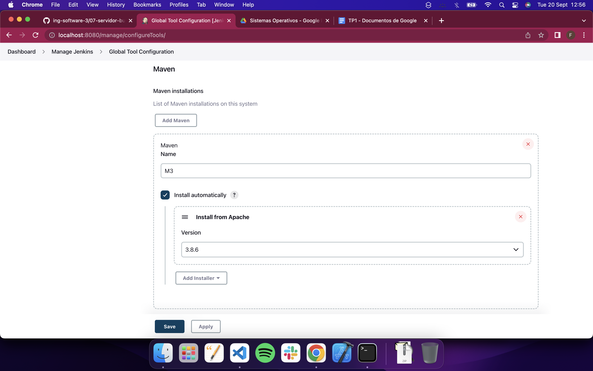

#### 4- Creando el primer Pipeline Job
  - Crear un nuevo item, del tipo Pipeline con nombre **hello-world**
  - Una vez creado el job, en la sección Pipeline seleccionamos **try sample Pipeline** y luego **Hello World**
  - Guardamos y ejecutamos el Job
  - Analizar la salida del mismo

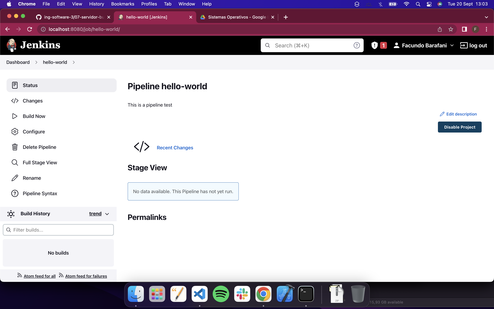

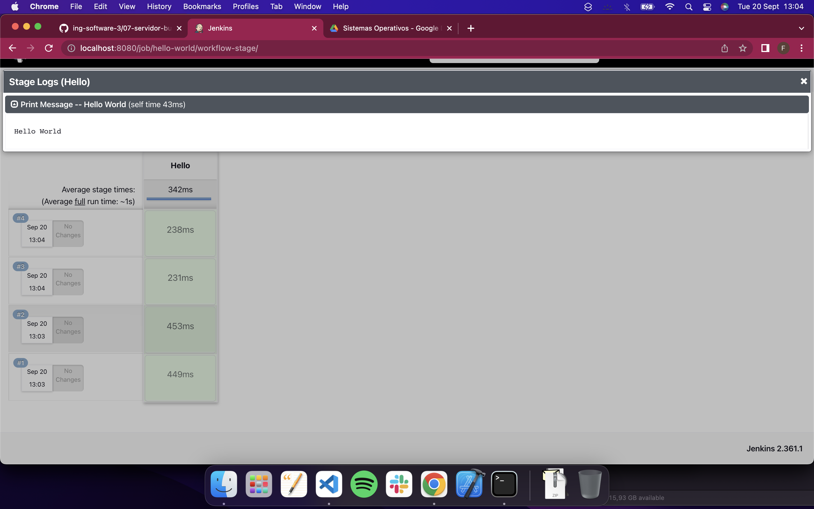

  ```jenkins
  pipeline {
    agent any

    stages {
        stage('Hello') {
            steps {
                echo 'Hello World'
            }
        }
    }
}
```

> Analizando el código podemos ver que se define un pipeline con una sola etapa(stage) llamada `"Hello"` y cuenta con un solo paso el cual devuelve una salida `"Hello World"`.
 
#### 5- Creando un Pipeline Job con Git y Maven
  - Similar al paso anterior creamos un ítem con el nombre **simple-maven**
  - Elegir **Git + Maven** en la sección **try sample Pipeline**
  - Guardar y ejecutar el Job
  - Analizar el script, para identificar los diferentes pasos definidos y correlacionarlos con lo que se ejecuta en el Job y se visualiza en la página del Job.

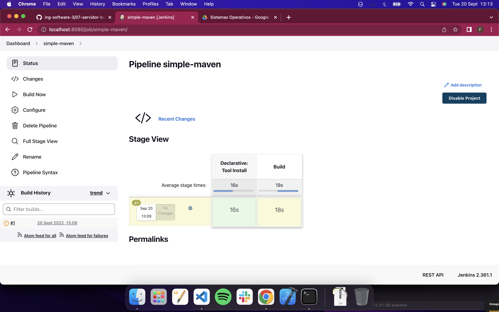

  ```jenkins
  pipeline {
    agent any

    tools {
        // Install the Maven version configured as "M3" and add it to the path.
        maven "M3"
    }

    stages {
        stage('Build') {
            steps {
                // Get some code from a GitHub repository
                git 'https://github.com/jglick/simple-maven-project-with-tests.git'

                // Run Maven on a Unix agent.
                sh "mvn -Dmaven.test.failure.ignore=true clean package"

                // To run Maven on a Windows agent, use
                // bat "mvn -Dmaven.test.failure.ignore=true clean package"
            }

            post {
                // If Maven was able to run the tests, even if some of the test
                // failed, record the test results and archive the jar file.
                success {
                    junit '**/target/surefire-reports/TEST-*.xml'
                    archiveArtifacts 'target/*.jar'
                }
            }
        }
    }
}
```

> Analizando el script podemos ver que hace uso de la herramienta creada previamente de Maven a la cual nombramos M3.

> Este cuenta con una sola etapa la cual se llama `Build` y cuenta con dos secciones:

> 1) **steps**: Pasos a reproducir en la etapa en general, donde basicamente obtiene codigo de el siguiente repo de github:
`https://github.com/jglick/simple-maven-project-with-tests.git` y luego ejecuta Maven.

> 2) **post**: En esta sección se indica lo que genera el pipeline, en este caso si Maven puedo ejecutar el test y alguno de estos fallo lo registra y lo archiva en un archivo .jar el cual esta disponible para descargar al usuario.

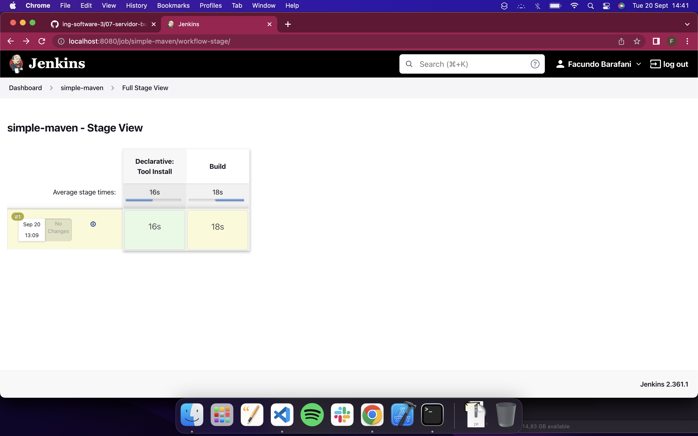

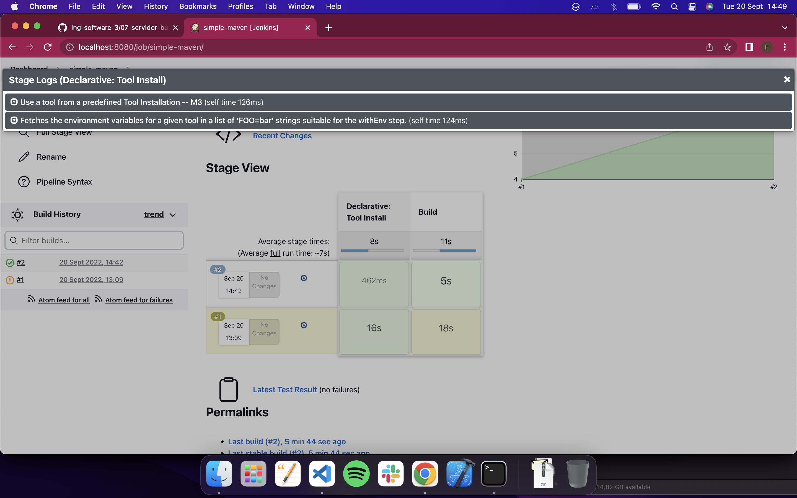

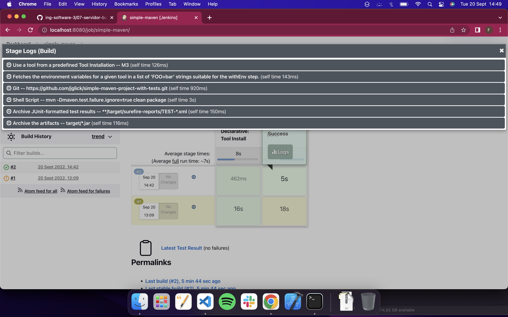

> Lo que genera la sección `post` es el siguiente archivo `.jar`:

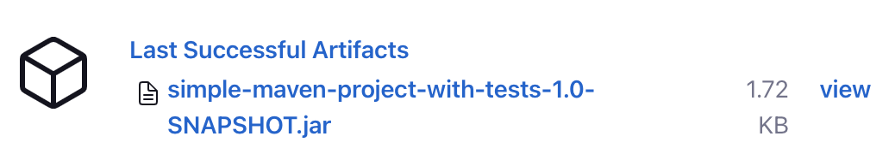

#### 6- Utilizando nuestros proyectos
  - Utilizando lo aprendido en el ejercicio 5
  - Crear un Job que construya el proyecto **spring-boot** del [trabajo práctico 6](06-construccion-imagenes-docker.md).
  - Obtener el código desde el repositorio de cada alumno (se puede crear un repositorio nuevo en github que contenga solamente el proyecto maven).
  - Generar y publicar los artefactos que se producen.
  - Como resultado de este ejercicio proveer el script en un archivo **spring-boot/Jenkinsfile**

> Resultado obtenido
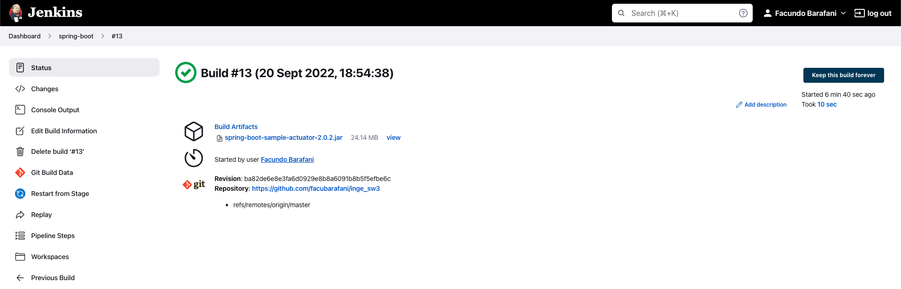

> Artefactos producidos:


> Jenkinsfile que produce el resultado obtenido:
```Jenkinsfile
  pipeline {
    agent any

    tools {
        // Install the Maven version configured as "M3" and add it to the path.
        maven "M3"
    }

    stages {
        stage('Build') {
            steps {
                // Clones github repo
                git 'https://github.com/facubarafani/inge_sw3'
                
                // sets working directory as `tp6/spring-boot`
                dir('tp6/spring-boot') {
                  // executes mvn package -> builds maven project
                    sh("mvn package")
                }
            }
            post {
              // if build succeeded
                success {
                  // moves back to maven project directory
                    dir('tp6/spring-boot') {
                  // archives all .jar files inside `target` directory
                        archiveArtifacts 'target/*.jar'
                    }
                }
            }
        }
    }
}
```

#### 7- Utilizando nuestros proyectos con Docker
  - Extender el ejercicio 6
  - Generar y publicar en Dockerhub la imagen de docker ademas del Jar.
  - Se puede utilizar el [plugin de docker](https://docs.cloudbees.com/docs/admin-resources/latest/plugins/docker-workflow) o comandos de shell.
  - No poner usuario y password en el pipeline en texto plano, por ejemplo para conectarse a DockerHub, utilizar [credenciales de jenkins](https://github.com/jenkinsci/credentials-plugin/blob/master/docs/user.adoc) en su lugar.
  - Como resultado de este ejercicio proveer el script en un archivo **spring-boot/Jenkinsfile**
  - Referencia: https://tutorials.releaseworksacademy.com/learn/building-your-first-docker-image-with-jenkins-2-guide-for-developers

  > Al intentar ejecutar `docker` desde jenkins fallaba, esto se soluciono agregando al path de el servicio de `homebrew` de Jenkins lo siguiente:

  ```plist
        <key>EnvironmentVariables</key>
    <dict>
      <key>PATH</key>
      <string>/usr/local/bin:/usr/bin:/bin:/usr/sbin:/sbin:/Applications/Docker.app/Contents/Resources/bin/:/Users/Kh0a/Library/Group\ Containers/group.com.docker/Applications/Docker.app/Contents/Resources/bin</string>
    </dict>
  ```

  > En el archivo que se encuentra en el siguiente path
  > `/usr/local/Cellar/jenkins-lts/2.176.3/homebrew.mxcl.jenkins-lts.plist`

  > [Link del post de solución](https://stackoverflow.com/questions/40043004/docker-command-not-found-mac-mini-only-happens-in-jenkins-shell-step-but-wo/58688536#58688536)

  > Jenkinsfile que genera archivo .jar y sube imagen a Docker-hub:

  ```Jenkinsfile
  // Sets global variable for using docker image
// in multiple stages (build & prod)
def newImage

pipeline {
    agent any

    tools {
        // Install the Maven version configured as "M3" and add it to the path.
         maven "M3"
    }
    stages {

        stage('Build') {
             steps {
                // Get spring-boot folder from github repo
                git 'https://github.com/facubarafani/inge_sw3'
                    
                 dir('tp6/spring-boot') {
                     sh("mvn package")
                }
            }
            post {
                 // If Maven was able to run the tests, even if some of the test
                 // failed, record the test results and archive the jar file.
                success {
                    dir('tp6/spring-boot') {
                         archiveArtifacts 'target/*.jar'
                    }
                }
            }
        }
        stage("Docker Image Build") {
            steps {
                dir('tp6/spring-boot') {
                    script {
                        // Builds new docker image named 'facubarafani/spring-boot-jenkins'
                        newImage = docker.build("facubarafani/spring-boot-jenkins:${env.BUILD_ID}")
                    }
                }
            }
         }
         stage("Docker Image Post") {
            steps {
                script {
                    withCredentials([usernamePassword( credentialsId: 'dockerhub', usernameVariable: 'USERNAME', passwordVariable: 'PASSWORD')]) {
                        docker.withRegistry('', 'dockerhub') {
                        // logins into docker using credentials stored inside Jenkins credentials manager
                        sh "docker login -u ${USERNAME} -p ${PASSWORD}"

                        // push image built into docker-hub with two tags:
                        // one with the actual build number (Jenkins job build #)
                        newImage.push("${env.BUILD_NUMBER}")
                        // the other one as latest
                        newImage.push("latest")
                        }
                    }
                }
            }
        }
    }
}
```

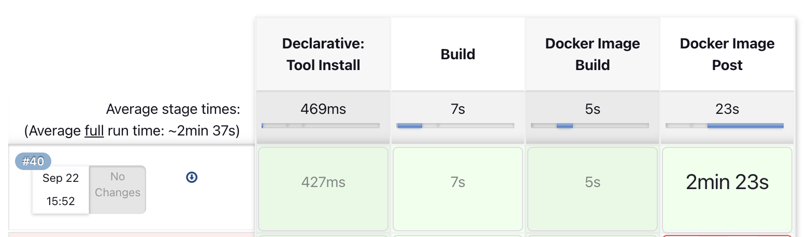

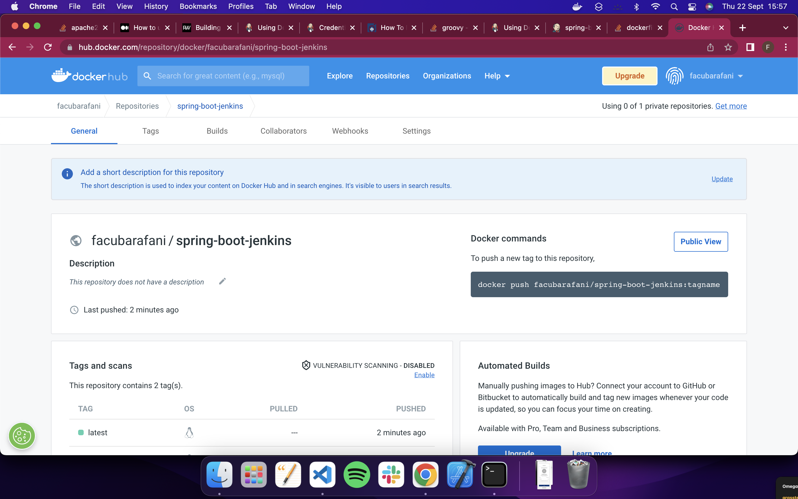


