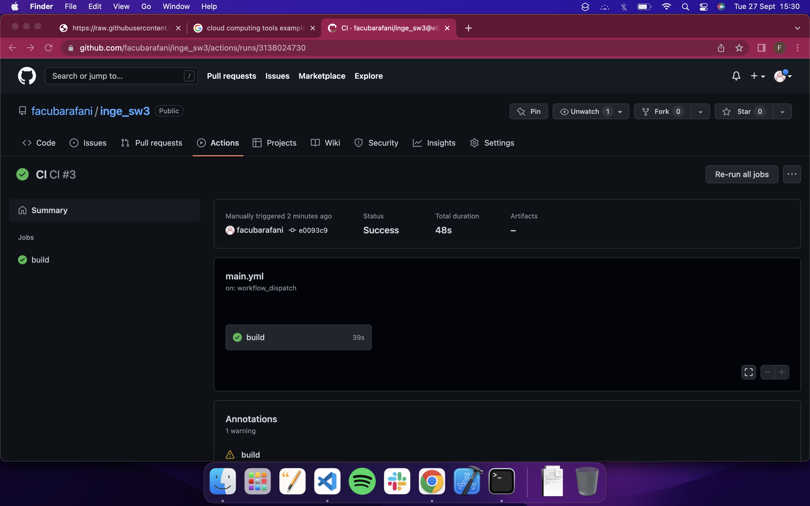
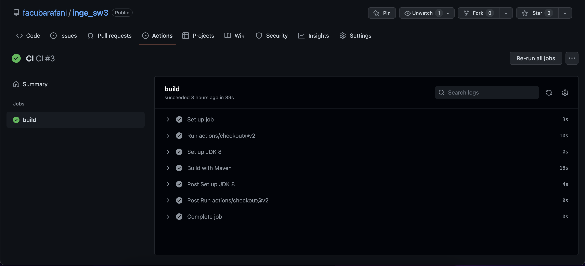
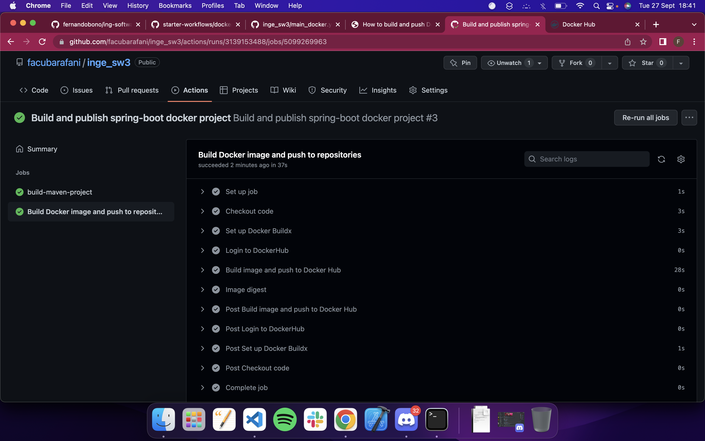
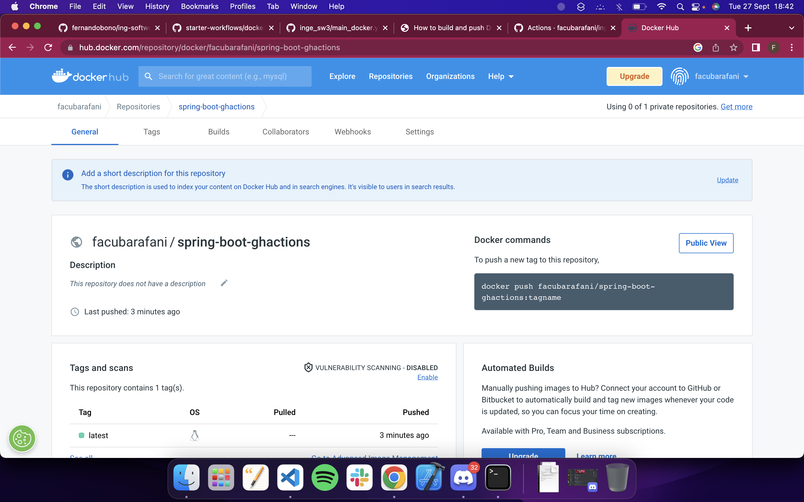
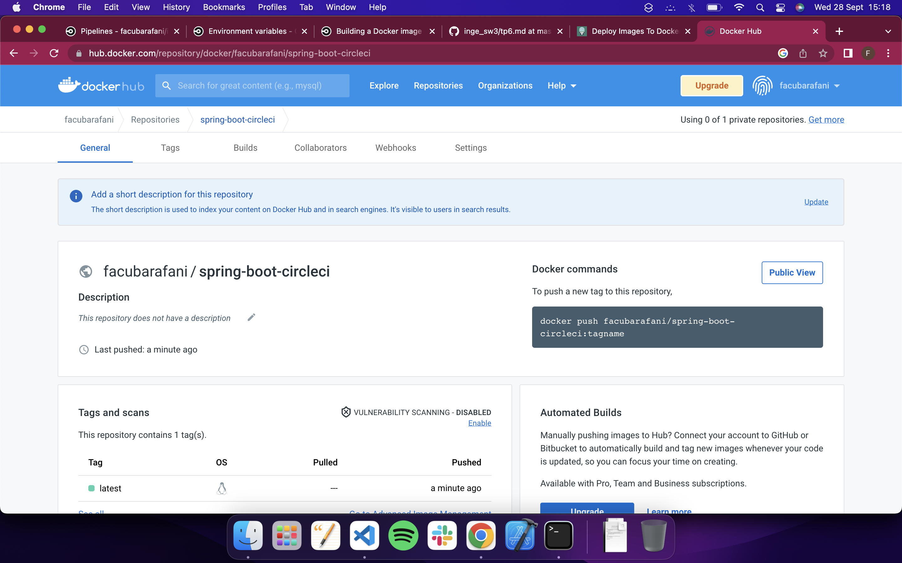
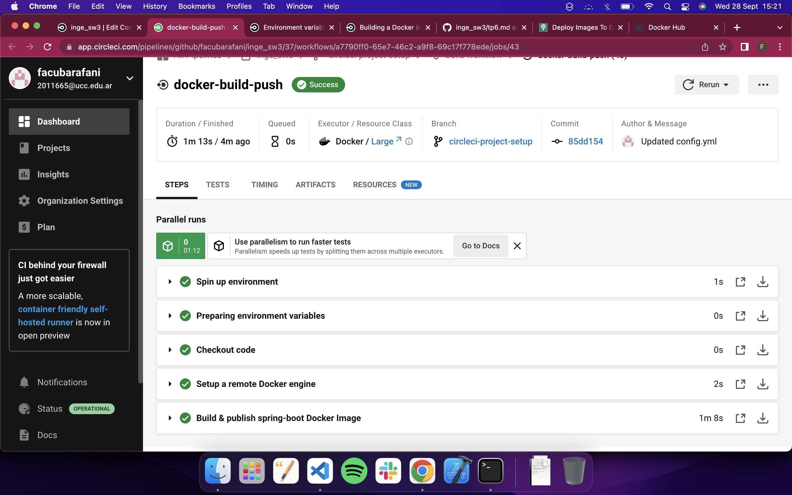

## Trabajo Práctico 8 - Herramientas de construcción de software en la nube

#### 1- Pros y Contras
  - Listar los pros y contras de este tipo de herramientas
  - Sacar conclusiones
> ### Ventajas de las herramientas de CI en la nube
> - **Gran disponibilidad:** La gran ventaja que tiene es que nos permite tener gran disponibilidad sin tener que crear la infraestructura del servidor desde cero. Permite el acceso desde multiples puntos y no tenemos que preocuparnos por el mantenimiento del hardware.
> - **Costos bajo control**: No se necesita de una gran inversión inicial como seria en el caso de que nosotros tendriamos que diseñar e implementar la infraestructura desde cero y ademas sumado esto tenemos un mayor conocimiento de los gastos gracias a las predicciones de gastos mensuales que estas plataformas nos otorgan.
> - **Escalabilidad**: Nos otorga la posiblidad de escalar en capacidad ya sea de procesamiento y/o almacenamiento de una manera muy sencilla sin tener que preocuparnos por el hardware, es por esto que es muy efectiva para startups o empresas que experimentan un gran crecimiento de su sistema brindando eficiencia a el uso de los recursos ya que este se va a adaptar a los consumos realizados.
> - **Infraestructura como código**: Es un concepto que asume que toda la infraestructura de una aplicación debe ser tratada en la misma forma en que se trata al codigo de la aplicacion. La "contenerización" de la aplicación facilita la comunicación entre los contenedores y la infraestructura como codigo para automatizar la operación de la plataforma.
> ### Desventajas de las herramientas de CI en la nube
> **La disponibilidad de los datos y ubicación no es para todos**: Esto puede limitar las posibilidades de ajustar el servidor a necesidades particulares como si se podría realizar en caso de que se diseñe e implemente la infraestructura a medida.
> **Costos altos cuando se hace uso de gran cantidad de recursos**: Puede ser que con un gran tráfico el mantenimiento del mismo resulte en grandes costos comparandolo con una implementación propia a pesar de que est requiere de una gran inversión inicial.

#### 2- Configurando GitHub Actions
  - Repetir el ejercicio 6 del trabajo práctico [trabajo práctico 7](07-servidor-build.md) para el proyecto **spring-boot**, pero utilizando GitHub Actions.
  - En GitHub, en el repositorio donde se encuentra la aplicación **spring-boot**, ir a la opción **Actions** y crear un nuevo `workflow`.
  - El nombre de archivo puede ser build.xml y tendrá un contenido similar al siguiente (el path donde se encuentra el código puede ser diferente):

```yaml
# This is a basic workflow to help you get started with Actions

name: CI

# Controls when the workflow will run
on:
  # Triggers the workflow on push or pull request events but only for the master branch
  push:
    paths:
    - 'proyectos/spring-boot/**'
    branches: [ master ]
  pull_request:
    paths:
    - 'proyectos/spring-boot/**'  
    branches: [ master ]

  # Allows you to run this workflow manually from the Actions tab
  workflow_dispatch:

# A workflow run is made up of one or more jobs that can run sequentially or in parallel
jobs:
  # This workflow contains a single job called "build"
  build:
    # The type of runner that the job will run on
    runs-on: ubuntu-latest

    # Steps represent a sequence of tasks that will be executed as part of the job
    steps:
      # Checks-out your repository under $GITHUB_WORKSPACE, so your job can access it
      - uses: actions/checkout@v2

      # Install Java JDK with maven
      - name: Set up JDK 8
        uses: actions/setup-java@v2
        with:
          java-version: '8'
          distribution: 'adopt'
          cache: maven
          
      # Compile the application
      - name: Build with Maven
        run: |
          cd proyectos/spring-boot/
          mvn -B package --file pom.xml
```
  - Guardar el archivo (hacemos commit directamente en GitHub por ejemplo) y ejecutamos manualmente el pipeline.
  - Explicar que realiza el pipeline anterior.

  

  

  > En una primera instancia define situaciones en las que se va a ejecutar la "action": en caso de que se realice algun `push` o `pull-request` dentro del directorio del proyecto `spring-boot`. Lo que hace es lo siguiente:

  ```bash
  cd proyectos/spring-boot/
  ```
> 1) se mueve al directorio `proyectos/spring-boot`
> 2) luego ejecuta el siguiente comando:
  ```bash
mvn -B package --file pom.xml
  ```
> Realiza el build utilizando maven a partir del archivo `pom.xml` que se encuentra en el directorio.

#### 3- Utilizando nuestros proyectos con Docker
  - Repetir el ejercicio 7 del trabajo práctico [trabajo práctico 7](07-servidor-build.md), pero utilizando GitHub Actions.
  - Generar `secretos` y los `pasos` necesarios para subir la imagen a Docker Hub. [Referencia](https://github.com/actions/starter-workflows/blob/main/ci/docker-publish.yml)

```yml
name: Build and publish spring-boot docker project

# Controls when the workflow will run
on:
  # Triggers the workflow on push or pull request events but only for the master branch
  push:
    paths:
    - 'tp6/spring-boot/**'
    branches: [ master ]
  pull_request:
    paths:
    - 'tp6/spring-boot/**'  
    branches: [ master ]

  # Allows you to run this workflow manually from the Actions tab
  workflow_dispatch:

jobs:
 # This workflow contains a single job called "build"
  build-maven-project:
    # The type of runner that the job will run on
    runs-on: ubuntu-latest

    # Steps represent a sequence of tasks that will be executed as part of the job
    steps:
      # Checks-out your repository under $GITHUB_WORKSPACE, so your job can access it
      - uses: actions/checkout@v2

      # Install Java JDK with maven
      - name: Set up JDK 8
        uses: actions/setup-java@v2
        with:
          java-version: '8'
          distribution: 'adopt'
          cache: maven
          
      # Compile the application
      - name: Build with Maven
        run: |
          cd tp6/spring-boot/
          mvn -B package --file pom.xml

  # define job to build and publish docker image
  build-and-push-docker-image:
    name: Build Docker image and push to repositories
    # run only when code is compiling and tests are passing
    runs-on: ubuntu-latest

    # steps to perform in job
    steps:
      - name: Checkout code
        uses: actions/checkout@v3

      # setup Docker buld action
      - name: Set up Docker Buildx
        id: buildx
        uses: docker/setup-buildx-action@v2

      - name: Login to DockerHub
        uses: docker/login-action@v2
        with:
          username: ${{ secrets.DOCKERHUB_USERNAME }}
          password: ${{ secrets.DOCKERHUB_TOKEN }}
      
      - name: Build image and push to Docker Hub
        uses: docker/build-push-action@v2
        with:
          # relative path to the place where source code with Dockerfile is located
          context: ./tp6/spring-boot/
          # Note: tags has to be all lower-case
          tags: |
            facubarafani/spring-boot-ghactions:latest 
          # build on feature branches, push only on master branch
          push: ${{ github.ref == 'refs/heads/master' }}

      - name: Image digest
        run: echo ${{ steps.docker_build.outputs.digest }}
```





> [Link imagen docker-hub](https://hub.docker.com/repository/docker/facubarafani/spring-boot-ghactions)

#### 4- Opcional: Configurando CircleCI
  - De manera similar al ejercicio 2, configurar un build job para el mismo proyecto, pero utilizando CircleCI
  - Para capturar artefactos, utilizar esta referencia: https://circleci.com/docs/2.0/artifacts/
  - Como resultado de este ejercicio, subir el config.yml a la carpeta **spring-boot**

```yaml
# Use the latest 2.1 version of CircleCI pipeline process engine.
# See: https://circleci.com/docs/2.0/configuration-reference
version: 2.1

# Define a job to be invoked later in a workflow.
# See: https://circleci.com/docs/2.0/configuration-reference/#jobs
jobs:
  build:
    # Specify the execution environment. You can specify an image from Dockerhub or use one of our Convenience Images from CircleCI's Developer Hub.
    docker:
      - image: maven:3.5.2-jdk-8-alpine
    steps:
      - checkout
      - run:
          name: "Build Maven Project"
          command: |
            cd tp6/spring-boot/;
            mvn package;
            mkdir artifacts;
            cp target/*.jar /tmp/artifacts
      - store_artifacts:
          path: /tmp/artifacts
  docker-build-push:
    docker:
      - image: docker:17.05.0-ce-git
    steps:
      - checkout
      - setup_remote_docker:
          docker_layer_caching: false
      - run:
          name: Build & publish spring-boot Docker Image
          command: |
            cd tp6/spring-boot/;
            docker build -t facubarafani/spring-boot-circleci .;
            docker login --username $DOCKERHUB_USERNAME --password $DOCKERHUB_PASSWORD;
            docker push facubarafani/spring-boot-circleci:latest;


# Invoke jobs via workflows
workflows:
  build-workflow:
    jobs:
      - build
      - docker-build-push
```





#### 5- Opcional: Configurando TravisCI
  - Configurar el mismo proyecto, pero para TravisCI. No es necesario publicar los artefactos porque TravisCI no dispone de esta funcionalidad.
  - Como resultado de este ejercicio subir el archivo .travis.yml a la carpeta **spring-boot**

#### 6- Opcional: Configurando Codefresh
  - Configurar el mismo proyecto, pero para Codefresh. 
  - Como resultado de este ejercicio subir el archivo codefresh.yml a la carpeta **spring-boot**

#### 7- Opcional: Configurando Gitlab
  - Configurar el mismo proyecto, pero para Gitlab. 
  - Como resultado de este ejercicio subir el archivo .gitlab-ci.yml a la carpeta **spring-boot**