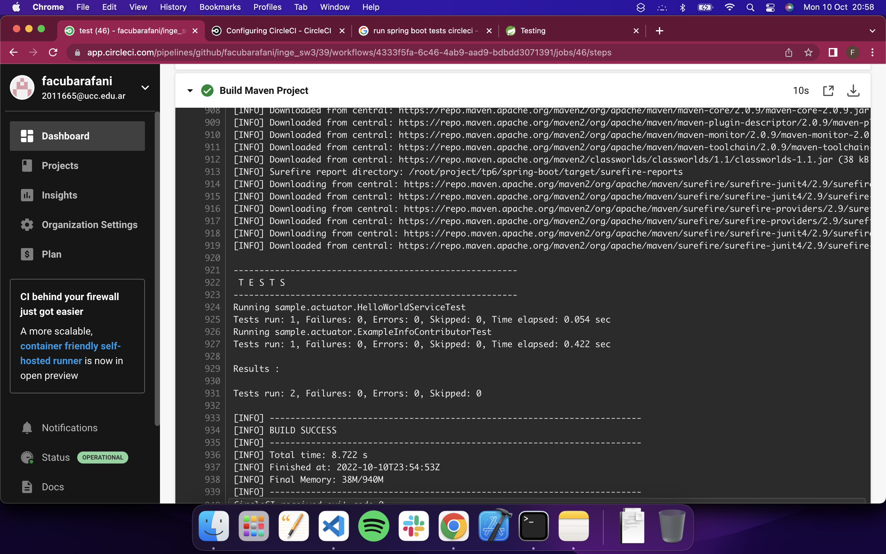

# Trabajo Práctico 9 - Pruebas de unidad
#### 1- Familiarizarse con algunos conceptos del framework JUnit:

| JUnit 4                            | Descripción                                                                                                                                                                                                                                                                                                                       |
|------------------------------------|-----------------------------------------------------------------------------------------------------------------------------------------------------------------------------------------------------------------------------------------------------------------------------------------------------------------------------------|
| import org.junit.*                 | Instrucción de importación para usar las siguientes anotaciones.                                                                                                                                                                                                                                                                  |
| @Test                              | Identifica un método como un método de prueba.                                                                                                                                                                                                                                                                                    |
| @Before                            | Ejecutado antes de cada prueba. Se utiliza para preparar el entorno de prueba (por ejemplo, leer datos de entrada, inicializar la clase).                                                                                                                                                                                         |
| @After                             | Ejecutado después de cada prueba. Se utiliza para limpiar el entorno de prueba (por ejemplo, eliminar datos temporales, restablecer los valores predeterminados). También puede ahorrar memoria limpiando costosas estructuras de memoria.                                                                                        |
| @BeforeClass                       | Ejecutado una vez, antes del comienzo de todas las pruebas. Se usa para realizar actividades intensivas de tiempo, por ejemplo, para conectarse a una base de datos. Los métodos marcados con esta anotación deben definirse static para que funcionen con JUnit.                                                                  |
| @AfterClass                        | Ejecutado una vez, después de que se hayan terminado todas las pruebas. Se utiliza para realizar actividades de limpieza, por ejemplo, para desconectarse de una base de datos. Los métodos anotados con esta anotación deben definirse static para que funcionen con JUnit.                                                       |
| @Ignore o @Ignore("Why disabled")  | Marca que la prueba debe ser deshabilitada. Esto es útil cuando se ha cambiado el código subyacente y el caso de prueba aún no se ha adaptado. O si el tiempo de ejecución de esta prueba es demasiado largo para ser incluido. Es una mejor práctica proporcionar la descripción opcional, por qué la prueba está deshabilitada. |
| @Test (expected = Exception.class) | Falla si el método no arroja la excepción nombrada.                                                                                                                                                                                                                                                                               |
| @Test(timeout=100)                 | Falla si el método tarda más de 100 milisegundos.                                                                                                                                                                                                                                                                                 |

| Declaración                                          | Descripción                                                                                                                                                                                                                    |
|------------------------------------------------------|--------------------------------------------------------------------------------------------------------------------------------------------------------------------------------------------------------------------------------|
| fail ([mensaje])                                   | Deja que el método falle. Se puede usar para verificar que no se llegue a una determinada parte del código o para realizar una prueba de falla antes de implementar el código de prueba. El parámetro del mensaje es opcional. |
| assertTrue ([mensaje,] condición booleana)           | Comprueba que la condición booleana es verdadera.                                                                                                                                                                              |
| assertFalse ([mensaje,] condición booleana)          | Comprueba que la condición booleana es falsa.                                                                                                                                                                                  |
| assertEquals ([mensaje,] esperado, real)             | Comprueba que dos valores son iguales. Nota: para las matrices, la referencia no se verifica en el contenido de las matrices.                                                                                                  |
| assertEquals ([mensaje,] esperado, real, tolerancia) | Pruebe que los valores float o double coincidan. La tolerancia es el número de decimales que debe ser el mismo.                                                                                                                |
| assertNull (objeto [mensaje,])                       | Verifica que el objeto sea nulo.                                                                                                                                                                                               |
| assertNotNull (objeto [mensaje,])                    | Verifica que el objeto no sea nulo.                                                                                                                                                                                            |
| assertSame ([mensaje,] esperado, real)               | Comprueba que ambas variables se refieren al mismo objeto.                                                                                                                                                                     |
| assertNotSame ([mensaje,] esperado, real)            | Comprueba que ambas variables se refieren a diferentes objetos.                                                                                                                                                                |
#### 1- Utilizando Unit test
  - ¿En el proyecto **spring-boot** para qué está esta dependencia en el pom.xml?
```xml
		<dependency>
			<groupId>org.springframework.boot</groupId>
			<artifactId>spring-boot-starter-test</artifactId>
			<scope>test</scope>
		</dependency>
```
> Esta dependencia nos brinda un "starter" para realizar tests en un proyecto de spring-boot. Este incluye librerias como JUnit Jupiter, Hamcrest and Mockito.

  - Analizar y ejectuar el metodo de unit test:

```java
public class HelloWorldServiceTest {

	@Test
	public void expectedMessage() {
		HelloWorldService helloWorldService = new HelloWorldService();
		assertEquals("Expected correct message","Spring boot says hello from a Docker container",helloWorldService.getHelloMessage());
	}
	
}
```

> @Test indica que es un metodo de prueba, el cual instancia un objeto de la clase `"HelloWorldService"`. Luego prueba si los valores pasados por parametro son iguales. En este caso `"Expected correct message"` y `"Spring boot says hello from a Docker container"`. Finalmente si la comparación devuelve `true` se ejecuta el metodo de la clase `HelloWorldService` llamado `getHelloMessage()`.

  - Ejecutar los tests utilizando la IDE

  ```bash
  INFO] Scanning for projects...
[INFO] 
[INFO] --------< org.springframework.boot:spring-boot-sample-actuator >--------
[INFO] Building Spring Boot Actuator Sample 2.0.2
[INFO] --------------------------------[ jar ]---------------------------------
[INFO] 
[INFO] --- maven-resources-plugin:3.0.1:resources (default-resources) @ spring-boot-sample-actuator ---
[INFO] Using 'UTF-8' encoding to copy filtered resources.
[INFO] Copying 1 resource
[INFO] Copying 1 resource
[INFO] 
[INFO] --- maven-compiler-plugin:3.7.0:compile (default-compile) @ spring-boot-sample-actuator ---
[INFO] Nothing to compile - all classes are up to date
[INFO] 
[INFO] --- maven-resources-plugin:3.0.1:testResources (default-testResources) @ spring-boot-sample-actuator ---
[INFO] Using 'UTF-8' encoding to copy filtered resources.
[INFO] Copying 1 resource
[INFO] 
[INFO] --- maven-compiler-plugin:3.7.0:testCompile (default-testCompile) @ spring-boot-sample-actuator ---
[INFO] Nothing to compile - all classes are up to date
[INFO] 
[INFO] --- maven-surefire-plugin:2.9:test (default-test) @ spring-boot-sample-actuator ---
[INFO] Surefire report directory: /Users/facundobarafani/Desktop/UCC/Sistemas IV/Segundo Semestre/Inge de SW 3/Practico/inge_sw3/tp6/spring-boot/target/surefire-reports

-------------------------------------------------------
 T E S T S
-------------------------------------------------------
Running sample.actuator.ExampleInfoContributorTest
Tests run: 1, Failures: 0, Errors: 0, Skipped: 0, Time elapsed: 0.467 sec
Running sample.actuator.HelloWorldServiceTest
Tests run: 1, Failures: 0, Errors: 0, Skipped: 0, Time elapsed: 0 sec

Results :

Tests run: 2, Failures: 0, Errors: 0, Skipped: 0

[INFO] ------------------------------------------------------------------------
[INFO] BUILD SUCCESS
[INFO] ------------------------------------------------------------------------
[INFO] Total time:  1.843 s
[INFO] Finished at: 2022-09-29T15:24:27-03:00
[INFO] ------------------------------------------------------------------------
```

  

#### 3- Familiarizarse con algunos conceptos de Mockito
Mockito es un framework de simulación popular que se puede usar junto con JUnit. Mockito permite crear y configurar objetos falsos. El uso de Mockito simplifica significativamente el desarrollo de pruebas para clases con dependencias externas.

Si se usa Mockito en las pruebas, normalmente:
 1. Se burlan las dependencias externas e insertan los mocks en el código bajo prueba
 2. Se ejecuta el código bajo prueba
 3. Se valida que el código se ejecutó correctamente

Referencia: https://www.vogella.com/tutorials/Mockito/article.html

- Analizar el código del test
```java
public class ExampleInfoContributorTest {

	@Test
	public void infoMap() {
		Info.Builder builder = mock(Info.Builder.class);
		
		ExampleInfoContributor exampleInfoContributor = new ExampleInfoContributor();
		exampleInfoContributor.contribute(builder);
		
		verify(builder).withDetail(any(),any());
	}
}
```

> Se realiza un mock a paritr de la clase Info.Builder la cual proviene de la libreria `Spring Boot` [Link de la doc de Info.Builder](https://docs.spring.io/spring-boot/docs/current/api/org/springframework/boot/actuate/info/Info.Builder.html), El cual sirve para generar instancias inmutables de `Info` la cual es una clase de Spring Boot la cual brinda información de la aplicación. Luego crea una instancia del objeto de tipo `ExampleInfoContributor` y ejecuta el metodo contribute y le pasa como parametro el builder instanciado previamente. Luego utiliza el metodo `verify()` de mockito el cual sirve para verificar la ejecución, y luego utiliza el metodo `withDetail()` el cual recive una key y el valor a registrar, en este caso ambo de tipo `Any`.

#### 4- Utilizando Mocks

- Agregar un unit test a la clase **HelloWorldServiceTest** 
  - Cuando se llame por primera vez al método **getHelloMessage** retorne "Hola Hola"
  - Cuando se llame por segunda vez al método **getHelloMessage** retorne "Hello Hello"

> Para llevarlo a cabo se realizo el siguiente metodo:
```java
	@Test
	public void testMethodInvoke() {
		HelloWorldService helloWorldService = mock(HelloWorldService.class);

		// When getHelloMessage gets called:
		// First time it will return "Hola Hola"
		// Second time it will return "Hello Hello"
		when(helloWorldService.getHelloMessage()).thenReturn("Hola Hola").thenReturn("Hello Hello");

		// Verifies if the method returns "Hola Hola" the first time the method gets called
		assertEquals("Hola Hola", "Hola Hola", helloWorldService.getHelloMessage());

		// Verifies if the method returns "Hello Hello" the first time the method gets called
		assertEquals("Hello Hello", "Hello Hello", helloWorldService.getHelloMessage());
		
		// ACLARATION -> IF WE CHANGE LINE EX ORDER OF LINE 35 WITH 32 IT WILL NOT PASS TESTS.
	}
  ```
  > Se realizo de esta manera para no modificar el `behaviour` del metodo en si, es decir se modifico lo que retorna el metodo unicamente para el mock instanciado dentro de ese test case. En este caso el orden es escencial. Como indican los comentarios si se modifica el orden de la ejecución de los assertEquals no va a pasar el test case ya que arriba se definio lo siguiente:
  ```java
  		when(helloWorldService.getHelloMessage()).thenReturn("Hola Hola").thenReturn("Hello Hello");
  ```
  > En una primera instancia se va a retornear `"Hola Hola"` pero en su segunda vez se va a llamar a `Hello Hello`.

  > Al correr el case se obtuvo lo siguiente:
  ```bash
  -------------------------------------------------------
 T E S T S
-------------------------------------------------------
Running sample.actuator.ExampleInfoContributorTest
Tests run: 1, Failures: 0, Errors: 0, Skipped: 0, Time elapsed: 0.471 sec
Running sample.actuator.HelloWorldServiceTest
Tests run: 2, Failures: 0, Errors: 0, Skipped: 0, Time elapsed: 0.017 sec

Results :

Tests run: 3, Failures: 0, Errors: 0, Skipped: 0
```

> En cambio si cambiamos el orden de los assertEquals:
```java
	@Test
	public void testMethodInvoke() {
		HelloWorldService helloWorldService = mock(HelloWorldService.class);

		// When getHelloMessage gets called:
		// First time it will return "Hola Hola"
		// Second time it will return "Hello Hello"
		when(helloWorldService.getHelloMessage()).thenReturn("Hola Hola").thenReturn("Hello Hello");

		// Verifies if the method returns "Hello Hello" the second time the method gets called
		assertEquals("Hello Hello", "Hello Hello", helloWorldService.getHelloMessage());
		
		// Verifies if the method returns "Hola Hola" the first time the method gets called
		assertEquals("Hola Hola", "Hola Hola", helloWorldService.getHelloMessage());

		// ACLARATION -> IF WE CHANGE LINE EX ORDER OF LINE 35 WITH 32 IT WILL NOT PASS TESTS.
	}
```

> Surge lo siguiente:
```bash
-------------------------------------------------------
 T E S T S
-------------------------------------------------------
Running sample.actuator.ExampleInfoContributorTest
Tests run: 1, Failures: 0, Errors: 0, Skipped: 0, Time elapsed: 0.478 sec
Running sample.actuator.HelloWorldServiceTest
Tests run: 2, Failures: 1, Errors: 0, Skipped: 0, Time elapsed: 0.025 sec <<< FAILURE!
testMethodInvoke(sample.actuator.HelloWorldServiceTest)  Time elapsed: 0.025 sec  <<< FAILURE!
org.junit.ComparisonFailure: Hello Hello expected:<H[ello Hello]> but was:<H[ola Hola]>
	at org.junit.Assert.assertEquals(Assert.java:115)
	at sample.actuator.HelloWorldServiceTest.testMethodInvoke(HelloWorldServiceTest.java:32)
	at java.base/jdk.internal.reflect.NativeMethodAccessorImpl.invoke0(Native Method)
	at java.base/jdk.internal.reflect.NativeMethodAccessorImpl.invoke(NativeMethodAccessorImpl.java:62)
	at java.base/jdk.internal.reflect.DelegatingMethodAccessorImpl.invoke(DelegatingMethodAccessorImpl.java:43)
	at java.base/java.lang.reflect.Method.invoke(Method.java:567)
	at org.junit.runners.model.FrameworkMethod$1.runReflectiveCall(FrameworkMethod.java:50)
	at org.junit.internal.runners.model.ReflectiveCallable.run(ReflectiveCallable.java:12)
	at org.junit.runners.model.FrameworkMethod.invokeExplosively(FrameworkMethod.java:47)
	at org.junit.internal.runners.statements.InvokeMethod.evaluate(InvokeMethod.java:17)
	at org.junit.runners.ParentRunner.runLeaf(ParentRunner.java:325)
	at org.junit.runners.BlockJUnit4ClassRunner.runChild(BlockJUnit4ClassRunner.java:78)
	at org.junit.runners.BlockJUnit4ClassRunner.runChild(BlockJUnit4ClassRunner.java:57)
	at org.junit.runners.ParentRunner$3.run(ParentRunner.java:290)
	at org.junit.runners.ParentRunner$1.schedule(ParentRunner.java:71)
	at org.junit.runners.ParentRunner.runChildren(ParentRunner.java:288)
	at org.junit.runners.ParentRunner.access$000(ParentRunner.java:58)
	at org.junit.runners.ParentRunner$2.evaluate(ParentRunner.java:268)
	at org.junit.runners.ParentRunner.run(ParentRunner.java:363)
	at org.apache.maven.surefire.junit4.JUnit4TestSet.execute(JUnit4TestSet.java:53)
	at org.apache.maven.surefire.junit4.JUnit4Provider.executeTestSet(JUnit4Provider.java:123)
	at org.apache.maven.surefire.junit4.JUnit4Provider.invoke(JUnit4Provider.java:104)
	at java.base/jdk.internal.reflect.NativeMethodAccessorImpl.invoke0(Native Method)
	at java.base/jdk.internal.reflect.NativeMethodAccessorImpl.invoke(NativeMethodAccessorImpl.java:62)
	at java.base/jdk.internal.reflect.DelegatingMethodAccessorImpl.invoke(DelegatingMethodAccessorImpl.java:43)
	at java.base/java.lang.reflect.Method.invoke(Method.java:567)
	at org.apache.maven.surefire.util.ReflectionUtils.invokeMethodWithArray(ReflectionUtils.java:164)
	at org.apache.maven.surefire.booter.ProviderFactory$ProviderProxy.invoke(ProviderFactory.java:110)
	at org.apache.maven.surefire.booter.SurefireStarter.invokeProvider(SurefireStarter.java:172)
	at org.apache.maven.surefire.booter.SurefireStarter.runSuitesInProcessWhenForked(SurefireStarter.java:104)
	at org.apache.maven.surefire.booter.ForkedBooter.main(ForkedBooter.java:70)

Results :

Failed tests:   testMethodInvoke(sample.actuator.HelloWorldServiceTest): Hello Hello expected:<H[ello Hello]> but was:<H[ola Hola]>

Tests run: 3, Failures: 1, Errors: 0, Skipped: 0
```
- Crear la siguiente clase **AbstractTest**
```java
package sample.actuator;

import org.junit.runner.RunWith;
import org.springframework.beans.factory.annotation.Autowired;
import org.springframework.boot.test.context.SpringBootTest;
import org.springframework.test.context.junit4.SpringJUnit4ClassRunner;
import org.springframework.test.context.web.WebAppConfiguration;
import org.springframework.test.web.servlet.MockMvc;
import org.springframework.test.web.servlet.setup.MockMvcBuilders;
import org.springframework.web.context.WebApplicationContext;

@RunWith(SpringJUnit4ClassRunner.class)
@SpringBootTest(classes = SampleActuatorApplication.class)
@WebAppConfiguration
public abstract class AbstractTest {
    protected MockMvc mvc;

    @Autowired
    WebApplicationContext webApplicationContext;

    protected void setUp() {
        mvc = MockMvcBuilders.webAppContextSetup(webApplicationContext).build();
    }
}
```

- Agregar esta otra clase también en el mismo directorio

```java
package sample.actuator;

import static org.junit.Assert.assertEquals;

import org.junit.Before;
import org.junit.Test;
import org.springframework.http.MediaType;
import org.springframework.test.web.servlet.MvcResult;
import org.springframework.test.web.servlet.request.MockMvcRequestBuilders;


public class SampleControllerTest extends AbstractTest {

    @Override
    @Before
    public void setUp() {
        super.setUp();
    }

    @Test
    public void testRootMessage() throws Exception {
        String uri = "/";
        MvcResult mvcResult = mvc.perform(MockMvcRequestBuilders.get(uri)
                .accept( MediaType.APPLICATION_JSON_VALUE)).andReturn();

        String content = mvcResult.getResponse().getContentAsString();
        int status = mvcResult.getResponse().getStatus();
        assertEquals(200, status);
        assertEquals("Expected correct message","{\"message\":\"Spring boot says hello from a Docker container\"}",content);
    }
}
```

  - Analizar estos tests

```bash
-------------------------------------------------------
 T E S T S
-------------------------------------------------------
Running sample.actuator.ExampleInfoContributorTest
Tests run: 1, Failures: 0, Errors: 0, Skipped: 0, Time elapsed: 0.471 sec
Running sample.actuator.SampleControllerTest
2022-10-10 20:09:12.466  INFO   --- [           main] .b.t.c.SpringBootTestContextBootstrapper : Neither @ContextConfiguration nor @ContextHierarchy found for test class [sample.actuator.SampleControllerTest], using SpringBootContextLoader
2022-10-10 20:09:12.474  INFO   --- [           main] o.s.t.c.support.AbstractContextLoader    : Could not detect default resource locations for test class [sample.actuator.SampleControllerTest]: no resource found for suffixes {-context.xml, Context.groovy}.
2022-10-10 20:09:12.629  INFO   --- [           main] .b.t.c.SpringBootTestContextBootstrapper : Loaded default TestExecutionListener class names from location [META-INF/spring.factories]: [org.springframework.boot.test.mock.mockito.MockitoTestExecutionListener, org.springframework.boot.test.mock.mockito.ResetMocksTestExecutionListener, org.springframework.boot.test.autoconfigure.restdocs.RestDocsTestExecutionListener, org.springframework.boot.test.autoconfigure.web.client.MockRestServiceServerResetTestExecutionListener, org.springframework.boot.test.autoconfigure.web.servlet.MockMvcPrintOnlyOnFailureTestExecutionListener, org.springframework.boot.test.autoconfigure.web.servlet.WebDriverTestExecutionListener, org.springframework.test.context.web.ServletTestExecutionListener, org.springframework.test.context.support.DirtiesContextBeforeModesTestExecutionListener, org.springframework.test.context.support.DependencyInjectionTestExecutionListener, org.springframework.test.context.support.DirtiesContextTestExecutionListener, org.springframework.test.context.transaction.TransactionalTestExecutionListener, org.springframework.test.context.jdbc.SqlScriptsTestExecutionListener]
2022-10-10 20:09:12.648  INFO   --- [           main] .b.t.c.SpringBootTestContextBootstrapper : Using TestExecutionListeners: [org.springframework.test.context.web.ServletTestExecutionListener@6f6a7463, org.springframework.test.context.support.DirtiesContextBeforeModesTestExecutionListener@1bdaa23d, org.springframework.boot.test.mock.mockito.MockitoTestExecutionListener@79f227a9, org.springframework.boot.test.autoconfigure.SpringBootDependencyInjectionTestExecutionListener@6ca320ab, org.springframework.test.context.support.DirtiesContextTestExecutionListener@50d68830, org.springframework.test.context.transaction.TransactionalTestExecutionListener@1e53135d, org.springframework.test.context.jdbc.SqlScriptsTestExecutionListener@7674a051, org.springframework.boot.test.mock.mockito.ResetMocksTestExecutionListener@3a7704c, org.springframework.boot.test.autoconfigure.restdocs.RestDocsTestExecutionListener@6754ef00, org.springframework.boot.test.autoconfigure.web.client.MockRestServiceServerResetTestExecutionListener@619bd14c, org.springframework.boot.test.autoconfigure.web.servlet.MockMvcPrintOnlyOnFailureTestExecutionListener@323e8306, org.springframework.boot.test.autoconfigure.web.servlet.WebDriverTestExecutionListener@a23a01d]

  .   ____          _            __ _ _
 /\\ / ___'_ __ _ _(_)_ __  __ _ \ \ \ \
( ( )\___ | '_ | '_| | '_ \/ _` | \ \ \ \
 \\/  ___)| |_)| | | | | || (_| |  ) ) ) )
  '  |____| .__|_| |_|_| |_\__, | / / / /
 =========|_|==============|___/=/_/_/_/
 :: Spring Boot ::        (v2.0.2.RELEASE)

2022-10-10 20:09:12.966  INFO 3606 --- [           main] sample.actuator.SampleControllerTest     : Starting SampleControllerTest on Facundos-MBP with PID 3606 (started by facundobarafani in /Users/facundobarafani/Desktop/UCC/Sistemas IV/Segundo Semestre/Inge de SW 3/Practico/inge_sw3/tp6/spring-boot)
2022-10-10 20:09:12.967  INFO 3606 --- [           main] sample.actuator.SampleControllerTest     : No active profile set, falling back to default profiles: default
WARNING: An illegal reflective access operation has occurred
WARNING: Illegal reflective access by org.codehaus.groovy.reflection.CachedClass (file:/Users/facundobarafani/.m2/repository/org/codehaus/groovy/groovy/2.4.15/groovy-2.4.15.jar) to method java.lang.Object.finalize()
WARNING: Please consider reporting this to the maintainers of org.codehaus.groovy.reflection.CachedClass
WARNING: Use --illegal-access=warn to enable warnings of further illegal reflective access operations
WARNING: All illegal access operations will be denied in a future release
2022-10-10 20:09:13.231  INFO 3606 --- [           main] o.s.w.c.s.GenericWebApplicationContext   : Refreshing org.springframework.web.context.support.GenericWebApplicationContext@6b410923: startup date [Mon Oct 10 20:09:13 ART 2022]; root of context hierarchy
2022-10-10 20:09:14.155  INFO 3606 --- [           main] trationDelegate$BeanPostProcessorChecker : Bean 'org.springframework.transaction.annotation.ProxyTransactionManagementConfiguration' of type [org.springframework.transaction.annotation.ProxyTransactionManagementConfiguration$$EnhancerBySpringCGLIB$$cb566d01] is not eligible for getting processed by all BeanPostProcessors (for example: not eligible for auto-proxying)
2022-10-10 20:09:14.436  INFO 3606 --- [           main] o.s.w.s.handler.SimpleUrlHandlerMapping  : Mapped URL path [/**/favicon.ico] onto handler of type [class org.springframework.web.servlet.resource.ResourceHttpRequestHandler]
2022-10-10 20:09:14.608  INFO 3606 --- [           main] s.w.s.m.m.a.RequestMappingHandlerAdapter : Looking for @ControllerAdvice: org.springframework.web.context.support.GenericWebApplicationContext@6b410923: startup date [Mon Oct 10 20:09:13 ART 2022]; root of context hierarchy
2022-10-10 20:09:14.667  INFO 3606 --- [           main] s.w.s.m.m.a.RequestMappingHandlerMapping : Mapped "{[/foo]}" onto public java.lang.String sample.actuator.SampleController.foo()
2022-10-10 20:09:14.668  INFO 3606 --- [           main] s.w.s.m.m.a.RequestMappingHandlerMapping : Mapped "{[/],methods=[GET],produces=[application/json]}" onto public java.util.Map<java.lang.String, java.lang.String> sample.actuator.SampleController.hello()
2022-10-10 20:09:14.668  INFO 3606 --- [           main] s.w.s.m.m.a.RequestMappingHandlerMapping : Mapped "{[/],methods=[POST],produces=[application/json]}" onto public java.util.Map<java.lang.String, java.lang.Object> sample.actuator.SampleController.olleh(sample.actuator.SampleController$Message)
2022-10-10 20:09:14.671  INFO 3606 --- [           main] s.w.s.m.m.a.RequestMappingHandlerMapping : Mapped "{[/error]}" onto public org.springframework.http.ResponseEntity<java.util.Map<java.lang.String, java.lang.Object>> org.springframework.boot.autoconfigure.web.servlet.error.BasicErrorController.error(javax.servlet.http.HttpServletRequest)
2022-10-10 20:09:14.671  INFO 3606 --- [           main] s.w.s.m.m.a.RequestMappingHandlerMapping : Mapped "{[/error],produces=[text/html]}" onto public org.springframework.web.servlet.ModelAndView org.springframework.boot.autoconfigure.web.servlet.error.BasicErrorController.errorHtml(javax.servlet.http.HttpServletRequest,javax.servlet.http.HttpServletResponse)
2022-10-10 20:09:14.691  INFO 3606 --- [           main] o.s.w.s.handler.SimpleUrlHandlerMapping  : Mapped URL path [/webjars/**] onto handler of type [class org.springframework.web.servlet.resource.ResourceHttpRequestHandler]
2022-10-10 20:09:14.691  INFO 3606 --- [           main] o.s.w.s.handler.SimpleUrlHandlerMapping  : Mapped URL path [/**] onto handler of type [class org.springframework.web.servlet.resource.ResourceHttpRequestHandler]
2022-10-10 20:09:15.434  INFO 3606 --- [           main] o.s.b.a.e.web.EndpointLinksResolver      : Exposing 15 endpoint(s) beneath base path '/actuator'
2022-10-10 20:09:15.441  INFO 3606 --- [           main] s.b.a.e.w.s.WebMvcEndpointHandlerMapping : Mapped "{[/actuator/auditevents],methods=[GET],produces=[application/vnd.spring-boot.actuator.v2+json || application/json]}" onto public java.lang.Object org.springframework.boot.actuate.endpoint.web.servlet.AbstractWebMvcEndpointHandlerMapping$OperationHandler.handle(javax.servlet.http.HttpServletRequest,java.util.Map<java.lang.String, java.lang.String>)
2022-10-10 20:09:15.441  INFO 3606 --- [           main] s.b.a.e.w.s.WebMvcEndpointHandlerMapping : Mapped "{[/actuator/beans],methods=[GET],produces=[application/vnd.spring-boot.actuator.v2+json || application/json]}" onto public java.lang.Object org.springframework.boot.actuate.endpoint.web.servlet.AbstractWebMvcEndpointHandlerMapping$OperationHandler.handle(javax.servlet.http.HttpServletRequest,java.util.Map<java.lang.String, java.lang.String>)
2022-10-10 20:09:15.442  INFO 3606 --- [           main] s.b.a.e.w.s.WebMvcEndpointHandlerMapping : Mapped "{[/actuator/health],methods=[GET],produces=[application/vnd.spring-boot.actuator.v2+json || application/json]}" onto public java.lang.Object org.springframework.boot.actuate.endpoint.web.servlet.AbstractWebMvcEndpointHandlerMapping$OperationHandler.handle(javax.servlet.http.HttpServletRequest,java.util.Map<java.lang.String, java.lang.String>)
2022-10-10 20:09:15.442  INFO 3606 --- [           main] s.b.a.e.w.s.WebMvcEndpointHandlerMapping : Mapped "{[/actuator/conditions],methods=[GET],produces=[application/vnd.spring-boot.actuator.v2+json || application/json]}" onto public java.lang.Object org.springframework.boot.actuate.endpoint.web.servlet.AbstractWebMvcEndpointHandlerMapping$OperationHandler.handle(javax.servlet.http.HttpServletRequest,java.util.Map<java.lang.String, java.lang.String>)
2022-10-10 20:09:15.442  INFO 3606 --- [           main] s.b.a.e.w.s.WebMvcEndpointHandlerMapping : Mapped "{[/actuator/shutdown],methods=[POST],produces=[application/vnd.spring-boot.actuator.v2+json || application/json]}" onto public java.lang.Object org.springframework.boot.actuate.endpoint.web.servlet.AbstractWebMvcEndpointHandlerMapping$OperationHandler.handle(javax.servlet.http.HttpServletRequest,java.util.Map<java.lang.String, java.lang.String>)
2022-10-10 20:09:15.443  INFO 3606 --- [           main] s.b.a.e.w.s.WebMvcEndpointHandlerMapping : Mapped "{[/actuator/configprops],methods=[GET],produces=[application/vnd.spring-boot.actuator.v2+json || application/json]}" onto public java.lang.Object org.springframework.boot.actuate.endpoint.web.servlet.AbstractWebMvcEndpointHandlerMapping$OperationHandler.handle(javax.servlet.http.HttpServletRequest,java.util.Map<java.lang.String, java.lang.String>)
2022-10-10 20:09:15.443  INFO 3606 --- [           main] s.b.a.e.w.s.WebMvcEndpointHandlerMapping : Mapped "{[/actuator/env],methods=[GET],produces=[application/vnd.spring-boot.actuator.v2+json || application/json]}" onto public java.lang.Object org.springframework.boot.actuate.endpoint.web.servlet.AbstractWebMvcEndpointHandlerMapping$OperationHandler.handle(javax.servlet.http.HttpServletRequest,java.util.Map<java.lang.String, java.lang.String>)
2022-10-10 20:09:15.444  INFO 3606 --- [           main] s.b.a.e.w.s.WebMvcEndpointHandlerMapping : Mapped "{[/actuator/env/{toMatch}],methods=[GET],produces=[application/vnd.spring-boot.actuator.v2+json || application/json]}" onto public java.lang.Object org.springframework.boot.actuate.endpoint.web.servlet.AbstractWebMvcEndpointHandlerMapping$OperationHandler.handle(javax.servlet.http.HttpServletRequest,java.util.Map<java.lang.String, java.lang.String>)
2022-10-10 20:09:15.444  INFO 3606 --- [           main] s.b.a.e.w.s.WebMvcEndpointHandlerMapping : Mapped "{[/actuator/info],methods=[GET],produces=[application/vnd.spring-boot.actuator.v2+json || application/json]}" onto public java.lang.Object org.springframework.boot.actuate.endpoint.web.servlet.AbstractWebMvcEndpointHandlerMapping$OperationHandler.handle(javax.servlet.http.HttpServletRequest,java.util.Map<java.lang.String, java.lang.String>)
2022-10-10 20:09:15.444  INFO 3606 --- [           main] s.b.a.e.w.s.WebMvcEndpointHandlerMapping : Mapped "{[/actuator/loggers],methods=[GET],produces=[application/vnd.spring-boot.actuator.v2+json || application/json]}" onto public java.lang.Object org.springframework.boot.actuate.endpoint.web.servlet.AbstractWebMvcEndpointHandlerMapping$OperationHandler.handle(javax.servlet.http.HttpServletRequest,java.util.Map<java.lang.String, java.lang.String>)
2022-10-10 20:09:15.445  INFO 3606 --- [           main] s.b.a.e.w.s.WebMvcEndpointHandlerMapping : Mapped "{[/actuator/loggers/{name}],methods=[GET],produces=[application/vnd.spring-boot.actuator.v2+json || application/json]}" onto public java.lang.Object org.springframework.boot.actuate.endpoint.web.servlet.AbstractWebMvcEndpointHandlerMapping$OperationHandler.handle(javax.servlet.http.HttpServletRequest,java.util.Map<java.lang.String, java.lang.String>)
2022-10-10 20:09:15.445  INFO 3606 --- [           main] s.b.a.e.w.s.WebMvcEndpointHandlerMapping : Mapped "{[/actuator/loggers/{name}],methods=[POST],consumes=[application/vnd.spring-boot.actuator.v2+json || application/json]}" onto public java.lang.Object org.springframework.boot.actuate.endpoint.web.servlet.AbstractWebMvcEndpointHandlerMapping$OperationHandler.handle(javax.servlet.http.HttpServletRequest,java.util.Map<java.lang.String, java.lang.String>)
2022-10-10 20:09:15.446  INFO 3606 --- [           main] s.b.a.e.w.s.WebMvcEndpointHandlerMapping : Mapped "{[/actuator/heapdump],methods=[GET],produces=[application/octet-stream]}" onto public java.lang.Object org.springframework.boot.actuate.endpoint.web.servlet.AbstractWebMvcEndpointHandlerMapping$OperationHandler.handle(javax.servlet.http.HttpServletRequest,java.util.Map<java.lang.String, java.lang.String>)
2022-10-10 20:09:15.446  INFO 3606 --- [           main] s.b.a.e.w.s.WebMvcEndpointHandlerMapping : Mapped "{[/actuator/threaddump],methods=[GET],produces=[application/vnd.spring-boot.actuator.v2+json || application/json]}" onto public java.lang.Object org.springframework.boot.actuate.endpoint.web.servlet.AbstractWebMvcEndpointHandlerMapping$OperationHandler.handle(javax.servlet.http.HttpServletRequest,java.util.Map<java.lang.String, java.lang.String>)
2022-10-10 20:09:15.446  INFO 3606 --- [           main] s.b.a.e.w.s.WebMvcEndpointHandlerMapping : Mapped "{[/actuator/metrics],methods=[GET],produces=[application/vnd.spring-boot.actuator.v2+json || application/json]}" onto public java.lang.Object org.springframework.boot.actuate.endpoint.web.servlet.AbstractWebMvcEndpointHandlerMapping$OperationHandler.handle(javax.servlet.http.HttpServletRequest,java.util.Map<java.lang.String, java.lang.String>)
2022-10-10 20:09:15.446  INFO 3606 --- [           main] s.b.a.e.w.s.WebMvcEndpointHandlerMapping : Mapped "{[/actuator/metrics/{requiredMetricName}],methods=[GET],produces=[application/vnd.spring-boot.actuator.v2+json || application/json]}" onto public java.lang.Object org.springframework.boot.actuate.endpoint.web.servlet.AbstractWebMvcEndpointHandlerMapping$OperationHandler.handle(javax.servlet.http.HttpServletRequest,java.util.Map<java.lang.String, java.lang.String>)
2022-10-10 20:09:15.447  INFO 3606 --- [           main] s.b.a.e.w.s.WebMvcEndpointHandlerMapping : Mapped "{[/actuator/scheduledtasks],methods=[GET],produces=[application/vnd.spring-boot.actuator.v2+json || application/json]}" onto public java.lang.Object org.springframework.boot.actuate.endpoint.web.servlet.AbstractWebMvcEndpointHandlerMapping$OperationHandler.handle(javax.servlet.http.HttpServletRequest,java.util.Map<java.lang.String, java.lang.String>)
2022-10-10 20:09:15.447  INFO 3606 --- [           main] s.b.a.e.w.s.WebMvcEndpointHandlerMapping : Mapped "{[/actuator/httptrace],methods=[GET],produces=[application/vnd.spring-boot.actuator.v2+json || application/json]}" onto public java.lang.Object org.springframework.boot.actuate.endpoint.web.servlet.AbstractWebMvcEndpointHandlerMapping$OperationHandler.handle(javax.servlet.http.HttpServletRequest,java.util.Map<java.lang.String, java.lang.String>)
2022-10-10 20:09:15.448  INFO 3606 --- [           main] s.b.a.e.w.s.WebMvcEndpointHandlerMapping : Mapped "{[/actuator/mappings],methods=[GET],produces=[application/vnd.spring-boot.actuator.v2+json || application/json]}" onto public java.lang.Object org.springframework.boot.actuate.endpoint.web.servlet.AbstractWebMvcEndpointHandlerMapping$OperationHandler.handle(javax.servlet.http.HttpServletRequest,java.util.Map<java.lang.String, java.lang.String>)
2022-10-10 20:09:15.448  INFO 3606 --- [           main] s.b.a.e.w.s.WebMvcEndpointHandlerMapping : Mapped "{[/actuator],methods=[GET],produces=[application/vnd.spring-boot.actuator.v2+json || application/json]}" onto protected java.util.Map<java.lang.String, java.util.Map<java.lang.String, org.springframework.boot.actuate.endpoint.web.Link>> org.springframework.boot.actuate.endpoint.web.servlet.WebMvcEndpointHandlerMapping.links(javax.servlet.http.HttpServletRequest,javax.servlet.http.HttpServletResponse)
2022-10-10 20:09:15.495  INFO 3606 --- [           main] sample.actuator.SampleControllerTest     : Started SampleControllerTest in 2.81 seconds (JVM running for 4.031)
2022-10-10 20:09:15.516  INFO 3606 --- [           main] o.s.b.t.m.w.SpringBootMockServletContext : Initializing Spring FrameworkServlet ''
2022-10-10 20:09:15.516  INFO 3606 --- [           main] o.s.t.web.servlet.TestDispatcherServlet  : FrameworkServlet '': initialization started
2022-10-10 20:09:15.527  INFO 3606 --- [           main] o.s.t.web.servlet.TestDispatcherServlet  : FrameworkServlet '': initialization completed in 11 ms
Tests run: 1, Failures: 0, Errors: 0, Skipped: 0, Time elapsed: 3.469 sec
Running sample.actuator.HelloWorldServiceTest
Tests run: 2, Failures: 0, Errors: 0, Skipped: 0, Time elapsed: 0.014 sec
2022-10-10 20:09:15.601  INFO 3606 --- [       Thread-3] o.s.w.c.s.GenericWebApplicationContext   : Closing org.springframework.web.context.support.GenericWebApplicationContext@6b410923: startup date [Mon Oct 10 20:09:13 ART 2022]; root of context hierarchy

Results :

Tests run: 4, Failures: 0, Errors: 0, Skipped: 0

[INFO] ------------------------------------------------------------------------
[INFO] BUILD SUCCESS
[INFO] ------------------------------------------------------------------------
[INFO] Total time:  6.291 s
[INFO] Finished at: 2022-10-10T20:09:15-03:00
[INFO] ------------------------------------------------------------------------
```

> En el test tenemos en una primera instancia `AbstractTest` el cual cuenta con un metodo `setUp()` que basicamente es el encargado de crear el mock de la web app.

> Luego entra en juego el `SampleControllerTest` el cual comienza en la etiqueta `@Before` donde llama al metodo `setUp` de `AbstractTest`, es decir inicializa el contexto de la webapp.

> Luego se ejecuta el test `testRootMessage` el cual analiza el endpoint raiz `(/)` de la webapp:

> 1. Hace un get request apuntando al root de la webapp a partir de la siguiente linea (se puede observar que se define como metodo de recepción formato `JSON`):
```java
        MvcResult mvcResult = mvc.perform(MockMvcRequestBuilders.get(uri)
                .accept( MediaType.APPLICATION_JSON_VALUE)).andReturn();
``` 
> 2. Se guarda el valor de la respuesta que da la webapp en formato string:

```java
String content = mvcResult.getResponse().getContentAsString();
```

> 3. En una tercera instancia, almacena el response status de la petición en una variable denominada `status`.

```java
int status = mvcResult.getResponse().getStatus();
```

> 4. Finalmente asegura que el response status sea 200 el cual indica que el mismo fue exitoso y ademas que la respuesta de la webapp haya sido la esperada en el campo message: "Spring boot says hello from a Docker container":

```java
        assertEquals(200, status);
        assertEquals("Expected correct message","{\"message\":\"Spring boot says hello from a Docker container\"}",content);
```

#### 5- Opcional: Agregar otros unit tests
  - Agregar unit tests para mejorar la cobertura, pueden ser test simples que validen getter y setters.

> Se creo un test case que prueba el metodo `POST` al endpoint `/`, en donde se le pasa el mensaje y luego se valida que en la respuesta contenga este mensaje pasado por parametro:

```java
    @Test
    public void testRootPost() throws Exception {
        String uri = "/";
        String message = "This is a test message";
        MvcResult mvcResult = mvc.perform(MockMvcRequestBuilders.post(uri)
        		.param("value", "This is a test message")
                .accept( MediaType.APPLICATION_JSON_VALUE)).andReturn();

        String content = mvcResult.getResponse().getContentAsString();
        int status = mvcResult.getResponse().getStatus();

        assertEquals(200, status);
        assertTrue("Expected correct message",content.contains(message));
    }
```

#### 6- Capturar los unit tests como parte del proceso de CI/CD
  - Hacer los cambios en Jenkins (o en la herramienta de CICD utilizada) si es necesario, para capturar los resultados de los unit tests y mostrarlos en la ejecución del build.

> Se añado un extra step en el config file de CircleCI el cual corre los tests haciendo uso del comando de maven:
```bash
maven -B test
```

> El archivo `config.yml` final:

```yaml
# Use the latest 2.1 version of CircleCI pipeline process engine.
# See: https://circleci.com/docs/2.0/configuration-reference
version: 2.1

# Define a job to be invoked later in a workflow.
# See: https://circleci.com/docs/2.0/configuration-reference/#jobs
jobs:
  build:
    # Specify the execution environment. You can specify an image from Dockerhub or use one of our Convenience Images from CircleCI's Developer Hub.
    docker:
      - image: maven:3.5.2-jdk-8-alpine
    steps:
      - checkout
      - run:
          name: "Build Maven Project"
          command: |
            cd tp6/spring-boot/;
            mvn package;
            mkdir artifacts;
            cp target/*.jar /tmp/artifacts
      - store_artifacts:
          path: /tmp/artifacts
  test:
    docker:
      - image: maven:3.5.2-jdk-8-alpine
    steps:
      - checkout
      - run:
          name: "Test Maven Project"
          command: |
            cd tp6/spring-boot/;
            mvn -B test;
  docker-build-push:
    docker:
      - image: docker:17.05.0-ce-git
    steps:
      - checkout
      - setup_remote_docker:
          docker_layer_caching: false
      - run:
          name: Build & publish spring-boot Docker Image
          command: |
            cd tp6/spring-boot/;
            docker build -t facubarafani/spring-boot-circleci .;
            docker login --username $DOCKERHUB_USERNAME --password $DOCKERHUB_PASSWORD;
            docker push facubarafani/spring-boot-circleci:latest;


# Invoke jobs via workflows
workflows:
  build-workflow:
    jobs:
      - build
      - test
      - docker-build-push
```

> Imagen de comprobación durante la ejecución:
